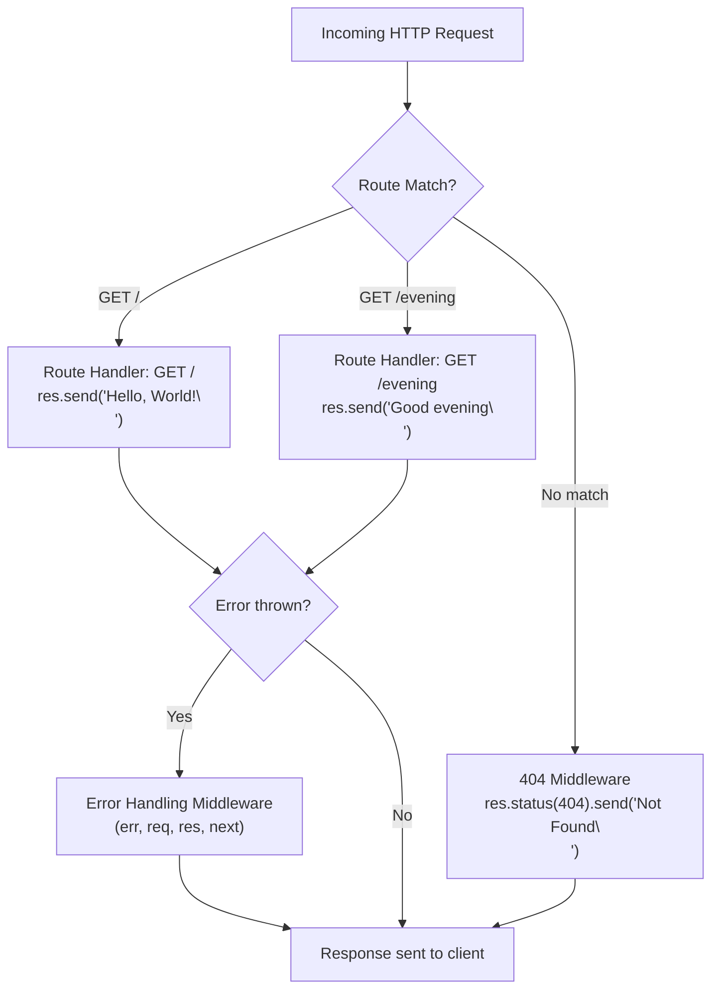
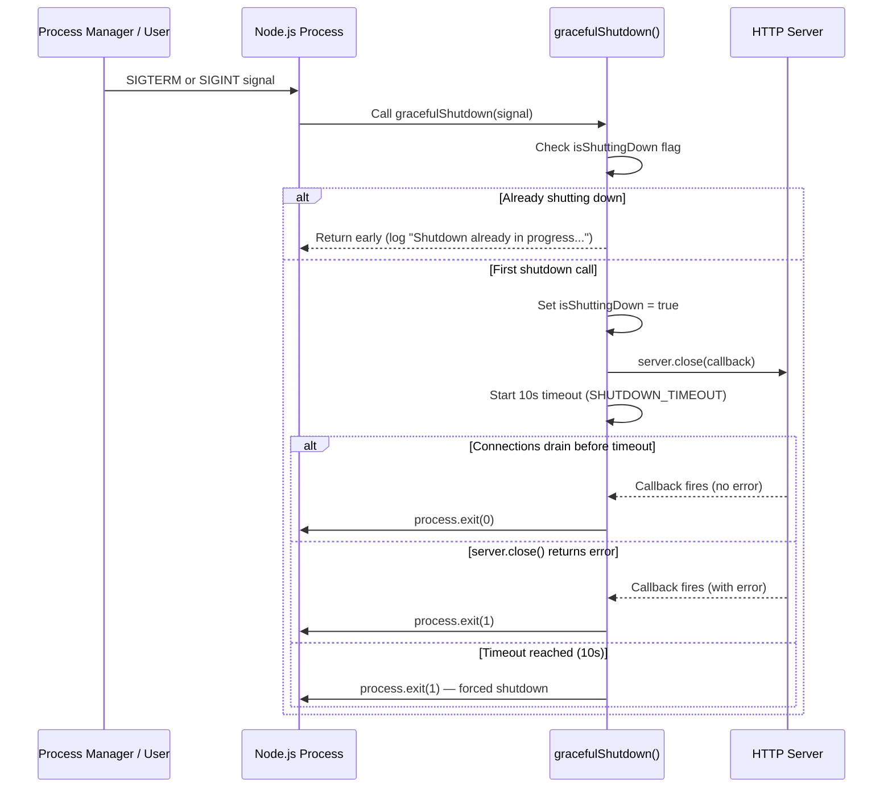

# Hello World Express Server

A production-ready Hello World HTTP server built with [Express.js 5.x](https://expressjs.com/) for Node.js. This application demonstrates modern Express 5 patterns including async error handling, environment-aware error responses, graceful shutdown with timeout protection, and comprehensive signal/exception management.

## Table of Contents

- [Features](#features)
- [Prerequisites](#prerequisites)
- [Installation](#installation)
- [Usage](#usage)
- [API Reference](#api-reference)
  - [GET /](#get-)
  - [GET /evening](#get-evening)
  - [Error Responses](#error-responses)
  - [Content Type Behaviour](#content-type-behaviour)
- [Environment Variables](#environment-variables)
- [Architecture Overview](#architecture-overview)
  - [Middleware Pipeline](#middleware-pipeline)
  - [Graceful Shutdown Flow](#graceful-shutdown-flow)
- [Testing](#testing)
- [Deployment Guide](#deployment-guide)
  - [Production Configuration](#production-configuration)
  - [Running with pm2](#running-with-pm2)
  - [Running with Docker](#running-with-docker)
  - [Health Checks and Monitoring](#health-checks-and-monitoring)
- [Troubleshooting](#troubleshooting)
- [Contributing](#contributing)
- [License](#license)

## Features

- **Two GET endpoints** — root (`/`) and evening (`/evening`) greeting routes returning plain text responses
- **Graceful shutdown** — clean server termination on SIGTERM and SIGINT signals with a 10-second timeout safety net
- **404 catch-all handler** — returns a plain text `Not Found` response for any unmatched route or HTTP method
- **Environment-aware error handling** — detailed error messages in development, generic messages in production
- **Uncaught exception handling** — captures synchronous exceptions and unhandled promise rejections at the process level
- **Comprehensive test suite** — 19 tests across 6 categories covering routes, errors, shutdown, exports, and content types
- **Express 5 async support** — leverages Express 5's built-in async error propagation for route handlers

## Prerequisites

Before you begin, ensure you have the following installed:

| Requirement | Minimum Version | Recommended Version | Verification Command |
|-------------|-----------------|---------------------|----------------------|
| Node.js     | 20.x            | 20.20.0 or later    | `node --version`     |
| npm         | 11.x            | 11.1.0 or later     | `npm --version`      |

## Installation

1. **Clone the repository:**

```bash
git clone <repository-url>
cd hello_world
```

2. **Install dependencies:**

```bash
npm install
```

This installs the following packages:

| Package                                           | Version | Type       | Purpose                          |
|---------------------------------------------------|---------|------------|----------------------------------|
| [express](https://www.npmjs.com/package/express)  | 5.2.1   | Production | Web framework for HTTP routing   |
| [jest](https://www.npmjs.com/package/jest)        | 30.2.0  | Dev        | JavaScript testing framework     |
| [supertest](https://www.npmjs.com/package/supertest) | 7.2.2 | Dev        | HTTP assertion library for tests |

3. **Verify the installation:**

```bash
node -e "require('./server'); console.log('Dependencies OK');"
```

> **Note:** The verification command will start the server. Press `Ctrl+C` to stop it after confirming the output.

## Usage

Start the server by running:

```bash
node server.js
```

You should see the following output:

```
Server running at http://127.0.0.1:3000/
```

Verify the server is responding by opening a new terminal and running:

```bash
curl http://127.0.0.1:3000/
```

Expected response:

```
Hello, World!
```

To stop the server, press `Ctrl+C` in the terminal where the server is running. The server will perform a graceful shutdown, closing all active connections before exiting.

## API Reference

All endpoints return responses with `Content-Type: text/plain` and include a trailing newline character (`\n`) in the response body.

### GET /

Returns a greeting message.

| Property     | Value              |
|--------------|--------------------|
| Method       | `GET`              |
| Path         | `/`                |
| Status Code  | `200 OK`           |
| Content-Type | `text/plain`       |
| Response Body| `Hello, World!\n`  |

**Example:**

```bash
curl -i http://127.0.0.1:3000/
```

```
HTTP/1.1 200 OK
Content-Type: text/plain; charset=utf-8

Hello, World!
```

### GET /evening

Returns an evening greeting message.

| Property     | Value              |
|--------------|--------------------|
| Method       | `GET`              |
| Path         | `/evening`         |
| Status Code  | `200 OK`           |
| Content-Type | `text/plain`       |
| Response Body| `Good evening\n`   |

**Example:**

```bash
curl -i http://127.0.0.1:3000/evening
```

```
HTTP/1.1 200 OK
Content-Type: text/plain; charset=utf-8

Good evening
```

### Error Responses

#### 404 Not Found

Any request to an undefined route or an unsupported HTTP method on an existing route returns a `404` response.

| Property     | Value              |
|--------------|--------------------|
| Status Code  | `404 Not Found`    |
| Content-Type | `text/plain`       |
| Response Body| `Not Found\n`      |

**Example — undefined route:**

```bash
curl -i http://127.0.0.1:3000/nonexistent
```

```
HTTP/1.1 404 Not Found
Content-Type: text/plain; charset=utf-8

Not Found
```

**Example — unsupported method on existing route:**

```bash
curl -i -X POST http://127.0.0.1:3000/
```

```
HTTP/1.1 404 Not Found
Content-Type: text/plain; charset=utf-8

Not Found
```

#### 500 Internal Server Error

When a route handler throws an error, the error-handling middleware returns a `500` response (or the status code set on the error object). The response body depends on the `NODE_ENV` environment variable:

| Environment              | Response Body                     |
|--------------------------|-----------------------------------|
| `NODE_ENV=production`    | `Internal Server Error\n`         |
| All other values (default) | `<actual error message>\n`      |

**Example — development mode (default):**

```
HTTP/1.1 500 Internal Server Error
Content-Type: text/plain; charset=utf-8

Something went wrong in the handler
```

**Example — production mode:**

```
HTTP/1.1 500 Internal Server Error
Content-Type: text/plain; charset=utf-8

Internal Server Error
```

The error-handling middleware also supports custom HTTP status codes. If an error object includes a `status` or `statusCode` property, that value is used instead of `500`.

### Content Type Behaviour

All responses from this server — including success responses, 404 errors, and 500 errors — are returned with `Content-Type: text/plain`. This is explicitly set via `res.type('text/plain')` in every handler and middleware.

## Environment Variables

| Variable    | Default       | Description                                                                                                     |
|-------------|---------------|-----------------------------------------------------------------------------------------------------------------|
| `NODE_ENV`  | *(not set)*   | Controls error message visibility in responses. Set to `production` to hide internal error details from clients. |

### How `NODE_ENV` Affects Behaviour

- **`NODE_ENV` is not set or set to any value other than `production`:** Error responses include the actual error message (e.g., `TypeError: Cannot read properties of undefined`), which is useful during development and debugging.
- **`NODE_ENV=production`:** Error responses return the generic message `Internal Server Error` regardless of the actual error, preventing information leakage to clients.

### Internal Configuration Constants

The following values are defined as constants within `server.js` and are not configurable via environment variables:

| Constant           | Value         | Description                                                        |
|--------------------|---------------|--------------------------------------------------------------------|
| `hostname`         | `127.0.0.1`  | Network interface the server binds to (localhost only)             |
| `port`             | `3000`        | TCP port the server listens on                                     |
| `SHUTDOWN_TIMEOUT` | `10000` (ms)  | Maximum time to wait for active connections to close during shutdown before forcing process exit |

## Architecture Overview

### Middleware Pipeline

The following diagram shows how an incoming HTTP request flows through the Express middleware stack:



**Key architectural decisions:**

- The 404 handler is registered as the last non-error middleware using `app.use()`. Express invokes it only when no route matches the incoming request's method and path.
- The error-handling middleware must declare exactly four parameters (`err`, `req`, `res`, `next`) — this is how Express distinguishes it from regular middleware. Omitting any parameter causes Express to treat it as a normal middleware and skip it during error propagation.
- Express 5 automatically catches errors thrown in `async` route handlers and forwards them to the error-handling middleware, eliminating the need for manual `try/catch` blocks or `next(err)` calls in async handlers.

### Graceful Shutdown Flow

The following diagram shows how the server handles termination signals:



**Key architectural decisions:**

- The `isShuttingDown` flag prevents race conditions when multiple signals arrive in rapid succession (e.g., pressing `Ctrl+C` twice). Only the first signal triggers the shutdown sequence.
- `server.close()` stops accepting new connections while allowing existing in-flight requests to complete. The callback fires once all active connections have drained.
- The `setTimeout` with `SHUTDOWN_TIMEOUT` (10 seconds) acts as a safety net to force process termination if connections fail to drain, preventing the process from hanging indefinitely.
- `unhandledRejection` events are logged but do **not** trigger a shutdown. Express 5 automatically catches rejected Promises in route handlers, so an unhandled rejection in this context typically indicates a non-critical background task failure.

## Testing

### Running Tests

Execute the full test suite with:

```bash
npm test
```

This runs [Jest](https://jestjs.io/) with the configuration defined in `package.json`.

### Test Categories

The test suite in `server.test.js` contains **19 tests** organized across **6 categories**:

| Category                          | Tests | Description                                                                 |
|-----------------------------------|-------|-----------------------------------------------------------------------------|
| Server Routes                     | 2     | Validates `GET /` and `GET /evening` return correct status codes and bodies |
| 404 Error Handling                | 4     | Verifies 404 responses for undefined routes, unsupported methods, and nested paths |
| Content Type Handling             | 2     | Confirms all responses use `text/plain` content type                        |
| Server Exports                    | 2     | Checks that `app` and `server` are properly exported from `module.exports`  |
| Graceful Shutdown Setup           | 4     | Verifies SIGTERM, SIGINT, uncaughtException, and unhandledRejection handlers are registered |
| Error Handling Middleware Pattern  | 5     | Tests sync/async error catching, custom status codes, and error content types |

### Expected Output

```
 PASS  ./server.test.js
  Server Routes
    GET /
      ✓ should return "Hello, World!" with status 200
    GET /evening
      ✓ should return "Good evening" with status 200
  404 Error Handling
    ✓ should return 404 for non-existent routes
    ✓ should return 404 for non-existent POST routes
    ✓ should return 404 for deeply nested non-existent routes
    ✓ should return 404 for unsupported HTTP methods on existing routes
  Content Type Handling
    ✓ should return plain text content type for root
    ✓ should return plain text content type for 404
  Server Exports
    ✓ should export app object
    ✓ should export server object
  Graceful Shutdown Setup
    ✓ should have SIGTERM handler registered
    ✓ should have SIGINT handler registered
    ✓ should have uncaughtException handler registered
    ✓ should have unhandledRejection handler registered
  Error Handling Middleware Pattern
    ✓ should catch synchronous errors and return 500
    ✓ should catch async errors and return 500
    ✓ should respect custom status codes on errors
    ✓ should allow normal routes to work
    ✓ should return plain text content type for errors

Test Suites: 1 passed, 1 total
Tests:       19 passed, 19 total
```

## Deployment Guide

### Production Configuration

Run the server in production mode by setting the `NODE_ENV` environment variable:

```bash
NODE_ENV=production node server.js
```

In production mode, the error-handling middleware returns generic `Internal Server Error` messages instead of exposing internal error details to clients.

### Running with pm2

[pm2](https://pm2.keymetrics.io/) is a production process manager for Node.js that provides automatic restarts, load balancing, and log management.

**Install pm2 globally:**

```bash
npm install -g pm2
```

**Start the server with pm2:**

```bash
pm2 start server.js --name hello-world --env production
```

**Common pm2 commands:**

```bash
pm2 status              # View running processes
pm2 logs hello-world    # View application logs
pm2 restart hello-world # Restart the server
pm2 stop hello-world    # Stop the server
pm2 delete hello-world  # Remove from pm2 process list
```

pm2 sends a `SIGINT` signal by default when stopping a process, triggering the graceful shutdown sequence. The server will finish handling active requests before exiting. If the process does not exit within pm2's configurable `kill_timeout` (default: 1600 ms), pm2 sends `SIGKILL`. You may want to increase this value to accommodate the server's 10-second `SHUTDOWN_TIMEOUT`:

```bash
pm2 start server.js --name hello-world --kill-timeout 15000
```

### Running with Docker

**Example `Dockerfile`:**

```dockerfile
FROM node:20-alpine

WORKDIR /app

COPY package*.json ./
RUN npm ci --omit=dev

COPY server.js ./

EXPOSE 3000

USER node

CMD ["node", "server.js"]
```

**Build and run:**

```bash
docker build -t hello-world-server .
docker run -d -p 3000:3000 -e NODE_ENV=production --name hello-world hello-world-server
```

**Stop gracefully:**

```bash
docker stop --time 15 hello-world
```

The `--time 15` flag gives the container 15 seconds to shut down gracefully before Docker sends `SIGKILL`, which accommodates the server's 10-second `SHUTDOWN_TIMEOUT`.

### Health Checks and Monitoring

The `GET /` endpoint can serve as a lightweight health check:

```bash
curl -sf http://127.0.0.1:3000/ > /dev/null && echo "healthy" || echo "unhealthy"
```

**Docker health check configuration:**

```dockerfile
HEALTHCHECK --interval=30s --timeout=5s --start-period=5s --retries=3 \
  CMD curl -sf http://127.0.0.1:3000/ > /dev/null || exit 1
```

**Key monitoring considerations:**

- The server logs all errors to `stderr` via `console.error()`, including uncaught exceptions, unhandled rejections, and request-level errors.
- Graceful shutdown events are logged to `stdout`, including the signal name, server close status, and timeout warnings.
- The `isShuttingDown` flag ensures that the server stops accepting new connections immediately upon receiving a termination signal.

## Troubleshooting

### Port Already in Use (EADDRINUSE)

**Error:**

```
Error: listen EADDRINUSE: address already in use 127.0.0.1:3000
```

**Solution:** Another process is using port 3000. Find and stop it:

```bash
# Find the process using port 3000
lsof -i :3000

# Kill the process (replace <PID> with the actual process ID)
kill <PID>
```

### Connection Refused (ECONNREFUSED)

**Error:**

```
curl: (7) Failed to connect to 127.0.0.1 port 3000: Connection refused
```

**Solution:** The server is not running. Start it with `node server.js` and wait for the `Server running at http://127.0.0.1:3000/` confirmation message before making requests.

### Server Not Accessible from Other Machines

The server binds to `127.0.0.1` (localhost), which means it only accepts connections from the same machine. This is intentional for development. To accept connections from other machines, modify the `hostname` constant in `server.js` to `0.0.0.0` — but be aware of the security implications of exposing the server on all network interfaces.

### Tests Failing After Changes

If tests fail after modifying `server.js`, verify:

1. Route handlers still return the exact expected response strings (`Hello, World!\n`, `Good evening\n`, `Not Found\n`).
2. The `module.exports` at the bottom of the file still exports both `app` and `server`.
3. The error-handling middleware still accepts exactly four parameters (`err`, `req`, `res`, `next`).

Run the test suite to check:

```bash
npm test
```

## Contributing

Contributions are welcome. To contribute:

1. Fork the repository.
2. Create a feature branch: `git checkout -b feature/your-feature-name`.
3. Make your changes and ensure all tests pass: `npm test`.
4. Commit your changes with a descriptive message.
5. Push to your fork and submit a pull request.

Please ensure that:

- All existing tests continue to pass.
- New features include corresponding tests.
- Code style is consistent with the existing codebase.

## License

This project is licensed under the **MIT License**. See the `package.json` `license` field for details.
