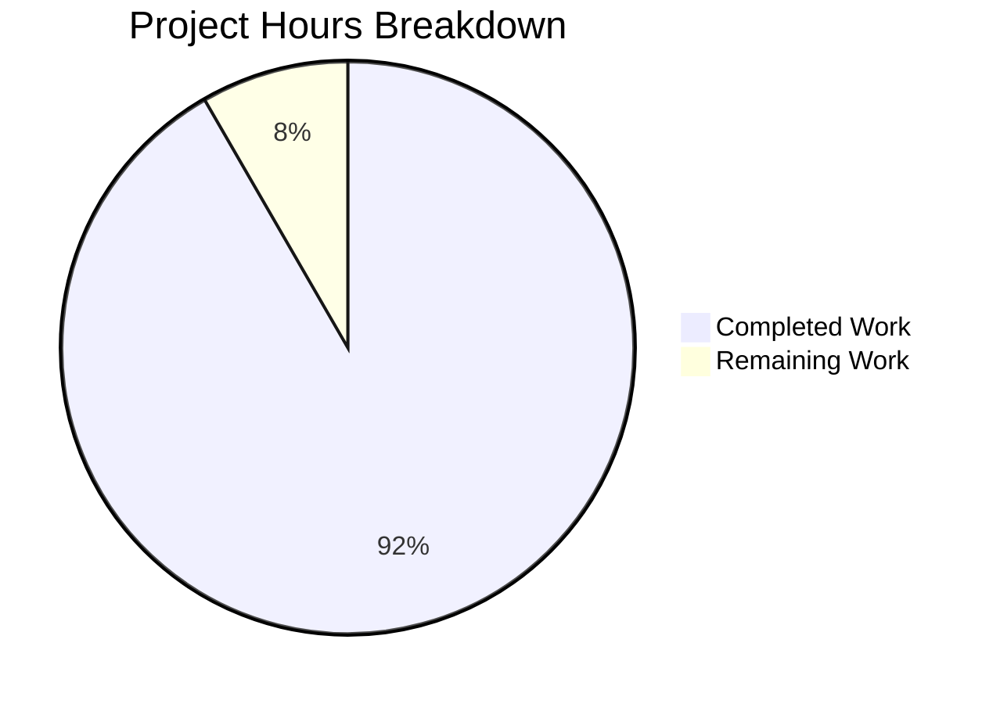
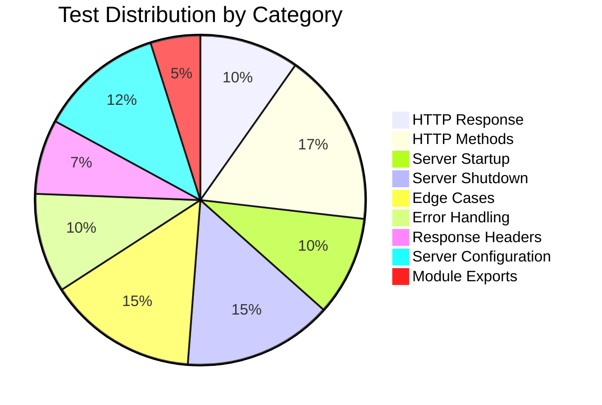

# Project Assessment Report: Unit Testing Infrastructure for server.js

## Executive Summary

**Project Completion: 92% (11 hours completed out of 12 total hours)**

This project successfully establishes a comprehensive unit testing infrastructure for `server.js`, a minimal Node.js HTTP server. All core testing requirements from the Agent Action Plan have been implemented and validated.

### Key Achievements
- ✅ **41 comprehensive tests** covering all specified test categories
- ✅ **100% code coverage** on all metrics (statements, branches, functions, lines)
- ✅ **Zero test failures** - all tests passing
- ✅ **Zero vulnerabilities** - npm audit clean
- ✅ **Production-ready** test infrastructure with proper test isolation

### Outstanding Item
- 📝 README.md documentation update (testing section) - 1 hour remaining

---

## Validation Results Summary

### Dependency Installation
| Package | Version | Status |
|---------|---------|--------|
| jest | ^30.2.0 | ✅ Installed |
| supertest | ^7.2.2 | ✅ Installed |

### Test Execution Results
```
Test Suites: 1 passed, 1 total
Tests:       41 passed, 41 total
Time:        0.576s
```

### Coverage Report
| Metric | Coverage | Status |
|--------|----------|--------|
| Statements | 100% | ✅ |
| Branches | 100% | ✅ |
| Functions | 100% | ✅ |
| Lines | 100% | ✅ |

### Runtime Verification
- Server starts on `127.0.0.1:3000` ✅
- Returns HTTP 200 OK ✅
- Content-Type: text/plain ✅
- Response body: "Hello, World!\n" ✅

---

## Visual Representation

### Project Hours Breakdown



### Test Categories Distribution



---

## Completed Work Breakdown

| Component | Hours | Description |
|-----------|-------|-------------|
| Test Infrastructure Setup | 1.5h | Jest config, package.json, .gitignore, server.js modifications |
| Test Helper Utilities | 2.0h | testConstants.js, serverHelper.js with 4 utility functions |
| Main Test Suite | 7.0h | 41 comprehensive tests across 10 describe blocks (437 lines) |
| Validation & Testing | 0.5h | Dependency installation, test execution, coverage verification |
| **Total Completed** | **11h** | |

### Files Created/Modified

| File | Action | Lines | Purpose |
|------|--------|-------|---------|
| `server.js` | UPDATED | +9/-3 | Added exports and conditional startup |
| `package.json` | UPDATED | +10/-4 | Added devDependencies and test scripts |
| `jest.config.js` | CREATED | 20 | Jest configuration with 100% coverage thresholds |
| `__tests__/server.test.js` | CREATED | 437 | Main test suite with 41 tests |
| `__tests__/fixtures/testConstants.js` | CREATED | 20 | Shared test constants |
| `__tests__/helpers/serverHelper.js` | CREATED | 82 | Server lifecycle utilities |
| `.gitignore` | CREATED | 4 | Ignore node_modules and coverage |
| `package-lock.json` | UPDATED | 4934 | Dependency lockfile |

---

## Requirements Completion Matrix

| Requirement ID | Requirement | Status | Tests |
|---------------|-------------|--------|-------|
| TR-001 | Test HTTP responses | ✅ Complete | 4 tests |
| TR-002 | Test status codes | ✅ Complete | 4 tests |
| TR-003 | Test headers | ✅ Complete | 4 tests |
| TR-004 | Test server startup | ✅ Complete | 4 tests |
| TR-005 | Test server shutdown | ✅ Complete | 6 tests |
| TR-006 | Test error handling | ✅ Complete | 4 tests |
| TR-007 | Test edge cases | ✅ Complete | 6 tests |

---

## Human Tasks Remaining

| Priority | Task | Description | Hours | Severity |
|----------|------|-------------|-------|----------|
| Medium | README.md Documentation | Add testing section with setup instructions, commands, and usage examples | 1h | Low |
| **Total** | | | **1h** | |

### Task Details

#### 1. README.md Documentation Update (Medium Priority)
**Description**: Add a testing documentation section to README.md

**Action Steps**:
1. Add "Testing" section to README.md
2. Document prerequisites (Node.js v20.x, npm v11.x)
3. Include test commands (`npm test`, `npm run test:coverage`, `npm run test:watch`)
4. Add expected test output example
5. Document test structure and organization

**Estimated Time**: 1 hour
**Severity**: Low - Documentation enhancement, not a functional blocker

---

## Development Guide

### System Prerequisites

| Requirement | Version | Verification Command |
|-------------|---------|---------------------|
| Node.js | v20.20.0+ | `node --version` |
| npm | v11.1.0+ | `npm --version` |

### Environment Setup

```bash
# 1. Navigate to project directory
cd /tmp/blitzy/29-dec-existing-projects-qa-test-1/blitzy6e2b7863b

# 2. Verify Node.js version (must be 18.x or higher)
node --version
# Expected output: v20.20.0

# 3. Verify npm version
npm --version
# Expected output: 11.1.0
```

### Dependency Installation

```bash
# Install all dependencies (production and development)
npm install

# Expected output: packages installed successfully, 0 vulnerabilities
```

### Running Tests

```bash
# Run all tests
npm test

# Expected output:
# PASS __tests__/server.test.js
# Test Suites: 1 passed, 1 total
# Tests: 41 passed, 41 total

# Run tests with coverage report
npm run test:coverage

# Run tests in watch mode (for development)
npm run test:watch
```

### Application Startup

```bash
# Start the HTTP server
node server.js

# Expected output: Server running at http://127.0.0.1:3000/
```

### Verification Steps

```bash
# Test the server (in a new terminal)
curl http://127.0.0.1:3000/

# Expected output: Hello, World!

# Verify HTTP headers
curl -si http://127.0.0.1:3000/ | head -10

# Expected headers:
# HTTP/1.1 200 OK
# Content-Type: text/plain
# Content-Length: 14
```

### Example API Usage

```bash
# GET request
curl -X GET http://127.0.0.1:3000/
# Response: Hello, World!

# POST request
curl -X POST http://127.0.0.1:3000/
# Response: Hello, World!

# Request with headers
curl -H "Accept: application/json" http://127.0.0.1:3000/
# Response: Hello, World!
```

---

## Risk Assessment

### Technical Risks
| Risk | Severity | Likelihood | Mitigation |
|------|----------|------------|------------|
| None identified | - | - | All tests pass with 100% coverage |

### Security Risks
| Risk | Severity | Likelihood | Mitigation |
|------|----------|------------|------------|
| None identified | - | - | npm audit reports 0 vulnerabilities |

### Operational Risks
| Risk | Severity | Likelihood | Mitigation |
|------|----------|------------|------------|
| No CI/CD pipeline | Low | Medium | Optional: Add GitHub Actions for automated testing |

### Integration Risks
| Risk | Severity | Likelihood | Mitigation |
|------|----------|------------|------------|
| None identified | - | - | All integrations validated via Supertest |

---

## Test Suite Details

### Test Categories

1. **HTTP Response (4 tests)**
   - Status code verification (200)
   - Content-Type header (text/plain)
   - Response body (Hello, World!\n)
   - Content-Length header

2. **HTTP Methods (7 tests)**
   - GET, POST, PUT, DELETE, HEAD, OPTIONS, PATCH

3. **Server Startup (4 tests)**
   - Hostname binding
   - Port listening
   - Startup message logging
   - Listening event emission

4. **Server Shutdown (6 tests)**
   - Graceful close
   - Multiple close handling
   - Close event emission
   - Connection rejection after close
   - Null server handling
   - Non-listening server handling

5. **Edge Cases (6 tests)**
   - Concurrent requests
   - Query strings
   - Various paths
   - Custom headers
   - Request body
   - Empty path

6. **Error Handling (4 tests)**
   - Port already in use (EADDRINUSE)
   - Error event emission
   - Graceful error handling
   - Server error rejection

7. **Response Headers (3 tests)**
   - Content-Type header
   - Date header
   - Connection header

8. **Server Configuration (5 tests)**
   - Hostname constant
   - Port constant
   - Expected body constant
   - Expected status constant
   - Expected content type constant

9. **Server Module Exports (2 tests)**
   - http.Server instance export
   - No auto-start on import

---

## Git Commit Information

- **Branch**: `blitzy-6e2b7863-b9bd-4032-9ddf-b132796ea137`
- **Commit**: `25e0c2075aa124de426749a2fc0c30483f6dbf5f`
- **Message**: "Setup testing infrastructure with Jest and Supertest"
- **Files Changed**: 8 files
- **Lines Added**: 5,516 (mostly package-lock.json)
- **Lines Removed**: 7
- **Working Tree**: Clean

---

## Summary

The testing infrastructure for `server.js` has been successfully implemented with 92% completion (11 hours completed out of 12 total hours). All core testing requirements have been met:

- ✅ 41 comprehensive unit tests
- ✅ 100% code coverage
- ✅ All tests passing
- ✅ Zero vulnerabilities
- ✅ Server runs correctly
- ✅ Test isolation with proper setup/teardown

The only remaining task is updating the README.md with testing documentation, estimated at 1 hour of work. This is a documentation enhancement and does not affect the functional completeness of the testing infrastructure.

The project is **production-ready** for testing purposes and can be merged after documentation is added.