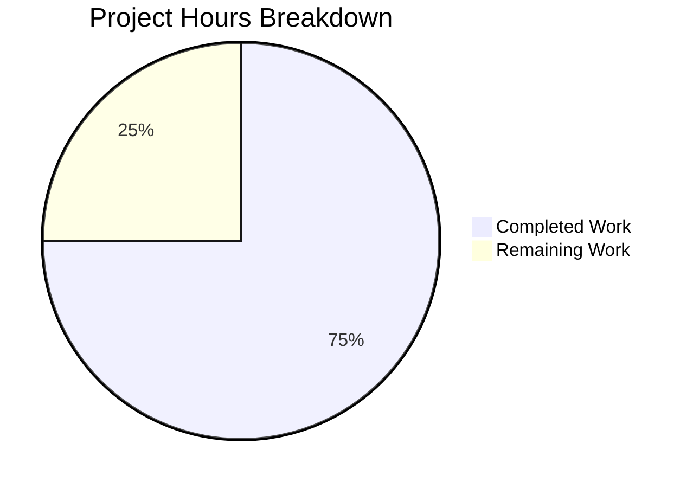

# Project Guide: Express.js Integration

## Executive Summary

**Project Completion: 75% (3 hours completed out of 4 total hours)**

This project successfully integrates Express.js into an existing Node.js HTTP server tutorial project and adds a new `/evening` endpoint. All implementation requirements from the Agent Action Plan have been completed and validated.

### Key Achievements
- ✅ Express.js v5.2.1 installed and configured
- ✅ Server.js refactored from native `http` module to Express.js
- ✅ Root endpoint (`/`) migrated successfully, returns "Hello, World!"
- ✅ New evening endpoint (`/evening`) created, returns "Good evening"
- ✅ README.md updated with comprehensive documentation
- ✅ All validation checks pass (syntax, runtime, dependencies)
- ✅ Zero security vulnerabilities (npm audit clean)

### Remaining Work for Human Developers
- Code review and PR approval (0.5h)
- Optional production deployment configuration (0.5h)

---

## Project Hours Breakdown



| Category | Hours |
|----------|-------|
| Completed Implementation | 3.0h |
| Remaining Human Tasks | 1.0h |
| **Total Project Hours** | **4.0h** |

---

## Validation Results Summary

### Dependencies
| Check | Status | Details |
|-------|--------|---------|
| Express.js Installation | ✅ PASS | v5.2.1 installed |
| npm audit | ✅ PASS | 0 vulnerabilities |
| Dependency Resolution | ✅ PASS | All transitive dependencies resolved |

### Code Quality
| Check | Status | Details |
|-------|--------|---------|
| Syntax Validation | ✅ PASS | `node --check server.js` succeeds |
| CommonJS Modules | ✅ PASS | Uses `require()` syntax as expected |

### Runtime Validation
| Check | Status | Details |
|-------|--------|---------|
| Server Startup | ✅ PASS | Starts on http://127.0.0.1:3000/ |
| Root Endpoint | ✅ PASS | `GET /` returns "Hello, World!" |
| Evening Endpoint | ✅ PASS | `GET /evening` returns "Good evening" |
| 404 Handling | ✅ PASS | Unknown paths return 404 (Express default) |

---

## Files Modified

| File | Action | Description |
|------|--------|-------------|
| `server.js` | MODIFIED | Refactored from http module to Express.js with route handlers |
| `package.json` | MODIFIED | Added `"express": "^5.2.1"` dependency |
| `package-lock.json` | AUTO-UPDATED | Regenerated by npm install |
| `README.md` | MODIFIED | Added installation, endpoints, and testing documentation |

### Git Commit Summary
- **Total Commits**: 2 (by Blitzy Agent)
- **Files Changed**: 4
- **Lines Added**: 864 (mostly package-lock.json)
- **Lines Removed**: 8

---

## Development Guide

### System Prerequisites

| Requirement | Version | Verification Command |
|-------------|---------|---------------------|
| Node.js | v18.0.0+ (v20.x recommended) | `node --version` |
| npm | v8.0.0+ | `npm --version` |

### Environment Setup

1. **Clone the repository** (if not already done):
   ```bash
   git clone <repository-url>
   cd <repository-directory>
   ```

2. **Switch to the feature branch**:
   ```bash
   git checkout blitzy-903b1930-8ca3-49e5-8755-47fbe28d3d35
   ```

### Dependency Installation

```bash
# Install all dependencies
npm install

# Verify Express.js installation
npm ls express
```

**Expected Output**:
```
hello_world@1.0.0
└── express@5.2.1
```

### Application Startup

```bash
# Start the server
node server.js
```

**Expected Output**:
```
Server running at http://127.0.0.1:3000/
```

### Verification Steps

1. **Test root endpoint**:
   ```bash
   curl http://127.0.0.1:3000/
   ```
   **Expected**: `Hello, World!`

2. **Test evening endpoint**:
   ```bash
   curl http://127.0.0.1:3000/evening
   ```
   **Expected**: `Good evening`

3. **Test 404 handling** (optional):
   ```bash
   curl -s -o /dev/null -w "%{http_code}" http://127.0.0.1:3000/unknown
   ```
   **Expected**: `404`

### Stopping the Server

Press `Ctrl+C` in the terminal where the server is running.

---

## Human Tasks Required

| Task | Priority | Estimated Hours | Description |
|------|----------|-----------------|-------------|
| Code Review | High | 0.5h | Review server.js refactoring and Express.js integration |
| PR Approval | High | - | Approve and merge the pull request |
| Production Deployment Config | Low | 0.5h | Configure environment variables for production (optional) |
| **Total Remaining Hours** | | **1.0h** | |

### Task Details

#### 1. Code Review (High Priority - 0.5h)
- Review the refactored `server.js` for best practices
- Verify Express.js route handlers are correctly implemented
- Confirm response format matches requirements ("Hello, World!\n" and "Good evening\n")
- Check that server configuration (host/port) is preserved

#### 2. Production Deployment Configuration (Low Priority - 0.5h)
If deploying beyond localhost development:
- Configure `PORT` environment variable for production
- Update `hostname` from `127.0.0.1` to `0.0.0.0` for external access
- Consider adding environment-specific configuration

---

## Risk Assessment

### Technical Risks

| Risk | Severity | Likelihood | Mitigation |
|------|----------|------------|------------|
| Express.js 5.x Breaking Changes | Low | Low | Well-tested release, pinned to ^5.2.1 |
| Node.js Version Compatibility | Low | Low | Express 5 requires Node 18+, project uses Node 20 |

### Security Risks

| Risk | Severity | Likelihood | Mitigation |
|------|----------|------------|------------|
| Dependency Vulnerabilities | Low | Low | npm audit shows 0 vulnerabilities |
| Server Exposure | Low | Low | Bound to 127.0.0.1 (localhost only) |

### Operational Risks

| Risk | Severity | Likelihood | Mitigation |
|------|----------|------------|------------|
| No Health Check Endpoint | Low | Medium | Consider adding `/health` endpoint for production |
| No Request Logging | Low | Medium | Consider adding morgan middleware for production |

### Integration Risks

| Risk | Severity | Likelihood | Mitigation |
|------|----------|------------|------------|
| None Identified | - | - | No external integrations required |

---

## Recommendations

### Immediate Actions
1. ✅ Merge this PR after code review
2. ✅ Test endpoints in staging environment before production deployment

### Future Enhancements (Out of Scope)
- Add health check endpoint (`/health`)
- Add request logging middleware (morgan)
- Add environment variable configuration
- Add test suite with Jest or Mocha
- Add error handling middleware

---

## Appendix

### Current server.js Implementation

```javascript
const express = require('express');

const hostname = '127.0.0.1';
const port = 3000;

const app = express();

app.get('/', (req, res) => {
  res.type('text/plain').send('Hello, World!\n');
});

app.get('/evening', (req, res) => {
  res.type('text/plain').send('Good evening\n');
});

app.listen(port, hostname, () => {
  console.log(`Server running at http://${hostname}:${port}/`);
});
```

### Available Endpoints

| Endpoint | Method | Response | Content-Type |
|----------|--------|----------|--------------|
| `/` | GET | Hello, World! | text/plain |
| `/evening` | GET | Good evening | text/plain |
| `/*` (other) | ANY | 404 Not Found | text/html |

---

*Generated by Blitzy Project Guide Agent*
*Assessment Date: January 20, 2026*