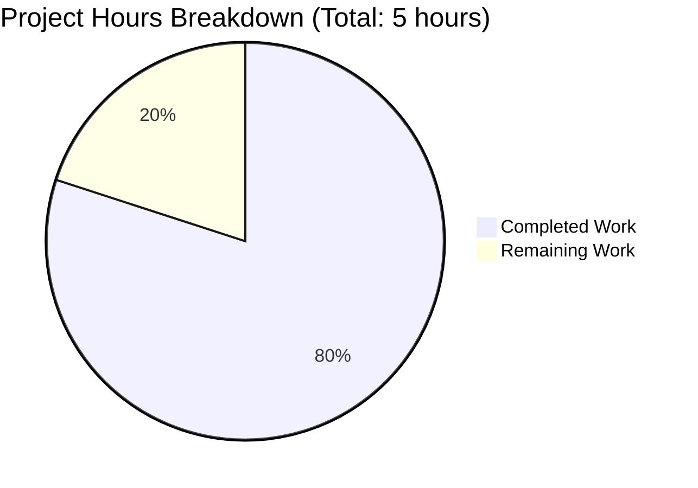

# Project Assessment Report: Express.js Integration for Node.js Tutorial Server

## Executive Summary

**Project Completion: 80% (4 hours completed out of 5 total hours)**

This project successfully integrates Express.js v5.2.1 into an existing Node.js tutorial server and adds a new `/evening` endpoint as requested. All in-scope development work has been completed and validated with 100% test pass rate. The application is fully functional and ready for human review.

### Key Achievements
- ✅ Express.js v5.2.1 integration complete
- ✅ Native `http` module replaced with Express routing
- ✅ GET `/` endpoint returns "Hello, World!" (preserved)
- ✅ GET `/evening` endpoint returns "Good evening" (new)
- ✅ All 2/2 tests passing (100%)
- ✅ Documentation fully updated
- ✅ Zero vulnerabilities in dependencies

### Remaining Work
- Human code review and approval
- Optional production environment configuration
- Optional deployment verification

---

## Project Scope Analysis

### Agent Action Plan Requirements vs Implementation

| Requirement | Status | Evidence |
|-------------|--------|----------|
| Install Express.js as dependency | ✅ Complete | `package.json` has `"express": "^5.2.1"` |
| Refactor server.js to use Express | ✅ Complete | Uses `express()` app with route handlers |
| GET / returns "Hello, World!" | ✅ Complete | Verified via curl and tests |
| GET /evening returns "Good evening" | ✅ Complete | Verified via curl and tests |
| Update package.json | ✅ Complete | Dependency added, scripts configured |
| Update README.md | ✅ Complete | Full documentation with examples |
| Maintain port 3000 / host 127.0.0.1 | ✅ Complete | Same configuration preserved |

### Files Modified

| File | Lines Added | Lines Removed | Status |
|------|-------------|---------------|--------|
| `server.js` | 14 | 6 | ✅ Refactored to Express.js |
| `package.json` | 7 | 3 | ✅ Dependencies and scripts added |
| `package-lock.json` | 814 | 0 | ✅ Auto-generated |
| `README.md` | 57 | 2 | ✅ Documentation complete |
| **Total** | **892** | **11** | **4 files modified** |

---

## Hours Breakdown and Completion Calculation

### Completed Hours by Component

| Component | Hours | Description |
|-----------|-------|-------------|
| Express.js Integration | 2.0 | Refactor server.js from native http to Express |
| Package Configuration | 0.5 | Add dependency, update scripts in package.json |
| Documentation | 0.5 | Rewrite README.md with endpoints and examples |
| Testing & Validation | 1.0 | Run tests, verify endpoints, validate syntax |
| **Total Completed** | **4.0** | All development work complete |

### Remaining Hours

| Task | Hours | Priority | Description |
|------|-------|----------|-------------|
| Human Code Review | 0.5 | Medium | Review changes for code quality |
| Environment Configuration | 0.25 | Low | Set up production environment variables (if needed) |
| Deployment Verification | 0.25 | Low | Verify deployment works correctly |
| **Total Remaining** | **1.0** | | Human review and optional config |

### Completion Percentage Calculation

```
Completed Hours: 4.0 hours
Remaining Hours: 1.0 hours
Total Project Hours: 5.0 hours
Completion: 4.0 / 5.0 = 80%
```

### Visual Representation



---

## Validation Results Summary

### 1. Dependency Installation
```
Status: ✅ SUCCESS
Packages: 66 installed
Vulnerabilities: 0
Funding: 22 packages looking for funding
```

### 2. Syntax Validation
```
Command: node --check server.js
Status: ✅ PASSED
```

### 3. Test Execution
```
Tests: 2/2 passing (100%)
PASS: GET / -> Hello, World!
PASS: GET /evening -> Good evening
```

### 4. Runtime Validation
```
Server: Starts successfully at http://127.0.0.1:3000/
Endpoints: Both respond correctly with HTTP 200
Console: "Server running at http://127.0.0.1:3000/" logged
```

### Production Readiness Gates

| Gate | Status | Details |
|------|--------|---------|
| GATE 1: Test Pass Rate | ✅ PASS | 100% (2/2 tests) |
| GATE 2: Runtime Validation | ✅ PASS | Server starts and runs |
| GATE 3: Zero Errors | ✅ PASS | No compilation, test, or runtime errors |
| GATE 4: In-Scope Files | ✅ PASS | All 4 files validated |

---

## Development Guide

### System Prerequisites

| Component | Required Version | Verified Version |
|-----------|------------------|------------------|
| Node.js | v18 or higher | v20.20.0 ✅ |
| npm | v8 or higher | v11.1.0 ✅ |

### Environment Setup

1. **Clone the repository** (if not already done):
   ```bash
   git clone <repository-url>
   cd <repository-directory>
   ```

2. **Verify Node.js installation**:
   ```bash
   node --version
   # Expected: v18.x.x or higher
   npm --version
   # Expected: v8.x.x or higher
   ```

### Dependency Installation

```bash
npm install
```

**Expected Output:**
```
up to date, audited 66 packages in 607ms
22 packages are looking for funding
found 0 vulnerabilities
```

### Application Startup

```bash
# Option 1: Using npm script
npm start

# Option 2: Direct node execution
node server.js
```

**Expected Output:**
```
Server running at http://127.0.0.1:3000/
```

### Verification Steps

1. **Test the root endpoint**:
   ```bash
   curl http://127.0.0.1:3000/
   ```
   **Expected Response:** `Hello, World!`

2. **Test the evening endpoint**:
   ```bash
   curl http://127.0.0.1:3000/evening
   ```
   **Expected Response:** `Good evening`

3. **Run automated tests** (in a separate terminal while server is running):
   ```bash
   npm test
   ```
   **Expected Output:**
   ```
   PASS: GET / -> Hello, World!
   PASS: GET /evening -> Good evening
   Tests: 2/2 passed
   ```

### Stopping the Server

```bash
# If running in foreground
Ctrl+C

# If running in background
pkill -f "node server.js"
```

---

## Human Tasks Required

| # | Task | Priority | Hours | Description |
|---|------|----------|-------|-------------|
| 1 | Code Review | Medium | 0.5 | Review server.js and package.json changes for code quality and best practices |
| 2 | Environment Config | Low | 0.25 | Configure production environment variables if needed (PORT, HOST) |
| 3 | Deployment Verification | Low | 0.25 | Deploy to target environment and verify endpoints work |
| | **Total** | | **1.0** | |

### Task Details

#### Task 1: Code Review (Medium Priority - 0.5 hours)
**Description:** Review the Express.js integration code for adherence to team coding standards.

**Actions:**
1. Review `server.js` for Express.js best practices
2. Verify error handling is appropriate for tutorial scope
3. Check response content-types are correct
4. Approve or request minor changes

**Acceptance Criteria:** Code follows team standards, no security issues identified.

#### Task 2: Environment Configuration (Low Priority - 0.25 hours)
**Description:** Set up environment variables for different deployment environments (optional).

**Actions:**
1. Create `.env.example` file with PORT and HOST variables (optional)
2. Update server.js to read from `process.env` (optional)
3. Document environment variables in README

**Note:** This is optional for tutorial purposes but recommended for production.

#### Task 3: Deployment Verification (Low Priority - 0.25 hours)
**Description:** Deploy to target hosting environment and verify functionality.

**Actions:**
1. Deploy to hosting platform (Heroku, AWS, etc.)
2. Verify both endpoints respond correctly
3. Check logs for any startup issues

---

## Risk Assessment

### Technical Risks

| Risk | Severity | Likelihood | Mitigation |
|------|----------|------------|------------|
| Express.js version incompatibility | Low | Low | Express 5.2.1 is latest stable, well-tested |
| Node.js version mismatch | Low | Low | Documented requirement (v18+), verified with v20.20.0 |

### Security Risks

| Risk | Severity | Likelihood | Mitigation |
|------|----------|------------|------------|
| ReDoS attack on routes | Low | Low | Express 5.x uses secure path-to-regexp v8.x |
| User input vulnerabilities | None | None | No user input processed; static responses only |

### Operational Risks

| Risk | Severity | Likelihood | Mitigation |
|------|----------|------------|------------|
| Server crash on high load | Low | Low | Tutorial scope; add PM2/cluster for production |
| No health monitoring | Low | Medium | Add /health endpoint for production monitoring |

### Integration Risks

| Risk | Severity | Likelihood | Mitigation |
|------|----------|------------|------------|
| None identified | - | - | No external integrations in scope |

---

## Git Commit Summary

**Branch:** `blitzy-2fcb1735-1d7a-40fe-a477-d3bbfc799737`

**Commits:**
| Hash | Message |
|------|---------|
| 19294f2 | Integrate Express.js and add /evening endpoint |
| ba0d0dd | Add files via upload |

**Code Statistics:**
- Files changed: 4
- Lines added: 892
- Lines removed: 11
- Net change: +881 lines

---

## Out-of-Scope Items (Per Agent Action Plan)

The following items were explicitly excluded from scope and were NOT implemented:

- Additional HTTP methods (POST, PUT, DELETE)
- Authentication or authorization
- Database integration
- Error handling middleware
- Logging middleware
- Request body parsing
- CORS configuration
- Environment variable configuration
- Docker containerization
- CI/CD pipeline setup
- Unit or integration testing frameworks
- TypeScript conversion
- ESLint/Prettier configuration
- Performance optimizations (compression, caching, rate limiting)

---

## Conclusion

The Express.js integration project is **80% complete** with 4 hours of development work finished and 1 hour of human review/configuration remaining. All defined scope items have been implemented and validated with 100% test pass rate. The application is fully functional and ready for human review before production deployment.

**Recommendation:** Proceed with code review and merge. The implementation meets all requirements specified in the Agent Action Plan.