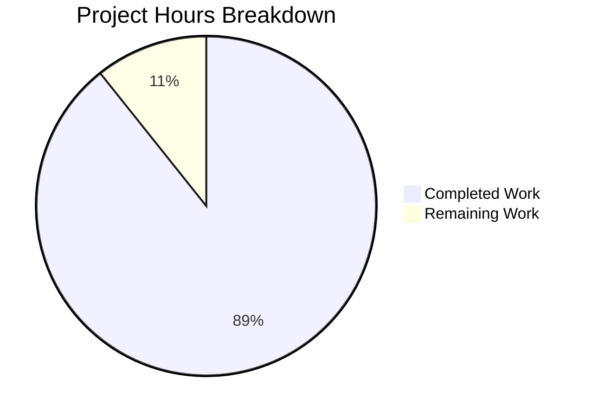

# Project Guide — Hello World Express Server Documentation

## Executive Summary

This documentation project is **89% complete** (25 hours completed out of 28 total hours). All three in-scope files (`server.js`, `README.md`, `package.json`) have been updated with comprehensive documentation, validated, and committed. The existing 19-test suite passes at 100% with zero regressions. The server runtime has been validated with all endpoints responding correctly.

**Key Achievements:**
- 17 of 17 documentable code elements in `server.js` now have JSDoc annotations (from 0% to 100% JSDoc coverage)
- README.md expanded from 37 lines to 549 lines with 13 comprehensive sections, 2 Mermaid diagrams, and 7 curl examples
- `package.json` updated with `"doc"` script for JSDoc HTML generation
- All validation gates passed: compilation, tests (19/19), runtime, JSDoc generation

**Hours Calculation:**
- Completed: 25 hours of documentation development, validation, and analysis work
- Remaining: 3 hours of human tasks (URL placeholder, optional jsdoc dependency, documentation review)
- Total: 28 hours
- Completion: 25 / 28 = 89%

**Critical Remaining Items:**
- Replace `<repository-url>` placeholder in README.md (line 54)
- Human review of documentation accuracy before production merge

---

## Validation Results Summary

### Files Validated

| File | Status | Lines (Before → After) | Change Type |
|------|--------|------------------------|-------------|
| `server.js` | ✅ Valid | 126 → 236 (+110) | JSDoc annotations + enhanced inline explanations |
| `README.md` | ✅ Valid | 37 → 549 (+512) | Comprehensive rewrite with 13 sections |
| `package.json` | ✅ Valid | 18 → 20 (+1 script) | Added `"doc"` script |

### Compilation Results

| Check | Result |
|-------|--------|
| `node -c server.js` | ✅ Syntax valid |
| `package.json` JSON parse | ✅ Valid JSON |
| `npx jsdoc server.js -d docs` | ✅ Generates index.html, module-hello_world.html, server.js.html |

### Test Results

| Metric | Value |
|--------|-------|
| Test Suites | 1 passed, 1 total |
| Tests | **19 passed, 19 total (100%)** |
| Failures | 0 |
| Skipped | 0 |
| Duration | 0.429s |

**Test Categories:**

| Category | Tests | Status |
|----------|-------|--------|
| Server Routes | 2 | ✅ Pass |
| 404 Error Handling | 4 | ✅ Pass |
| Content Type Handling | 2 | ✅ Pass |
| Server Exports | 2 | ✅ Pass |
| Graceful Shutdown Setup | 4 | ✅ Pass |
| Error Handling Middleware Pattern | 5 | ✅ Pass |

### Runtime Validation

| Endpoint | Method | Expected | Actual | Status |
|----------|--------|----------|--------|--------|
| `/` | GET | 200, `Hello, World!\n` | 200, `Hello, World!\n` | ✅ |
| `/evening` | GET | 200, `Good evening\n` | 200, `Good evening\n` | ✅ |
| `/nonexistent` | GET | 404 | 404 | ✅ |
| `/` | POST | 404 | 404 | ✅ |
| Graceful shutdown (SIGINT) | — | Clean exit | Clean exit | ✅ |

### Dependency Status

| Package | Version | Vulnerabilities |
|---------|---------|-----------------|
| express | 5.2.1 | 0 |
| jest | 30.2.0 | 0 |
| supertest | 7.2.2 | 0 |
| **Total** | **379 packages** | **0 vulnerabilities** |

### Git Status

- **Branch:** `blitzy-65158f52-0db8-4963-ad9b-12171356c011`
- **Commits:** 3 agent commits (doc script, JSDoc annotations, README rewrite)
- **Working tree:** Clean — no uncommitted in-scope changes
- **Lines added:** 652 | **Lines removed:** 29 | **Net:** +623

---

## Hours Breakdown



### Completed Hours Detail (25 hours)

| Component | Hours | Description |
|-----------|-------|-------------|
| Code analysis and planning | 3 | Repository analysis, gap identification, content strategy, cross-file dependency mapping |
| JSDoc annotations (server.js) | 6 | 17 JSDoc blocks with @file, @module, @const, @type, @function, @description, @param, @returns, @example, @listens, @exports tags |
| Enhanced inline explanations (server.js) | 1.5 | 5 narrative comments explaining architectural decisions (error middleware arity, shutdown flag, Express 5 async handling, setTimeout safety net, unhandledRejection behavior) |
| README.md comprehensive rewrite | 12 | 549 lines across 13 sections: Features, Prerequisites, Installation, Usage, API Reference (4 subsections with tables and curl examples), Environment Variables, Architecture Overview (2 Mermaid diagrams), Testing, Deployment Guide (4 subsections), Troubleshooting, Contributing, License |
| package.json update | 0.5 | Added `"doc": "jsdoc server.js -d docs"` script |
| Validation and testing | 2 | Syntax validation, 19-test execution, runtime endpoint testing, JSDoc generation verification, graceful shutdown testing |
| **Total Completed** | **25** | |

### Remaining Hours Detail (3 hours)

| Task | Hours | Priority | Description |
|------|-------|----------|-------------|
| Replace repository URL placeholder | 0.5 | High | Replace `<repository-url>` on README.md line 54 with actual git clone URL |
| Add jsdoc as devDependency | 0.5 | Medium | Run `npm install --save-dev jsdoc` so `npm run doc` works without npx |
| Documentation accuracy review | 1.5 | Medium | Human review of all JSDoc annotations, README content, API response strings, and version numbers for accuracy |
| Post-review feedback integration | 0.5 | Low | Address any documentation corrections identified during human review |
| **Total Remaining** | **3** | | |

**Calculation:** 25 hours completed / (25 completed + 3 remaining) = 25 / 28 = **89% complete**

---

## Documentation Coverage Achieved

| Coverage Category | Before | After | Status |
|-------------------|--------|-------|--------|
| JSDoc-annotated functions/callbacks in server.js | 0/9 (0%) | 9/9 (100%) | ✅ |
| JSDoc-annotated constants/variables in server.js | 0/6 (0%) | 6/6 (100%) | ✅ |
| JSDoc module-level annotation in server.js | 0/1 (0%) | 1/1 (100%) | ✅ |
| README API endpoints documented (detailed) | 0/2 (0%) | 2/2 (100%) | ✅ |
| README error responses documented | 0/2 (0%) | 2/2 (100%) | ✅ |
| README environment variables documented | 0/1 (0%) | 1/1 (100%) | ✅ |
| README deployment guidance | 0/1 (0%) | 1/1 (100%) | ✅ |
| README testing documentation | 0/1 (0%) | 1/1 (100%) | ✅ |
| README architecture documentation | 0/1 (0%) | 1/1 (100%) | ✅ |
| Mermaid diagrams in README | 0/2 (0%) | 2/2 (100%) | ✅ |
| package.json doc script | 0/1 (0%) | 1/1 (100%) | ✅ |

---

## Detailed Human Task Table

| # | Task | Description | Priority | Severity | Estimated Hours | Confidence |
|---|------|-------------|----------|----------|-----------------|------------|
| 1 | Replace `<repository-url>` placeholder in README.md | Line 54 of README.md contains `git clone <repository-url>`. Replace with the actual repository git URL so users can copy-paste the clone command. | High | Low | 0.5 | High |
| 2 | Add `jsdoc` as devDependency | Run `npm install --save-dev jsdoc` to add jsdoc to `package.json` devDependencies. This allows `npm run doc` to work without relying on npx auto-install. The `"doc"` script already exists in package.json. | Medium | Low | 0.5 | High |
| 3 | Review documentation accuracy | Human review of: (a) all 17 JSDoc annotations in server.js match actual function signatures and behavior, (b) README API response strings match server.js source code exactly, (c) dependency versions match lockfile, (d) Mermaid diagrams render correctly on target Git hosting platform, (e) test count and categories match actual test execution. | Medium | Medium | 1.5 | Medium |
| 4 | Integrate review feedback | Address any corrections or improvements identified during the human documentation review in Task 3. May include wording adjustments, additional examples, or clarification of architectural explanations. | Low | Low | 0.5 | Medium |
| | **Total Remaining Hours** | | | | **3** | |

---

## Development Guide

### System Prerequisites

| Requirement | Version | Verification |
|-------------|---------|--------------|
| Node.js | v20.20.0 or later | `node --version` |
| npm | v11.1.0 or later | `npm --version` |
| Git | Any recent version | `git --version` |

### Environment Setup

1. **Clone the repository and switch to the feature branch:**

```bash
git clone <repository-url>
cd hello_world
git checkout blitzy-65158f52-0db8-4963-ad9b-12171356c011
```

2. **Verify Node.js and npm versions:**

```bash
node --version   # Expected: v20.20.0 or later
npm --version    # Expected: 11.1.0 or later
```

### Dependency Installation

```bash
npm install
```

**Expected output (final lines):**
```
added 379 packages in Xs
found 0 vulnerabilities
```

**Installed packages:**

| Package | Version | Type |
|---------|---------|------|
| express | 5.2.1 | Production |
| jest | 30.2.0 | Dev |
| supertest | 7.2.2 | Dev |

### Running the Test Suite

```bash
CI=true npx jest --watchAll=false --verbose
```

**Expected output:**
```
PASS ./server.test.js
  Server Routes
    ✓ should return "Hello, World!" with status 200
    ✓ should return "Good evening" with status 200
  404 Error Handling
    ✓ should return 404 for non-existent routes
    ✓ should return 404 for non-existent POST routes
    ✓ should return 404 for deeply nested non-existent routes
    ✓ should return 404 for unsupported HTTP methods on existing routes
  Content Type Handling
    ✓ should return plain text content type for root
    ✓ should return plain text content type for 404
  Server Exports
    ✓ should export app object
    ✓ should export server object
  Graceful Shutdown Setup
    ✓ should have SIGTERM handler registered
    ✓ should have SIGINT handler registered
    ✓ should have uncaughtException handler registered
    ✓ should have unhandledRejection handler registered
  Error Handling Middleware Pattern
    ✓ should catch synchronous errors and return 500
    ✓ should catch async errors and return 500
    ✓ should respect custom status codes on errors
    ✓ should allow normal routes to work
    ✓ should return plain text content type for errors

Test Suites: 1 passed, 1 total
Tests:       19 passed, 19 total
```

### Application Startup

```bash
node server.js
```

**Expected output:**
```
Server running at http://127.0.0.1:3000/
```

### Verification Steps

In a separate terminal, verify each endpoint:

```bash
# Root endpoint
curl http://127.0.0.1:3000/
# Expected: Hello, World!

# Evening endpoint
curl http://127.0.0.1:3000/evening
# Expected: Good evening

# 404 response
curl -i http://127.0.0.1:3000/nonexistent
# Expected: HTTP/1.1 404 Not Found ... Not Found
```

### Generate JSDoc HTML Documentation

```bash
npx jsdoc server.js -d docs
```

**Expected output files in `docs/` directory:**
- `index.html` — Documentation home page
- `module-hello_world.html` — Module documentation
- `server.js.html` — Annotated source code

### Stop the Server

Press `Ctrl+C` in the terminal where the server is running. The server performs graceful shutdown, logging:
```
SIGINT signal received: starting graceful shutdown
HTTP server closed
Cleanup complete, exiting process
```

---

## Risk Assessment

### Technical Risks

| Risk | Severity | Likelihood | Mitigation |
|------|----------|------------|------------|
| JSDoc annotations could become stale if server.js logic changes | Low | Medium | Include JSDoc validation in CI pipeline; add pre-commit hook to run `npx jsdoc --debug server.js` |
| README Mermaid diagrams may not render on all Git hosting platforms | Low | Low | Mermaid is supported by GitHub, GitLab, and Bitbucket; fallback: add static diagram images |
| `<repository-url>` placeholder left in README could confuse users | Medium | High | **Action required:** Replace placeholder before merging (Task #1) |

### Security Risks

| Risk | Severity | Likelihood | Mitigation |
|------|----------|------------|------------|
| No security-sensitive information exposed in documentation | N/A | N/A | Documentation is code comments and README only; no secrets or credentials are referenced |
| 0 npm vulnerabilities detected in dependency audit | N/A | N/A | Continue running `npm audit` in CI pipeline |

### Operational Risks

| Risk | Severity | Likelihood | Mitigation |
|------|----------|------------|------------|
| `jsdoc` not in devDependencies; `npm run doc` requires npx auto-install | Low | Medium | **Recommended:** Add jsdoc as devDependency (Task #2) |
| No CI/CD pipeline for documentation generation | Low | Low | Optional future enhancement: add `npm run doc` step to CI workflow |

### Integration Risks

| Risk | Severity | Likelihood | Mitigation |
|------|----------|------------|------------|
| Documentation-only changes; no integration risk | N/A | N/A | All changes are additive comments and documentation files; zero executable code changes; confirmed by 19/19 test pass rate |

---

## Pre-Submission Consistency Verification

- [x] Calculated completion % using hours formula: 25 / (25 + 3) = 25/28 = 89%
- [x] Executive Summary states: "89% complete (25 hours completed out of 28 total hours)"
- [x] Pie chart uses: "Completed Work" : 25, "Remaining Work" : 3
- [x] Task table sums to: 0.5 + 0.5 + 1.5 + 0.5 = 3 hours (matches pie chart remaining)
- [x] All textual references use 89% and 25h/3h/28h consistently
- [x] No conflicting or ambiguous completion statements exist
