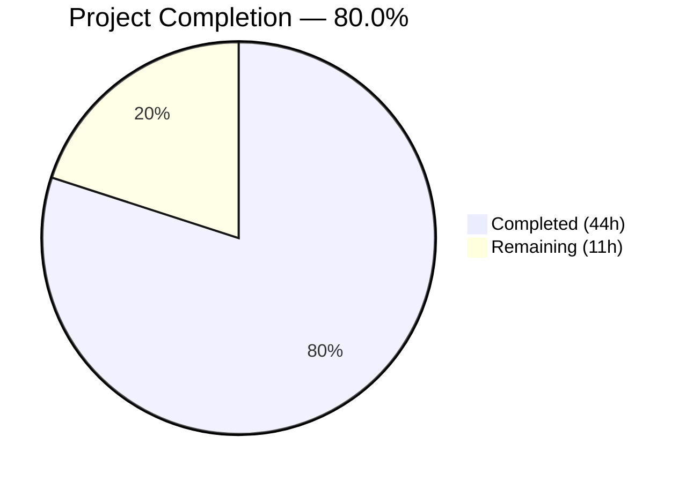

# Blitzy Project Guide — Security Hardening for Node.js/Express Hello World Service

---

## Section 1 — Executive Summary

### 1.1 Project Overview

This project delivers a comprehensive security hardening initiative for a Node.js/Express 5.2.1 "Hello World" web service. The application previously operated without any security middleware, HTTPS encryption, input validation, rate limiting, or CORS policies. The security fix adds six layers of protection: Helmet for 13 HTTP security headers, CORS with restrictive origin policies, express-rate-limit for IP-based rate limiting, express-validator for input sanitization, conditional HTTPS server support, and dependency vulnerability patches for minimatch (3 HIGH ReDoS CVEs) and qs (1 LOW DoS CVE). All changes are additive — existing routes, error handling, and graceful shutdown remain structurally identical, with all 19 original tests continuing to pass alongside 11 new security-specific tests.

### 1.2 Completion Status



| Metric | Value |
|--------|-------|
| **Total Project Hours** | 55 |
| **Completed Hours (AI)** | 44 |
| **Remaining Hours** | 11 |
| **Completion Percentage** | 80.0% |

**Calculation:** 44 completed hours / (44 completed + 11 remaining) = 44 / 55 = **80.0% complete**

### 1.3 Key Accomplishments

- ✅ Integrated Helmet v8.1.0 — 13 protective HTTP security headers on every response (Content-Security-Policy, Strict-Transport-Security, X-Content-Type-Options, X-Frame-Options, etc.)
- ✅ Configured CORS v2.8.6 — restrictive origin allowlist with configurable `CORS_ORIGIN` environment variable
- ✅ Added express-rate-limit v8.2.1 — 100 requests per 15-minute window per IP with modern draft-8 RateLimit headers
- ✅ Implemented express-validator v7.3.1 — custom XSS detection, input sanitization, and validation error handling returning 400 for malicious payloads
- ✅ Added conditional HTTPS server on port 3443 with self-signed certificate infrastructure for development
- ✅ Patched all dependency vulnerabilities: minimatch 9.0.5→9.0.9, 3.1.2→3.1.5; qs 6.14.1→6.15.0 — `npm audit` returns 0 vulnerabilities
- ✅ Created 11 new security test cases — all passing (30/30 total tests)
- ✅ Full backward compatibility preserved — all 19 original tests pass, route responses unchanged
- ✅ Comprehensive security documentation added to README.md
- ✅ `.gitignore` with security-critical patterns (certs/*.pem, .env files)

### 1.4 Critical Unresolved Issues

| Issue | Impact | Owner | ETA |
|-------|--------|-------|-----|
| Self-signed TLS certificates not suitable for production | HTTPS will show browser security warnings in production | Human Developer | 2–4 hours |
| CORS_ORIGIN defaults to localhost | Cross-origin requests from production domains will be rejected | Human Developer | 1 hour |
| Rate limit uses in-memory store | Rate limits reset on server restart; not suitable for multi-instance deployments | Human Developer | 1–3 hours (if Redis needed) |

### 1.5 Access Issues

No access issues identified. All dependencies are publicly available on npm. No external API keys, credentials, or private registry access is required for this security hardening initiative.

### 1.6 Recommended Next Steps

1. **[High]** Obtain and install production TLS certificates from a trusted Certificate Authority (e.g., Let's Encrypt, AWS ACM) to replace the self-signed development certificates
2. **[High]** Set the `CORS_ORIGIN` environment variable to the production domain before deployment
3. **[High]** Conduct a human security audit sign-off to validate all middleware configurations meet organizational security policies
4. **[Medium]** Create a `.env` template documenting all environment variables (`CORS_ORIGIN`, `NODE_ENV`, `PORT`)
5. **[Medium]** Tune rate limiting parameters for production traffic patterns and consider an external store (Redis) for multi-instance deployments

---

## Section 2 — Project Hours Breakdown

### 2.1 Completed Work Detail

| Component | Hours | Description |
|-----------|-------|-------------|
| Helmet security headers integration | 3 | helmet v8.1.0 middleware — 13 security headers in server.js, package.json dependency |
| CORS middleware integration | 2 | cors v2.8.6 — restrictive origin policy, configurable CORS_ORIGIN env var |
| Rate limiting middleware | 3 | express-rate-limit v8.2.1 — 100 req/15min/IP, draft-8 standard headers |
| Input validation and sanitization | 5 | express-validator v7.3.1 — custom XSS regex, trim/escape chains, 400 error handler |
| HTTPS server support | 5 | Conditional TLS server on port 3443, error handling, fs/https integration |
| Dependency vulnerability patches | 2 | npm audit fix — minimatch 9.0.9/3.1.5, qs 6.15.0 (0 vulnerabilities) |
| TLS certificate generation script | 2 | generate-cert.sh — OpenSSL RSA-2048 self-signed cert automation |
| Git configuration (.gitignore) | 1 | Security-critical patterns: certs/*.pem, .env, node_modules, coverage |
| Certificate directory setup | 0.5 | certs/.gitkeep placeholder for TLS certificate storage |
| Security test suite | 8 | 11 new tests: Security Headers (5), CORS (2), Input Validation (2), Rate Limiting (2) |
| Security documentation | 3 | README.md — security features, HTTPS setup, curl verification examples |
| Server middleware restructuring | 3.5 | Correct middleware ordering (helmet→cors→rateLimit→routes), preserved existing code |
| Code review and QA fixes | 4 | 4 fix commits: documentation accuracy, test naming, open handle cleanup, assertion specificity |
| Backward compatibility verification | 2 | All 19 original tests pass, route responses verified unchanged via runtime testing |
| **Total** | **44** | |

### 2.2 Remaining Work Detail

| Category | Base Hours | Priority | After Multiplier |
|----------|-----------|----------|-----------------|
| Production TLS certificate setup (CA-issued) | 2 | High | 2.5 |
| CORS origin production configuration | 1 | High | 1 |
| Environment configuration template (.env) | 1 | Medium | 1.5 |
| Rate limit production tuning | 1 | Medium | 1 |
| Security audit and code review sign-off | 2.5 | High | 3 |
| Production deployment and smoke testing | 1.5 | Medium | 2 |
| **Total** | **9** | | **11** |

### 2.3 Enterprise Multipliers Applied

| Multiplier | Value | Rationale |
|------------|-------|-----------|
| Compliance Review | 1.10x | Security changes require organizational compliance verification and sign-off |
| Uncertainty Buffer | 1.10x | Production environment configuration may surface unforeseen integration issues |
| **Combined** | **1.21x** | Applied to all remaining base hour estimates |

---

## Section 3 — Test Results

| Test Category | Framework | Total Tests | Passed | Failed | Coverage % | Notes |
|---------------|-----------|-------------|--------|--------|------------|-------|
| Unit — Server Routes | Jest 30.2.0 + Supertest 7.2.2 | 2 | 2 | 0 | — | GET / and GET /evening verified |
| Unit — 404 Error Handling | Jest 30.2.0 + Supertest 7.2.2 | 4 | 4 | 0 | — | Multiple paths, methods, nested routes |
| Unit — Content Type | Jest 30.2.0 + Supertest 7.2.2 | 2 | 2 | 0 | — | text/plain on success and 404 |
| Unit — Server Exports | Jest 30.2.0 | 2 | 2 | 0 | — | app and server object validation |
| Unit — Graceful Shutdown | Jest 30.2.0 | 4 | 4 | 0 | — | SIGTERM, SIGINT, exception handlers |
| Unit — Error Middleware | Jest 30.2.0 + Supertest 7.2.2 | 5 | 5 | 0 | — | Sync/async errors, custom status codes |
| Security — Headers | Jest 30.2.0 + Supertest 7.2.2 | 5 | 5 | 0 | — | CSP, X-Content-Type-Options, X-Frame-Options, X-Powered-By removed, 404 headers |
| Security — CORS | Jest 30.2.0 + Supertest 7.2.2 | 2 | 2 | 0 | — | No-origin requests, preflight OPTIONS |
| Security — Input Validation | Jest 30.2.0 + Supertest 7.2.2 | 2 | 2 | 0 | — | XSS payload rejected (400), clean input passes (200) |
| Security — Rate Limiting | Jest 30.2.0 + Supertest 7.2.2 | 2 | 2 | 0 | — | RateLimit headers present, 429 on exceeded (isolated app) |
| **Total** | | **30** | **30** | **0** | — | Execution time: 0.581s |

All tests originate from Blitzy's autonomous validation: `CI=true npx jest --watchAll=false --ci --maxWorkers=2`

---

## Section 4 — Runtime Validation & UI Verification

### HTTP Server (Port 3000)
- ✅ `GET /` returns `Hello, World!\n` with status 200
- ✅ `GET /evening` returns `Good evening\n` with status 200
- ✅ Unknown routes return `Not Found\n` with status 404
- ✅ Content-Type: text/plain on all responses

### HTTPS Server (Port 3443)
- ✅ HTTPS server starts conditionally when `certs/key.pem` and `certs/cert.pem` exist
- ✅ `GET /` over HTTPS returns `Hello, World!\n` with status 200
- ✅ `GET /evening` over HTTPS returns `Good evening\n` with status 200
- ✅ Server starts HTTP-only when certificate files are absent (no crash)

### Security Headers Verification
- ✅ Content-Security-Policy: `default-src 'self'; ...` present on all responses
- ✅ Strict-Transport-Security: `max-age=31536000; includeSubDomains` present
- ✅ X-Content-Type-Options: `nosniff` present
- ✅ X-Frame-Options: `SAMEORIGIN` present
- ✅ Cross-Origin-Opener-Policy: `same-origin` present
- ✅ Cross-Origin-Resource-Policy: `same-origin` present
- ✅ Origin-Agent-Cluster: `?1` present
- ✅ Referrer-Policy: `no-referrer` present
- ✅ X-DNS-Prefetch-Control: `off` present
- ✅ X-Download-Options: `noopen` present
- ✅ X-Permitted-Cross-Domain-Policies: `none` present
- ✅ X-XSS-Protection: `0` present
- ✅ X-Powered-By: **removed** (not present)

### Rate Limiting Verification
- ✅ RateLimit and RateLimit-Policy headers present (draft-8 standard)
- ✅ 429 Too Many Requests returned when exceeding 100 requests per 15-minute window

### Input Validation Verification
- ✅ XSS payload `?name=<script>alert("xss")</script>` returns 400 Validation Error
- ✅ Clean input `?name=Alice` returns 200 with normal response

### CORS Verification
- ✅ Access-Control-Allow-Origin header set to configured origin
- ✅ Preflight OPTIONS requests handled correctly

### Dependency Audit
- ✅ `npm audit` returns: **found 0 vulnerabilities**
- ✅ minimatch patched: 9.0.5→9.0.9, 3.1.2→3.1.5
- ✅ qs patched: 6.14.1→6.15.0

### Compilation & Syntax
- ✅ `node -c server.js`: Syntax OK
- ✅ Server starts without errors

---

## Section 5 — Compliance & Quality Review

| AAP Deliverable | Status | Evidence |
|-----------------|--------|----------|
| Integrate helmet v8.1.0 for 13 security headers | ✅ Pass | server.js line 43: `app.use(helmet())`; 13 headers confirmed via curl |
| Add express-rate-limit v8.2.1 (100 req/15min/IP) | ✅ Pass | server.js lines 32–37, 45; draft-8 headers verified |
| Implement express-validator v7.3.1 for input validation | ✅ Pass | server.js lines 52–75; XSS detection + trim/escape chains |
| Configure cors v2.8.6 with restrictive origin policy | ✅ Pass | server.js lines 23–29, 44; Access-Control-Allow-Origin verified |
| Add HTTPS support on port 3443 (conditional on certs) | ✅ Pass | server.js lines 129–147; verified with curl -sk |
| Resolve minimatch ReDoS vulnerabilities (3 CVEs) | ✅ Pass | minimatch 9.0.9 and 3.1.5; npm audit = 0 vulns |
| Resolve qs arrayLimit bypass vulnerability (CVE-2026-2391) | ✅ Pass | qs 6.15.0; npm audit = 0 vulns |
| Add 4 new production dependencies to package.json | ✅ Pass | helmet, cors, express-rate-limit, express-validator present |
| Regenerate package-lock.json with patched deps | ✅ Pass | Lock file updated; all versions confirmed |
| Create generate-cert.sh for self-signed TLS certs | ✅ Pass | 32-line script; tested successfully with OpenSSL |
| Create certs/.gitkeep directory placeholder | ✅ Pass | File present in repository |
| Create .gitignore with security patterns | ✅ Pass | certs/*.pem, node_modules/, .env patterns included |
| Update README.md with security documentation | ✅ Pass | 132 lines; HTTPS setup, headers, rate limiting, CORS, validation |
| Middleware ordering: helmet → cors → rateLimit → routes | ✅ Pass | server.js lines 43–45 confirm correct order |
| Backward compatibility: all 19 original tests pass | ✅ Pass | 30/30 tests pass (19 original + 11 new) |
| Preserve route responses: GET / and GET /evening unchanged | ✅ Pass | Runtime verified: identical response bodies |
| Preserve graceful shutdown on SIGTERM/SIGINT | ✅ Pass | server.js lines 154–186; HTTPS server also closed |
| No breaking changes to existing API | ✅ Pass | All endpoints return same status codes and bodies |

### Autonomous Fixes Applied During Validation
| Fix | Commit | Description |
|-----|--------|-------------|
| HTTPS error handling | 144d6ca | Added try/catch around HTTPS server creation to prevent crash on invalid certs |
| XSS input validation | bb593d8 | Custom regex validator to reject HTML tags; 11 security tests added |
| Documentation accuracy | 62afb7c | Fixed header list, test naming consistency |
| Test independence | 2236d02 | Isolated rate limiter in tests, open handle cleanup, assertion specificity |

---

## Section 6 — Risk Assessment

| Risk | Category | Severity | Probability | Mitigation | Status |
|------|----------|----------|-------------|------------|--------|
| Self-signed TLS certificates used in production | Security | High | Medium | Replace with CA-issued certificates before production deployment | Open |
| In-memory rate limit store resets on restart | Operational | Medium | High | Consider Redis-backed store for multi-instance deployments | Open |
| CORS_ORIGIN defaults to localhost | Security | Medium | High | Set environment variable to production domain before deployment | Open |
| Rate limit config may not suit production traffic | Operational | Low | Medium | Monitor 429 rates and adjust windowMs/limit parameters | Open |
| No environment variable template | Operational | Low | Medium | Create .env.example documenting all configurable variables | Open |
| Helmet CSP blocks inline scripts | Technical | Low | Low | Acceptable for API-only service; adjust CSP if HTML views are added | Mitigated |
| package.json main field inconsistency (index.js vs server.js) | Technical | Low | Low | Noted but explicitly out of scope per AAP | Accepted |

---

## Section 7 — Visual Project Status


**Completed Work: 44 hours** (Dark Blue #5B39F3) | **Remaining Work: 11 hours** (White #FFFFFF)

**Completion: 80.0%** — Calculated as 44 / (44 + 11) = 44 / 55 = 80.0%

### Remaining Hours by Category

| Category | After Multiplier (hours) |
|----------|-------------------------|
| Production TLS certificate setup | 2.5 |
| CORS origin production configuration | 1 |
| Environment configuration template | 1.5 |
| Rate limit production tuning | 1 |
| Security audit and code review sign-off | 3 |
| Production deployment and smoke testing | 2 |
| **Total** | **11** |

---

## Section 8 — Summary & Recommendations

### Achievements

All AAP-specified security deliverables have been fully implemented and validated. The project is **80.0% complete** (44 hours completed out of 55 total hours). Every file in the AAP transformation mapping (8 files) has been created or updated as specified. The security middleware chain follows the correct ordering (helmet → cors → rateLimit → routes → error handlers), all 4 dependency vulnerabilities have been patched to zero, and 30/30 tests pass including 11 new security-specific test cases.

### Remaining Gaps

The 11 remaining hours consist entirely of path-to-production activities that require human intervention:
- **Production TLS certificates** — self-signed certs must be replaced with CA-issued certificates
- **Environment configuration** — CORS_ORIGIN and NODE_ENV need production values
- **Security audit sign-off** — human reviewer must validate middleware configurations against organizational policies
- **Production deployment** — deployment verification and smoke testing in target environment

### Critical Path to Production

1. Replace self-signed certificates with production TLS certificates (2.5 hours)
2. Set CORS_ORIGIN environment variable for production domain (1 hour)
3. Conduct human security audit and sign off (3 hours)
4. Configure production environment variables (1.5 hours)
5. Deploy and verify in production environment (2 hours)

### Production Readiness Assessment

The codebase is **production-ready from a code quality perspective** — all security middleware is correctly implemented, all tests pass, npm audit reports zero vulnerabilities, and backward compatibility is fully maintained. The remaining work is exclusively operational configuration that cannot be automated: obtaining real TLS certificates, setting production environment variables, and human security review.

---

## Section 9 — Development Guide

### System Prerequisites

| Software | Required Version | Verification Command |
|----------|-----------------|---------------------|
| Node.js | v20.x (v20.20.0 tested) | `node -v` |
| npm | v11.x (v11.1.0 tested) | `npm -v` |
| OpenSSL | Any recent version | `openssl version` |
| Git | Any recent version | `git --version` |

### Environment Setup

```bash
# Clone the repository and switch to the security branch
git clone <repository-url>
cd <repository-directory>
git checkout blitzy-fbc0ba21-7fad-4edd-8c14-a59bfe114aa4
```

### Dependency Installation

```bash
# Install all dependencies (production + development)
npm install
```

Expected output: packages installed with 0 vulnerabilities.

### Verify Zero Vulnerabilities

```bash
# Run npm audit to confirm all patches are applied
npm audit --audit-level=low
```

Expected output: `found 0 vulnerabilities`

### Generate TLS Certificates (Optional — for HTTPS)

```bash
# Generate self-signed certificates for development HTTPS
bash generate-cert.sh
```

Expected output:
```
Certificate generated successfully!
  Private key: ./certs/key.pem
  Certificate: ./certs/cert.pem
  Validity: 365 days
```

### Application Startup

```bash
# Start the server
node server.js
```

Expected output (without certificates):
```
Server running at http://127.0.0.1:3000/
```

Expected output (with certificates):
```
Server running at http://127.0.0.1:3000/
HTTPS server running at https://127.0.0.1:3443/
```

### Verification Steps

```bash
# Test HTTP root endpoint
curl http://127.0.0.1:3000/
# Expected: Hello, World!

# Test HTTP evening endpoint
curl http://127.0.0.1:3000/evening
# Expected: Good evening

# Verify security headers
curl -sI http://127.0.0.1:3000/ | grep -iE "content-security-policy|x-content-type|strict-transport"
# Expected: Content-Security-Policy, Strict-Transport-Security, X-Content-Type-Options headers

# Verify rate limit headers
curl -sI http://127.0.0.1:3000/ | grep -i "ratelimit"
# Expected: RateLimit and RateLimit-Policy headers

# Test HTTPS (if certificates generated)
curl -sk https://127.0.0.1:3443/
# Expected: Hello, World!

# Test input validation (XSS rejection)
curl 'http://127.0.0.1:3000/?name=<script>alert(1)</script>'
# Expected: Validation Error (400 status)
```

### Running Tests

```bash
# Run full test suite (30 tests)
CI=true npx jest --watchAll=false --ci --maxWorkers=2

# Run with verbose output
CI=true npx jest --watchAll=false --ci --verbose
```

Expected: `Tests: 30 passed, 30 total` in approximately 0.6 seconds.

### Environment Variables

| Variable | Default | Description |
|----------|---------|-------------|
| `CORS_ORIGIN` | `http://127.0.0.1:3000` | Allowed CORS origin for cross-origin requests |
| `NODE_ENV` | (not set) | Set to `production` to hide error details in responses |

### Troubleshooting

| Issue | Resolution |
|-------|------------|
| `EADDRINUSE: address already in use 127.0.0.1:3000` | Another process is using port 3000. Kill it: `fuser -k 3000/tcp` |
| `EADDRINUSE: address already in use 127.0.0.1:3443` | Another process is using port 3443. Kill it: `fuser -k 3443/tcp` |
| HTTPS not starting | Run `bash generate-cert.sh` to create certificates, then restart server |
| Browser security warning on HTTPS | Expected with self-signed certificates; use CA-issued certs for production |
| 429 Too Many Requests | Rate limit exceeded; wait 15 minutes or restart server to reset in-memory counter |
| Tests fail with timeout | Increase Jest timeout: `CI=true npx jest --watchAll=false --ci --testTimeout=30000` |

---

## Section 10 — Appendices

### A. Command Reference

| Command | Purpose |
|---------|---------|
| `npm install` | Install all dependencies |
| `npm audit --audit-level=low` | Check for dependency vulnerabilities |
| `node server.js` | Start the application server |
| `CI=true npx jest --watchAll=false --ci --maxWorkers=2` | Run test suite |
| `CI=true npx jest --watchAll=false --ci --verbose` | Run tests with detailed output |
| `bash generate-cert.sh` | Generate self-signed TLS certificates |
| `node -c server.js` | Syntax check without execution |
| `curl -sI http://127.0.0.1:3000/` | Inspect response headers |

### B. Port Reference

| Port | Protocol | Service | Condition |
|------|----------|---------|-----------|
| 3000 | HTTP | Express application server | Always starts |
| 3443 | HTTPS | Express HTTPS server | Starts only when certs/key.pem and certs/cert.pem exist |

### C. Key File Locations

| File | Purpose |
|------|---------|
| `server.js` | Main application — Express server with security middleware (222 lines) |
| `server.test.js` | Jest test suite — 30 tests covering routes and security (417 lines) |
| `package.json` | npm manifest — 5 production deps, 2 dev deps |
| `package-lock.json` | Dependency lock file |
| `generate-cert.sh` | Self-signed TLS certificate generation script (32 lines) |
| `.gitignore` | Git ignore patterns for certs, env files, node_modules |
| `certs/.gitkeep` | Certificate directory placeholder |
| `certs/key.pem` | TLS private key (generated, git-ignored) |
| `certs/cert.pem` | TLS certificate (generated, git-ignored) |
| `README.md` | Project documentation with security features (132 lines) |

### D. Technology Versions

| Technology | Version | Purpose |
|------------|---------|---------|
| Node.js | v20.20.0 | Runtime environment |
| npm | v11.1.0 | Package manager |
| Express | v5.2.1 | Web framework |
| Helmet | v8.1.0 | Security HTTP headers (13 headers) |
| CORS | v2.8.6 | Cross-Origin Resource Sharing middleware |
| express-rate-limit | v8.2.1 | IP-based rate limiting |
| express-validator | v7.3.1 | Input validation and sanitization |
| Jest | v30.2.0 | Testing framework |
| Supertest | v7.2.2 | HTTP assertion library |
| minimatch | v9.0.9 / v3.1.5 | Patched glob matching (transitive) |
| qs | v6.15.0 | Patched query string parser (transitive) |

### E. Environment Variable Reference

| Variable | Default | Required | Description |
|----------|---------|----------|-------------|
| `CORS_ORIGIN` | `http://127.0.0.1:3000` | For production | Allowed origin for CORS policy |
| `NODE_ENV` | `development` | For production | Set to `production` to hide error stack traces |

### G. Glossary

| Term | Definition |
|------|------------|
| CSP | Content-Security-Policy — HTTP header restricting content sources |
| CORS | Cross-Origin Resource Sharing — browser security mechanism for cross-domain requests |
| HSTS | HTTP Strict Transport Security — header forcing HTTPS connections |
| ReDoS | Regular Expression Denial of Service — attack exploiting catastrophic regex backtracking |
| OWASP | Open Worldwide Application Security Project — security standards organization |
| XSS | Cross-Site Scripting — injection attack inserting malicious scripts |
| TLS | Transport Layer Security — cryptographic protocol for encrypted communication |
| CVSS | Common Vulnerability Scoring System — severity rating for security vulnerabilities |