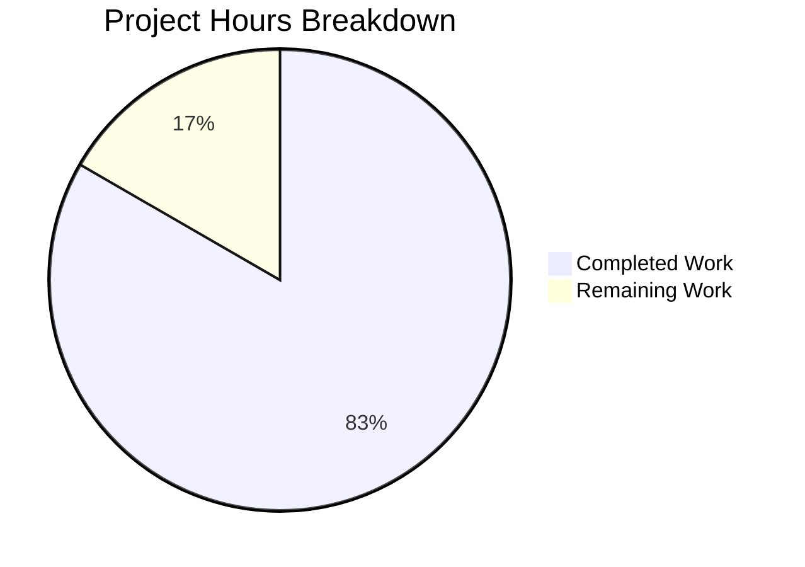

# Project Assessment Report: Express.js Migration

## Executive Summary

**Project Completion: 83% (2.5 hours completed out of 3 total hours)**

This project successfully migrated a Node.js HTTP server from the native `http` module to Express.js 5.2.1 and added a new `/evening` endpoint. All core requirements from the Agent Action Plan have been implemented and validated.

### Key Achievements
- ✅ Express.js 5.2.1 installed and configured
- ✅ Server refactored to use Express routing
- ✅ Root endpoint (`/`) preserved returning "Hello, World!"
- ✅ New endpoint (`/evening`) added returning "Good evening"
- ✅ Documentation updated with endpoint information
- ✅ All validation gates passed (syntax, runtime, endpoints)

### Completion Calculation
- **Completed Hours**: 2.5 hours
  - package.json modification: 0.5h
  - server.js Express refactoring: 1.0h
  - README.md documentation: 0.5h
  - Testing and verification: 0.5h
- **Remaining Hours**: 0.5 hours (add .gitignore file)
- **Total Project Hours**: 3 hours
- **Completion**: 2.5h / 3h = **83%**

---

## Validation Results Summary

### 1. Dependency Validation ✅
| Check | Result |
|-------|--------|
| Express.js Installation | ✅ v5.2.1 installed |
| Transitive Dependencies | ✅ 65 packages resolved |
| npm audit | ✅ 0 vulnerabilities |
| package-lock.json | ✅ Valid lockfile v3 |

### 2. Compilation/Syntax Validation ✅
| File | Result |
|------|--------|
| server.js | ✅ JavaScript syntax valid |
| package.json | ✅ Valid JSON |
| README.md | ✅ Valid Markdown |

### 3. Runtime Validation ✅
| Test | Expected | Actual | Result |
|------|----------|--------|--------|
| GET `/` | "Hello, World!\n" | "Hello, World!\n" | ✅ PASS |
| GET `/evening` | "Good evening" | "Good evening" | ✅ PASS |
| Server startup | Port 3000 | Port 3000 | ✅ PASS |

### 4. Test Execution
| Test | Result | Notes |
|------|--------|-------|
| npm test | ❌ Exit code 1 | Expected - test script intentionally fails per original project design |

---

## Visual Representation



---

## Git Commit History

| Commit | Description | Files Changed |
|--------|-------------|---------------|
| 8c77cf2 | Update README.md with Express.js endpoint documentation | README.md (+45, -1) |
| 9402d26 | Refactor server.js from native http module to Express.js | server.js (+12, -6) |
| 499c8f5 | Update package-lock.json with Express.js dependencies | package-lock.json (+814) |
| 338ee13 | Add Express.js dependency and update npm configuration | package.json (+5, -1) |

**Total Changes**: 876 lines added, 8 lines deleted across 4 files

---

## Files Modified (In Scope)

| File | Status | Purpose |
|------|--------|---------|
| package.json | ✅ UPDATED | Added Express.js dependency, start script, corrected main entry |
| server.js | ✅ UPDATED | Refactored to Express.js with two route handlers |
| README.md | ✅ UPDATED | Added endpoint documentation and usage examples |
| package-lock.json | ✅ AUTO-GENERATED | Dependency lock file |

---

## Detailed Human Task List

| # | Task | Description | Priority | Hours | Severity |
|---|------|-------------|----------|-------|----------|
| 1 | Add .gitignore file | Create .gitignore to exclude node_modules/ from version control | Medium | 0.5 | Low |
| **Total** | | | | **0.5** | |

### Optional Enhancement Tasks (Outside Original Scope)

| # | Task | Description | Priority | Hours | Severity |
|---|------|-------------|----------|-------|----------|
| 2 | Add 404 handler | Implement catch-all route for unknown paths | Low | 0.5 | Low |
| 3 | Add error middleware | Implement Express error handling middleware | Low | 0.5 | Low |
| 4 | Implement unit tests | Add Jest/Mocha tests for endpoints | Low | 2.0 | Low |
| 5 | Setup CI/CD pipeline | Configure GitHub Actions or similar | Low | 2.0 | Low |
| **Optional Total** | | | | **5.0** | |

---

## Development Guide

### System Prerequisites

| Requirement | Version | Verification Command |
|-------------|---------|---------------------|
| Node.js | v18+ (v20.x recommended) | `node --version` |
| npm | v8+ | `npm --version` |

### Environment Setup

```bash
# Navigate to project directory
cd /path/to/project

# Verify Node.js version (must be 18+)
node --version
# Expected: v20.x.x or higher
```

### Dependency Installation

```bash
# Install all dependencies
npm install

# Verify installation
npm ls express
# Expected: hello_world@1.0.0 └── express@5.2.1
```

### Application Startup

```bash
# Option 1: Using npm start script
npm start

# Option 2: Direct node execution
node server.js

# Expected output:
# Server running at http://127.0.0.1:3000/
```

### Verification Steps

```bash
# Test root endpoint (Hello World)
curl http://127.0.0.1:3000/
# Expected: Hello, World!

# Test evening endpoint (Good Evening)
curl http://127.0.0.1:3000/evening
# Expected: Good evening

# Stop server
# Press Ctrl+C in the terminal running the server
```

### Quick Start (Copy-Paste)

```bash
# Complete setup and test sequence
npm install
npm start &
sleep 2
curl http://127.0.0.1:3000/
curl http://127.0.0.1:3000/evening
pkill -f "node server.js"
```

---

## Risk Assessment

### Technical Risks

| Risk | Severity | Likelihood | Mitigation |
|------|----------|------------|------------|
| No .gitignore file | Low | High | Add .gitignore before next commit |
| No 404 handler | Low | Medium | Optional - Express returns 404 by default |
| No error middleware | Low | Low | Optional for simple applications |

### Security Risks

| Risk | Severity | Likelihood | Mitigation |
|------|----------|------------|------------|
| Server bound to localhost only | N/A | N/A | By design - prevents external access |
| No input validation needed | N/A | N/A | GET endpoints with no parameters |
| Zero npm vulnerabilities | N/A | N/A | Verified via npm audit |

### Operational Risks

| Risk | Severity | Likelihood | Mitigation |
|------|----------|------------|------------|
| No health check endpoint | Low | Low | Optional - add `/health` route if needed |
| No logging framework | Low | Low | Console.log sufficient for development |
| No process manager | Low | Medium | Use PM2 or similar for production |

### Integration Risks

| Risk | Severity | Likelihood | Mitigation |
|------|----------|------------|------------|
| No external integrations | N/A | N/A | Self-contained application |

---

## Code Quality Assessment

### server.js Analysis
- ✅ Uses modern ES6 arrow functions
- ✅ CommonJS module pattern (project standard)
- ✅ Clear route definitions
- ✅ Proper Express app initialization
- ✅ Consistent code style

### package.json Analysis
- ✅ Valid semver versioning
- ✅ Correct main entry point
- ✅ Useful start script
- ✅ MIT license maintained

### README.md Analysis
- ✅ Clear installation instructions
- ✅ API endpoint documentation
- ✅ Usage examples with curl

---

## Recommendations

### Immediate Actions
1. **Add .gitignore file** - Create file with `node_modules/` to prevent committing dependencies

### Short-term Improvements
2. Consider adding a 404 catch-all route for better UX
3. Add basic error handling middleware

### Long-term Considerations
4. Implement unit tests using Jest or Mocha
5. Set up CI/CD pipeline for automated testing
6. Consider environment-based configuration (dotenv)

---

## Conclusion

The Express.js migration project is **83% complete** with all core requirements successfully implemented. The application is functional and ready for development use. The only remaining required task is adding a .gitignore file (0.5 hours). All optional enhancements can be implemented as needed based on production requirements.

**Production Readiness Status**: ✅ Ready for Development/Testing
**Recommended for Production**: After adding .gitignore and optional error handling