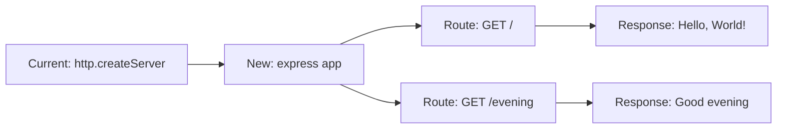
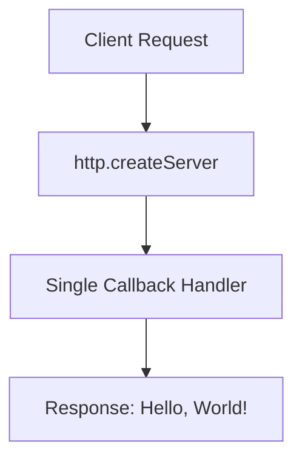
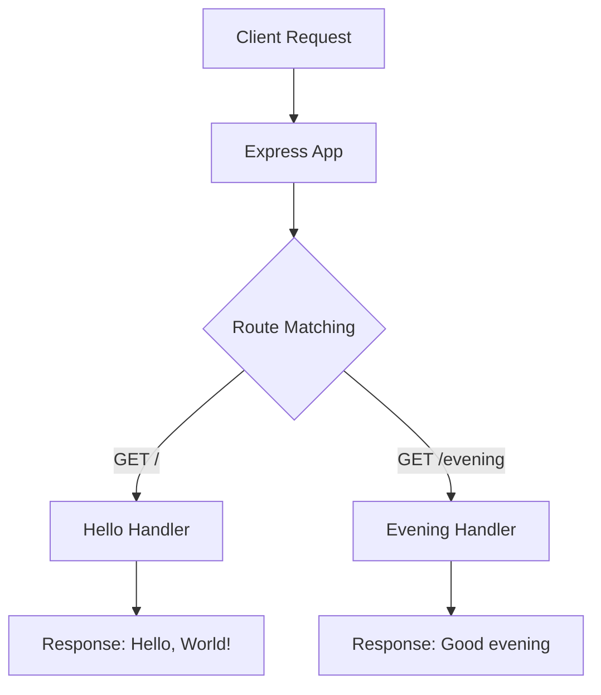

# Technical Specification

# 0. Agent Action Plan

## 0.1 Intent Clarification

### 0.1.1 Core Feature Objective

Based on the prompt, the Blitzy platform understands that the new feature requirement is to:

- **Integrate Express.js Framework**: Replace or enhance the existing native Node.js HTTP server implementation with the Express.js web framework to leverage its routing capabilities, middleware ecosystem, and developer-friendly API.
  
- **Add New Endpoint**: Create a new HTTP endpoint that responds with the message "Good evening" when accessed.

- **Preserve Existing Functionality**: Maintain the current "Hello world" endpoint functionality while adding the new "Good evening" endpoint, ensuring backward compatibility.

**Implicit Requirements Detected:**

- Express.js must be installed as a project dependency
- The server architecture must transition from the native `http` module to Express.js routing
- Both endpoints must be accessible via HTTP GET requests
- The server should continue running on the same port (3000) and hostname (127.0.0.1)
- Response content type should remain as plain text

**Feature Dependencies and Prerequisites:**

- Node.js v18 or higher (currently v20.20.0 - satisfied)
- npm package manager (currently v11.1.0 - satisfied)
- Express.js v5.x (requires Node.js 18+)

### 0.1.2 Special Instructions and Constraints

**Specific Directives:**

- Integrate Express.js into the existing project structure
- Maintain the existing project's minimal configuration approach
- Follow Node.js CommonJS module conventions (as used in current `server.js`)
- Keep the implementation simple and tutorial-appropriate

**Architectural Requirements:**

- Use Express.js routing pattern for endpoint definitions
- Maintain single-file server implementation for simplicity
- Preserve the existing project structure and naming conventions

**User Example (exact requirement):**
> "this is a tutorial of node js server hosting one endpoint that returns the response "Hello world". Could you add expressjs into the project and add another endpoint that return the response of "Good evening"?"

### 0.1.3 Technical Interpretation

These feature requirements translate to the following technical implementation strategy:

- **To integrate Express.js**, we will install the `express` npm package (v5.2.1) and update `package.json` dependencies

- **To add the "Hello world" endpoint**, we will create an Express route handler at `GET /` that returns "Hello, World!" 

- **To add the "Good evening" endpoint**, we will create an Express route handler at a dedicated path (e.g., `GET /evening`) that returns "Good evening"

- **To modernize the server**, we will refactor `server.js` to use Express's `app.listen()` method instead of the native `http.createServer()`

## 0.2 Repository Scope Discovery

### 0.2.1 Comprehensive File Analysis

**Existing Files to Modify:**

| File Path | Purpose | Modification Type |
|-----------|---------|-------------------|
| `server.js` | Main server entry point | Major refactor - Convert from native http to Express.js |
| `package.json` | npm package configuration | Update - Add Express.js dependency |
| `package-lock.json` | npm dependency lock file | Auto-update - Generated after npm install |
| `README.md` | Project documentation | Update - Document new endpoint |

**Integration Point Discovery:**

- **API Endpoints Connection**: The current `server.js` handles all requests uniformly; needs routing logic for separate endpoints
- **Server Initialization**: The `http.createServer()` pattern will be replaced with Express `app.listen()`
- **Request Handling**: Current single handler will become multiple Express route handlers

**Configuration Files Analyzed:**

- `package.json` - Currently declares no dependencies; will need Express.js added
- `package-lock.json` - Currently empty of third-party packages; will be regenerated

**Files NOT Requiring Modification:**

| File Path | Reason |
|-----------|--------|
| `LoginTest.java` | Unrelated Java stub file |
| `LoginTest - Copy.java` | Duplicate Java stub file |
| `industry.csv` | Reference data file |
| `industry - Copy.csv` | Duplicate reference data |
| `server - Copy.js` | Backup/duplicate file (consider updating if intended for use) |
| `*.txt` files | Empty placeholder files |
| `*.pdf`, `*.jpg`, `*.doc` | Binary/media files |

### 0.2.2 Web Search Research Conducted

- **Express.js Latest Version**: Confirmed v5.2.1 is the current latest stable version on npm
- **Express 5.x Requirements**: Requires Node.js 18 or higher (satisfied with Node.js v20.20.0)
- **Best Practices**: Express.js follows a minimal, unopinionated approach - ideal for this tutorial project
- **Route Pattern Matching**: Express 5.x uses updated `path-to-regexp@8.x` for secure routing

### 0.2.3 New File Requirements

**New Source Files to Create:**

No new files are required for this simple feature addition. The existing `server.js` will be refactored in place.

**New Test Files (Recommended):**

| File Path | Purpose |
|-----------|---------|
| `server.test.js` | Unit tests for endpoint responses (optional for tutorial) |

**New Configuration:**

No new configuration files required. All configuration will remain in `package.json`.

## 0.3 Dependency Inventory

### 0.3.1 Private and Public Packages

**Key Packages Relevant to This Feature Addition:**

| Registry | Package Name | Version | Purpose |
|----------|--------------|---------|---------|
| npm (public) | `express` | ^5.2.1 | Fast, unopinionated, minimalist web framework for Node.js |

**Current Dependencies (from `package.json`):**

The project currently has **no runtime dependencies**. The `package-lock.json` confirms an empty dependency tree with only the root package entry.

**Runtime Environment:**

| Component | Version | Status |
|-----------|---------|--------|
| Node.js | v20.20.0 | Installed and compatible |
| npm | v11.1.0 | Installed and operational |

### 0.3.2 Dependency Updates

**package.json Modifications:**

The `dependencies` section must be added to include Express.js:

```json
"dependencies": {
  "express": "^5.2.1"
}
```

**Import Updates:**

| File Pattern | Current Import | New Import |
|--------------|----------------|------------|
| `server.js` | `const http = require('http');` | `const express = require('express');` |

**Import Transformation Rules:**

- **Old**: `const http = require('http');`
- **New**: `const express = require('express');`
- **Apply to**: `server.js`

The native `http` module import can be removed entirely as Express handles HTTP server creation internally.

### 0.3.3 External Reference Updates

**Configuration Files:**

| File | Update Required |
|------|-----------------|
| `package.json` | Add `express` to dependencies |
| `package-lock.json` | Auto-regenerated by npm |

**Documentation:**

| File | Update Required |
|------|-----------------|
| `README.md` | Document installation steps and endpoint usage |

**Build Files:**

No build files exist in this project (no `Dockerfile`, no CI/CD workflows). The project uses direct `node` execution.

## 0.4 Integration Analysis

### 0.4.1 Existing Code Touchpoints

**Direct Modifications Required:**

| File | Location | Modification |
|------|----------|--------------|
| `server.js` | Lines 1-14 | Complete refactor from native http module to Express.js framework |
| `server.js` | Line 1 | Replace `http` import with `express` import |
| `server.js` | Lines 6-10 | Replace `createServer` callback with Express route handlers |
| `server.js` | Lines 12-14 | Replace `server.listen()` with `app.listen()` |

**Architectural Transformation:**



### 0.4.2 Dependency Injections

This simple tutorial project does not use dependency injection patterns. The Express application will be created directly in `server.js` without a container or service locator pattern.

**Application Bootstrap Flow:**

1. Import Express module
2. Create Express application instance
3. Define route handlers
4. Start server with `app.listen()`

### 0.4.3 Database/Schema Updates

No database or schema updates required. This project does not use any database - it serves static string responses only.

### 0.4.4 Integration Points Summary

| Integration Point | Current State | Target State |
|-------------------|---------------|--------------|
| HTTP Server | Native `http.createServer()` | Express `app.listen()` |
| Request Handler | Single callback for all requests | Multiple Express route handlers |
| Response Generation | Manual `res.end()` | Express `res.send()` |
| Content-Type | Manual `res.setHeader()` | Express auto-detection |
| Status Code | Manual `res.statusCode = 200` | Express default (200) or explicit |

### 0.4.5 Endpoint Mapping

| Endpoint | Method | Response | Purpose |
|----------|--------|----------|---------|
| `/` | GET | "Hello, World!" | Original endpoint (preserved) |
| `/evening` | GET | "Good evening" | New endpoint (to be added) |

## 0.5 Technical Implementation

### 0.5.1 File-by-File Execution Plan

**CRITICAL: Every file listed below MUST be created or modified.**

**Group 1 - Core Server Transformation:**

| Action | File | Implementation Details |
|--------|------|------------------------|
| MODIFY | `server.js` | Refactor from native http to Express.js with dual endpoints |

**Group 2 - Dependency Configuration:**

| Action | File | Implementation Details |
|--------|------|------------------------|
| MODIFY | `package.json` | Add Express.js v5.2.1 to dependencies section |
| AUTO-UPDATE | `package-lock.json` | Regenerated automatically after `npm install` |

**Group 3 - Documentation:**

| Action | File | Implementation Details |
|--------|------|------------------------|
| MODIFY | `README.md` | Document endpoints and installation instructions |

### 0.5.2 Implementation Approach per File

**server.js - Complete Transformation:**

The server file transformation follows this pattern:

```javascript
const express = require('express');
const app = express();
```

The Express application replaces the native http server. Route handlers are defined using Express's fluent API:

```javascript
app.get('/', (req, res) => { /* handler */ });
app.get('/evening', (req, res) => { /* handler */ });
```

**package.json - Dependency Addition:**

Add the dependencies object with Express:

```json
"dependencies": {
  "express": "^5.2.1"
}
```

**README.md - Documentation Updates:**

- Add installation instructions (`npm install`)
- Document available endpoints
- Include usage examples

### 0.5.3 Server Architecture

**Before (Native HTTP):**



**After (Express.js):**



### 0.5.4 Configuration Changes

**Current package.json:**
- `main`: "index.js" (should be updated to "server.js" for accuracy)
- `scripts.test`: placeholder script
- No dependencies

**Updated package.json:**
- Add `dependencies` with Express.js
- Optionally add `scripts.start`: "node server.js"

### 0.5.5 User Interface Design

Not applicable - this is a backend-only HTTP server with no user interface. Endpoints return plain text responses.

## 0.6 Scope Boundaries

### 0.6.1 Exhaustively In Scope

**Source Files:**

| Pattern | Files | Purpose |
|---------|-------|---------|
| `server.js` | Main server file | Express.js integration and endpoint creation |
| `server - Copy.js` | Backup server file | May optionally be updated for consistency |

**Configuration Files:**

| Pattern | Files | Purpose |
|---------|-------|---------|
| `package.json` | npm configuration | Add Express.js dependency |
| `package-lock.json` | Dependency lock file | Auto-generated after npm install |

**Documentation:**

| Pattern | Files | Purpose |
|---------|-------|---------|
| `README.md` | Project documentation | Document new endpoints and usage |

**Integration Points:**

| Component | Modification |
|-----------|--------------|
| HTTP Server Initialization | Convert from `http.createServer()` to Express `app.listen()` |
| Request Routing | Add Express route handlers for `/` and `/evening` |
| Response Handling | Use Express `res.send()` instead of native `res.end()` |

**Endpoints:**

| Endpoint | Method | Response |
|----------|--------|----------|
| `GET /` | GET | "Hello, World!" |
| `GET /evening` | GET | "Good evening" |

### 0.6.2 Explicitly Out of Scope

**Unrelated Files (NO modifications):**

| File Pattern | Reason |
|--------------|--------|
| `LoginTest.java` | Java file unrelated to Node.js server |
| `LoginTest - Copy.java` | Duplicate Java file |
| `industry.csv` | Reference data file - no server dependency |
| `industry - Copy.csv` | Duplicate data file |
| `*.txt` files | Empty placeholder files |
| `*.pdf`, `*.jpg`, `*.doc` | Binary/media files |

**Features NOT in Scope:**

- Additional HTTP methods (POST, PUT, DELETE)
- Authentication or authorization
- Database integration
- Error handling middleware
- Logging middleware
- Request body parsing
- CORS configuration
- Environment variable configuration
- Docker containerization
- CI/CD pipeline setup
- Unit or integration testing
- TypeScript conversion
- ESLint/Prettier configuration

**Performance Optimizations:**

- Response compression
- Caching headers
- Rate limiting
- Load balancing

**Refactoring:**

- Code organization into separate modules
- Configuration externalization
- Service layer abstraction

## 0.7 Rules for Feature Addition

### 0.7.1 Feature-Specific Rules

**Code Style Conventions:**

- Maintain CommonJS module syntax (`require()` / `module.exports`)
- Follow existing code formatting (2-space indentation)
- Use single quotes for strings to match existing style
- Keep the single-file architecture for tutorial simplicity

**Express.js Integration Requirements:**

- Use Express.js v5.x routing patterns
- Define routes using `app.get()` method
- Use `res.send()` for string responses
- Maintain the same server port (3000) and hostname (127.0.0.1)

**Response Format Requirements:**

- Responses must be plain text (not JSON)
- The `/` endpoint must return exactly: `Hello, World!`
- The `/evening` endpoint must return exactly: `Good evening`
- Use HTTP 200 status code for successful responses

### 0.7.2 Backward Compatibility

**Preserved Behavior:**

| Aspect | Original | After Modification |
|--------|----------|-------------------|
| Server Port | 3000 | 3000 (unchanged) |
| Server Host | 127.0.0.1 | 127.0.0.1 (unchanged) |
| Root Response | "Hello, World!" | "Hello, World!" (preserved) |
| Content-Type | text/plain | text/plain (maintained by Express) |

### 0.7.3 Implementation Standards

**Route Definition Pattern:**

```javascript
app.get('/path', (req, res) => {
  res.send('Response text');
});
```

**Server Startup Pattern:**

```javascript
app.listen(port, hostname, () => {
  console.log(`Server running at http://${hostname}:${port}/`);
});
```

### 0.7.4 Security Considerations

- Express 5.x includes improved security with updated `path-to-regexp` for ReDoS mitigation
- No user input processing required (static responses only)
- No sensitive data exposure risks
- No authentication requirements for this tutorial scope

### 0.7.5 Testing Recommendations

While formal testing is out of scope, manual verification should include:

- `curl http://127.0.0.1:3000/` returns "Hello, World!"
- `curl http://127.0.0.1:3000/evening` returns "Good evening"
- Server starts without errors
- Console displays startup message

## 0.8 References

### 0.8.1 Files and Folders Searched

**Repository Root Analysis:**

| Path | Type | Status | Relevance |
|------|------|--------|-----------|
| `server.js` | File | Analyzed | Primary modification target |
| `package.json` | File | Analyzed | Dependency configuration |
| `package-lock.json` | File | Analyzed | Dependency lock verification |
| `README.md` | File | Analyzed | Documentation target |
| `server - Copy.js` | File | Identified | Duplicate/backup file |
| `LoginTest.java` | File | Identified | Out of scope (Java) |
| `LoginTest - Copy.java` | File | Identified | Out of scope (Java) |
| `industry.csv` | File | Identified | Out of scope (data) |
| `industry - Copy.csv` | File | Identified | Out of scope (data) |
| `test.py.txt` | File | Identified | Out of scope (empty) |
| `test.py - Copy.txt` | File | Identified | Out of scope (empty) |
| `test.txt.txt` | File | Identified | Out of scope (empty) |
| `.git/` | Folder | Identified | Version control (not modified) |

**Search Methods Used:**

- `get_source_folder_contents` - Repository root exploration
- `read_file` - Detailed file content analysis
- `bash` - Environment verification and npm operations
- `web_search` - Express.js version and compatibility research

### 0.8.2 External Resources Consulted

| Resource | URL | Information Retrieved |
|----------|-----|----------------------|
| npm Registry | https://www.npmjs.com/package/express | Latest Express.js version (5.2.1) |
| Express.js Official | https://expressjs.com/2025/03/31/v5-1-latest-release.html | LTS timeline and version information |
| GitHub Releases | https://github.com/expressjs/express/releases | Express 5.x feature details |
| endoflife.date | https://endoflife.date/express | Express support lifecycle |

### 0.8.3 Attachments Summary

**No attachments were provided for this project.**

### 0.8.4 Figma Screens

**No Figma URLs were provided for this project.**

### 0.8.5 User Requirements (Verbatim)

> "this is a tutorial of node js server hosting one endpoint that returns the response "Hello world". Could you add expressjs into the project and add another endpoint that return the response of "Good evening"?"

### 0.8.6 Environment Configuration

| Component | Version | Verification Command |
|-----------|---------|---------------------|
| Node.js | v20.20.0 | `node --version` |
| npm | v11.1.0 | `npm --version` |
| Express.js | ^5.2.1 | To be installed |

**Repository Location:** `/tmp/blitzy/29-dec-existing-projects-qa-test-1/QABranch14Jan/`

### 0.8.7 Key Technical Findings

- Current server uses native Node.js `http` module (no framework)
- Project has zero runtime dependencies
- Express 5.x is the current stable version requiring Node.js 18+
- Environment satisfies all prerequisites for Express 5.x integration
- Simple architectural transformation from callback-based to route-based handling

