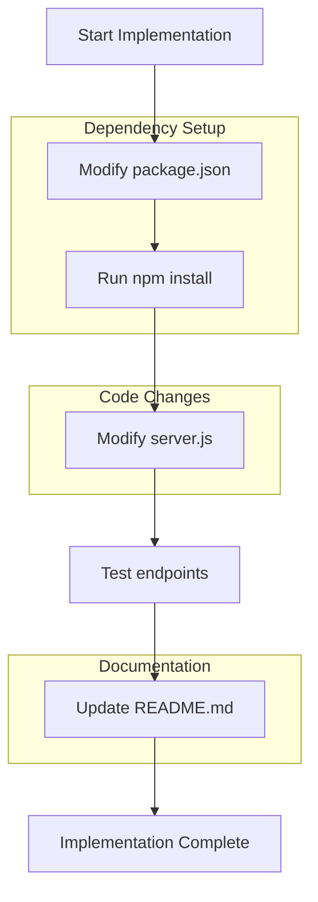
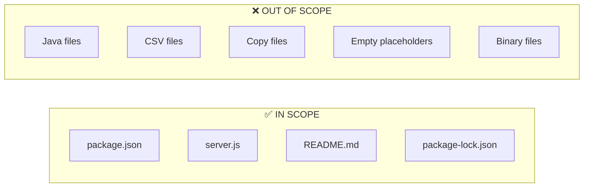

# Technical Specification

# 0. Agent Action Plan

## 0.1 Intent Clarification

### 0.1.1 Core Feature Objective

Based on the prompt, the Blitzy platform understands that the new feature requirement is to:

- **Add Express.js framework** to an existing Node.js HTTP server project that currently uses the native `http` module
- **Create a new endpoint** that returns the response "Good evening"
- **Preserve existing functionality** by maintaining the current "Hello world" behavior while introducing Express.js routing

| Requirement | Clarity Level | Technical Interpretation |
|-------------|---------------|--------------------------|
| Add Express.js to the project | Explicit | Install Express.js as a dependency and refactor server.js to use Express routing |
| Add endpoint returning "Good evening" | Explicit | Create a new route handler (e.g., `/evening` or similar) that responds with plain text "Good evening" |
| Maintain existing "Hello world" response | Implicit | Preserve existing behavior at root route (`/`) to return "Hello, World!" |

**Implicit Requirements Detected:**
- The server must continue to listen on the same port (3000) and hostname (127.0.0.1)
- Both endpoints should use the same content type (text/plain) for consistency
- The existing CommonJS module pattern should be maintained

### 0.1.2 Special Instructions and Constraints

**Architectural Requirements:**
- Use the existing server entry point (`server.js`) rather than creating a new file
- Follow the project's existing code style (CommonJS with `require()`)
- Maintain the minimal, straightforward approach established in the codebase

**User-Provided Examples:**
- User Example (existing response): `"Hello world"` - currently implemented as "Hello, World!\n"
- User Example (new response): `"Good evening"` - to be implemented exactly as specified

**Web Search Research Conducted:**
- Express.js latest stable version: **5.2.1** (confirmed via npm registry)
- Express.js 5.x requires Node.js 18 or higher (project uses v20.x, compatible)
- Express.js can be installed via: `npm install express`

### 0.1.3 Technical Interpretation

These feature requirements translate to the following technical implementation strategy:

- **To add Express.js**, we will modify `package.json` to include Express as a dependency and refactor `server.js` to use the Express application framework instead of the raw `http` module
- **To implement the "Hello world" endpoint**, we will create a GET route handler at the root path (`/`) using `app.get('/', ...)` that sends the existing "Hello, World!" response
- **To implement the "Good evening" endpoint**, we will create a new GET route handler at a new path (e.g., `/evening`) using `app.get('/evening', ...)` that sends "Good evening"
- **To preserve runtime configuration**, we will maintain the existing hostname (127.0.0.1) and port (3000) settings using `app.listen()`

| User Requirement | Technical Action | Target Component |
|------------------|------------------|------------------|
| Add ExpressJS into the project | Install express package, refactor server entry point | package.json, server.js |
| Add endpoint returning "Good evening" | Create new Express route handler | server.js |
| Maintain Hello world response | Convert existing HTTP handler to Express route | server.js |

## 0.2 Repository Scope Discovery

### 0.2.1 Comprehensive File Analysis

**Current Repository Structure:**

| File | Type | Status | Relevance to Feature |
|------|------|--------|---------------------|
| `server.js` | JavaScript | Existing | **Primary modification target** - Convert from http module to Express |
| `server - Copy.js` | JavaScript | Existing | May require update for consistency |
| `package.json` | Configuration | Existing | **Requires modification** - Add Express dependency |
| `package-lock.json` | Lock File | Existing | **Auto-generated** - Will be regenerated after npm install |
| `README.md` | Documentation | Existing | **Requires update** - Document new endpoint |
| `LoginTest.java` | Java | Existing | Out of scope (test stub) |
| `LoginTest - Copy.java` | Java | Existing | Out of scope (test stub) |
| `industry.csv` | Data | Existing | Out of scope (reference data) |
| `industry - Copy.csv` | Data | Existing | Out of scope (reference data) |
| `test.py.txt` | Placeholder | Existing | Out of scope (empty placeholder) |
| `test.py - Copy.txt` | Placeholder | Existing | Out of scope (empty placeholder) |
| `test.txt.txt` | Placeholder | Existing | Out of scope (empty placeholder) |

**Files Requiring Direct Modification:**

| File Path | Modification Type | Purpose |
|-----------|-------------------|---------|
| `server.js` | MODIFY | Refactor from native http to Express.js with two route handlers |
| `package.json` | MODIFY | Add Express.js dependency under `dependencies` |
| `README.md` | MODIFY | Document the new `/evening` endpoint and Express usage |

**Integration Point Discovery:**

| Integration Point | Current Implementation | Required Change |
|-------------------|----------------------|-----------------|
| HTTP Server Creation | `http.createServer()` | Replace with `express()` and `app.listen()` |
| Request Handling | Single callback function | Split into multiple Express route handlers |
| Response Sending | `res.end()` with manual headers | Use `res.send()` with automatic content-type |
| Port/Host Binding | `server.listen(port, hostname)` | `app.listen(port, hostname)` |

### 0.2.2 New File Requirements

No new source files are required for this feature. The implementation will modify existing files:

**Source File Modifications:**
- `server.js` - Primary modification: refactor HTTP server to Express application with dual routes

**Configuration File Modifications:**
- `package.json` - Add `"express": "^5.2.1"` to dependencies section

**Documentation Modifications:**
- `README.md` - Add documentation for new endpoint structure

**Auto-Generated Files:**
- `package-lock.json` - Will be regenerated by npm to lock Express.js and its transitive dependencies

### 0.2.3 Repository Files Analyzed

The following repository exploration was conducted:

| Search Type | Target | Files Discovered |
|-------------|--------|-----------------|
| Root folder analysis | `/` (repository root) | 12 files identified |
| JavaScript files | `*.js` pattern | `server.js`, `server - Copy.js` |
| Configuration files | `package.json`, `package-lock.json` | 2 npm configuration files |
| Documentation | `*.md` | `README.md` |

**Hierarchy Depth Achieved:**
- Root level (0): Complete exploration
- No subfolders exist in this repository - flat structure

## 0.3 Dependency Inventory

### 0.3.1 Current Dependencies

**Existing package.json Configuration:**

```json
{
  "name": "hello_world",
  "version": "1.0.0",
  "dependencies": {}
}
```

The project currently has **zero external dependencies** - it uses only the Node.js built-in `http` module.

### 0.3.2 Required New Dependencies

**Public Packages to Add:**

| Registry | Package Name | Version | Purpose | Node.js Compatibility |
|----------|--------------|---------|---------|----------------------|
| npm | express | ^5.2.1 | Web application framework for routing and HTTP handling | Node.js 18+ (compatible with project's v20.x) |

**Express.js 5.2.1 Transitive Dependencies:**
The following dependencies will be automatically installed as transitive dependencies of Express.js:

| Package | Purpose |
|---------|---------|
| body-parser | Parse incoming request bodies |
| cookie | HTTP cookie parsing |
| debug | Debug utility |
| path-to-regexp | Route path matching |
| qs | Query string parsing |
| send | Static file serving |
| mime | MIME type detection |

### 0.3.3 Dependency Installation Command

```bash
npm install express@^5.2.1
```

### 0.3.4 Import Updates

**Files Requiring Import Changes:**

| File | Current Imports | New Imports |
|------|----------------|-------------|
| `server.js` | `const http = require('http');` | `const express = require('express');` |

**Import Transformation Rules:**
- Old: `const http = require('http');`
- New: `const express = require('express');`
- Apply to: `server.js`

Note: The native `http` module import will be **removed entirely** as Express.js handles HTTP server creation internally.

### 0.3.5 Package.json Updates Required

**Updated dependencies section:**

```json
{
  "dependencies": {
    "express": "^5.2.1"
  }
}
```

**Optional enhancements to consider:**

| Field | Current Value | Suggested Update |
|-------|---------------|------------------|
| `main` | `"index.js"` | `"server.js"` (align with actual entry point) |
| `scripts.start` | (not defined) | `"node server.js"` (enable `npm start`) |

## 0.4 Integration Analysis

### 0.4.1 Existing Code Touchpoints

**Direct Modifications Required:**

| File | Location | Modification Description |
|------|----------|-------------------------|
| `server.js` | Line 1 | Replace `const http = require('http');` with `const express = require('express');` |
| `server.js` | Lines 3-4 | Keep hostname and port constants unchanged |
| `server.js` | Lines 6-10 | Replace `http.createServer()` callback with Express app initialization and route definitions |
| `server.js` | Lines 12-14 | Replace `server.listen()` with `app.listen()` |

### 0.4.2 Code Structure Transformation

**Current Implementation (Native HTTP):**

```javascript
const http = require('http');
const server = http.createServer((req, res) => {
  res.end('Hello, World!\n');
});
server.listen(port, hostname);
```

**Target Implementation (Express.js):**

```javascript
const express = require('express');
const app = express();
app.get('/', (req, res) => res.send('Hello, World!\n'));
app.get('/evening', (req, res) => res.send('Good evening'));
app.listen(port, hostname);
```

### 0.4.3 API Endpoint Mapping

**Route Handler Integration:**

| HTTP Method | Path | Response | Status |
|-------------|------|----------|--------|
| GET | `/` | "Hello, World!\n" | Existing (converted to Express) |
| GET | `/evening` | "Good evening" | **New endpoint** |

### 0.4.4 Backward Compatibility Analysis

| Aspect | Before | After | Compatibility |
|--------|--------|-------|---------------|
| Server Port | 3000 | 3000 | ✅ Preserved |
| Hostname Binding | 127.0.0.1 | 127.0.0.1 | ✅ Preserved |
| Root Path Response | "Hello, World!\n" | "Hello, World!\n" | ✅ Preserved |
| Content-Type | text/plain | text/plain (via Express default for strings) | ✅ Preserved |
| HTTP Status Code | 200 | 200 (Express default) | ✅ Preserved |

### 0.4.5 No Database or Schema Changes Required

This feature addition does not require any database modifications, migrations, or schema updates. The implementation is purely at the HTTP routing layer.

## 0.5 Technical Implementation

### 0.5.1 File-by-File Execution Plan

**Group 1 - Dependency Configuration:**

| Action | File | Purpose |
|--------|------|---------|
| MODIFY | `package.json` | Add Express.js dependency with version ^5.2.1 |

**Group 2 - Core Server Refactoring:**

| Action | File | Purpose |
|--------|------|---------|
| MODIFY | `server.js` | Convert from native http module to Express.js with two route handlers |

**Group 3 - Documentation:**

| Action | File | Purpose |
|--------|------|---------|
| MODIFY | `README.md` | Document the new Express.js-based server and available endpoints |

### 0.5.2 Implementation Approach per File

## package.json Modification

**Current Content:**
```json
{
  "name": "hello_world",
  "version": "1.0.0",
  "description": "Hello world in Node.js",
  "main": "index.js",
  "scripts": {
    "test": "echo \"Error: ...\" && exit 1"
  },
  "author": "hxu",
  "license": "MIT"
}
```

**Required Changes:**
- Add `dependencies` object with Express.js
- Optionally update `main` to `server.js` to match actual entry point
- Optionally add `start` script for convenience

## server.js Modification

**Implementation Strategy:**
1. Replace `http` module import with `express` import
2. Create Express application instance using `express()`
3. Define GET route for root path (`/`) returning "Hello, World!\n"
4. Define GET route for evening path (`/evening`) returning "Good evening"
5. Start server using `app.listen()` with existing port and hostname

**Code Structure:**
```javascript
const express = require('express');
const app = express();
const hostname = '127.0.0.1';
const port = 3000;

app.get('/', (req, res) => { /* handler */ });
app.get('/evening', (req, res) => { /* handler */ });
app.listen(port, hostname, () => { /* callback */ });
```

## README.md Modification

**Required Documentation Updates:**
- Update project description to mention Express.js
- Document available endpoints (/ and /evening)
- Add instructions for starting the server
- Document expected responses for each endpoint

### 0.5.3 Execution Sequence



### 0.5.4 Verification Commands

After implementation, verify the feature with:

```bash
# Start the server
node server.js

#### Test Hello World endpoint
curl http://127.0.0.1:3000/

#### Test Good Evening endpoint
curl http://127.0.0.1:3000/evening
```

**Expected Outputs:**

| Endpoint | Expected Response |
|----------|-------------------|
| `GET /` | `Hello, World!` |
| `GET /evening` | `Good evening` |

## 0.6 Scope Boundaries

### 0.6.1 Exhaustively In Scope

**Source Files:**

| File Pattern | Specific Files | Purpose |
|--------------|----------------|---------|
| `server.js` | `server.js` | Primary server entry point - convert to Express |

**Configuration Files:**

| File Pattern | Specific Files | Purpose |
|--------------|----------------|---------|
| `package.json` | `package.json` | Add Express dependency |
| `package-lock.json` | `package-lock.json` | Auto-regenerated by npm |

**Documentation Files:**

| File Pattern | Specific Files | Purpose |
|--------------|----------------|---------|
| `README.md` | `README.md` | Document new endpoints |

**Complete In-Scope File List:**

| # | File | Action | Lines Affected |
|---|------|--------|----------------|
| 1 | `package.json` | MODIFY | Lines 1-11 (add dependencies section) |
| 2 | `server.js` | MODIFY | Lines 1-14 (complete refactor) |
| 3 | `README.md` | MODIFY | Add endpoint documentation |
| 4 | `package-lock.json` | AUTO-GENERATE | Entire file (npm regenerates) |

### 0.6.2 Explicitly Out of Scope

**Files NOT to be Modified:**

| File | Reason |
|------|--------|
| `server - Copy.js` | Duplicate file for testing file handling, not part of active codebase |
| `LoginTest.java` | Java test stub, unrelated to Node.js feature |
| `LoginTest - Copy.java` | Java test stub duplicate, unrelated to Node.js feature |
| `industry.csv` | Reference data file, unrelated to HTTP endpoints |
| `industry - Copy.csv` | Reference data duplicate, unrelated to HTTP endpoints |
| `test.py.txt` | Empty placeholder file, unrelated to feature |
| `test.py - Copy.txt` | Empty placeholder file, unrelated to feature |
| `test.txt.txt` | Empty placeholder file, unrelated to feature |
| `*.pdf` | Binary document files, unrelated to feature |
| `*.jpg` | Image files, unrelated to feature |
| `*.doc` | Document files, unrelated to feature |

**Functionality Out of Scope:**

| Item | Reason |
|------|--------|
| Additional HTTP methods (POST, PUT, DELETE) | Not requested by user |
| Middleware implementation | Not required for basic routing |
| Error handling middleware | Not specified in requirements |
| Request body parsing | Not needed for GET endpoints |
| Static file serving | Not requested |
| HTTPS/TLS configuration | Not requested |
| Database integration | Not requested |
| Authentication/Authorization | Not requested |
| Unit tests | Not requested (test script exists but intentionally fails) |
| Performance optimizations | Beyond feature scope |
| Refactoring unrelated code | Beyond feature scope |

### 0.6.3 Scope Boundaries Summary



## 0.7 Rules for Feature Addition

### 0.7.1 Code Style and Conventions

**Patterns to Follow:**

| Rule | Description | Example |
|------|-------------|---------|
| Module System | Use CommonJS (`require/module.exports`) | `const express = require('express');` |
| Variable Declaration | Use `const` for unchanging values | `const app = express();` |
| Arrow Functions | Use arrow functions for callbacks | `(req, res) => { ... }` |
| Semicolons | Include semicolons at end of statements | `res.send('Hello');` |
| String Quotes | Use single quotes for strings | `'Hello, World!\n'` |

### 0.7.2 Integration Requirements

**Express.js Integration Rules:**

| Requirement | Implementation |
|-------------|----------------|
| Preserve existing response format | Keep "Hello, World!\n" exactly as-is including newline |
| Match new response exactly | Return "Good evening" as specified (no trailing newline) |
| Maintain server configuration | Keep port 3000 and hostname 127.0.0.1 |
| Use standard Express patterns | Use `app.get()` for route definitions |
| Keep console logging | Maintain startup message for user feedback |

### 0.7.3 Response Format Requirements

**Endpoint Response Specifications:**

| Endpoint | Response Text | Content-Type | Notes |
|----------|---------------|--------------|-------|
| GET `/` | `Hello, World!\n` | text/plain (auto) | Preserve exact existing format with newline |
| GET `/evening` | `Good evening` | text/plain (auto) | New endpoint per user specification |

### 0.7.4 Dependency Management Rules

| Rule | Description |
|------|-------------|
| Version Pinning | Use caret (^) for minor version flexibility: `^5.2.1` |
| Lock File | Allow npm to regenerate `package-lock.json` |
| No Additional Dependencies | Do not add dependencies beyond Express.js |

### 0.7.5 Documentation Requirements

| Rule | Description |
|------|-------------|
| Update README | Document both endpoints and their responses |
| Keep it minimal | Match existing documentation style (brief) |
| Include usage examples | Show curl commands to test endpoints |

### 0.7.6 Security Considerations

| Consideration | Status |
|---------------|--------|
| Input Validation | Not required - GET endpoints with no parameters |
| CORS | Not required - local development only |
| Rate Limiting | Not required - simple tutorial project |
| HTTPS | Not required - localhost binding only |

The server binds to `127.0.0.1` (localhost only), preventing external network access by design.

## 0.8 References

### 0.8.1 Repository Files and Folders Searched

**Files Retrieved and Analyzed:**

| File Path | Search Method | Relevance |
|-----------|---------------|-----------|
| `package.json` | `read_file` | Primary - dependency configuration |
| `server.js` | `read_file` | Primary - main server implementation |
| `package-lock.json` | `read_file` | Secondary - dependency lock state |
| `README.md` | `read_file` | Secondary - documentation |

**Folders Explored:**

| Folder Path | Search Method | Files Discovered |
|-------------|---------------|------------------|
| `/` (repository root) | `get_source_folder_contents` | 12 files (flat structure, no subfolders) |

**Search History:**

| # | Tool | Target | Purpose |
|---|------|--------|---------|
| 1 | `bash` | `find / -name ".blitzyignore"` | Check for ignore patterns |
| 2 | `get_source_folder_contents` | Root folder | Discover repository structure |
| 3 | `read_file` | `package.json` | Analyze npm configuration |
| 4 | `read_file` | `server.js` | Analyze current server implementation |
| 5 | `read_file` | `README.md` | Review existing documentation |
| 6 | `read_file` | `package-lock.json` | Verify dependency state |

### 0.8.2 Technical Specification Sections Referenced

| Section | Purpose |
|---------|---------|
| 3.2 PROGRAMMING LANGUAGES | Confirmed Node.js v20.x+ requirement, CommonJS module system |
| 3.8 RUNTIME REQUIREMENTS | Verified port 3000 and hostname 127.0.0.1 configuration |

### 0.8.3 External Web Sources Consulted

| Source | Information Retrieved |
|--------|----------------------|
| npm registry (npmjs.com) | Express.js latest version: 5.2.1 |
| Express.js GitHub releases | Version history and Node.js compatibility (18+) |
| Express.js official announcement | Express v5 release details (October 2024) |

### 0.8.4 User-Provided Attachments

| Attachment Type | Count | Description |
|-----------------|-------|-------------|
| Files | 0 | No file attachments provided |
| Figma URLs | 0 | No Figma screens provided |
| Setup Instructions | 0 | No custom setup instructions provided |
| Environment Variables | 0 | No environment variables specified |

### 0.8.5 Environment Verification

| Check | Result |
|-------|--------|
| Node.js Version | v20.19.6 (matches v20.x+ requirement) |
| npm Version | 11.1.0 |
| Current Server Test | Successfully returns "Hello, World!" on port 3000 |
| Project Location | `/tmp/blitzy/29-dec-existing-projects-qa-test-1/QABranch14Jan/` |

### 0.8.6 Key Source Code Evidence

**server.js (lines 1-14):**
- Line 1: `const http = require('http');` - Native HTTP module usage
- Line 4: `const port = 3000;` - Port configuration
- Line 9: `res.end('Hello, World!\n');` - Current response format

**package.json (lines 1-11):**
- No `dependencies` section currently exists
- `main` points to `index.js` (does not exist, could be updated)
- MIT license maintained

