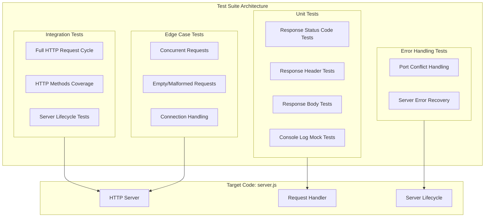
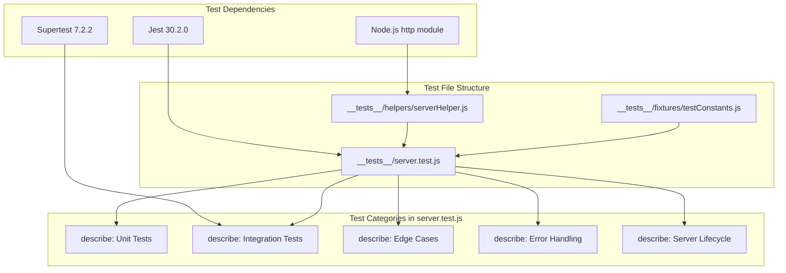
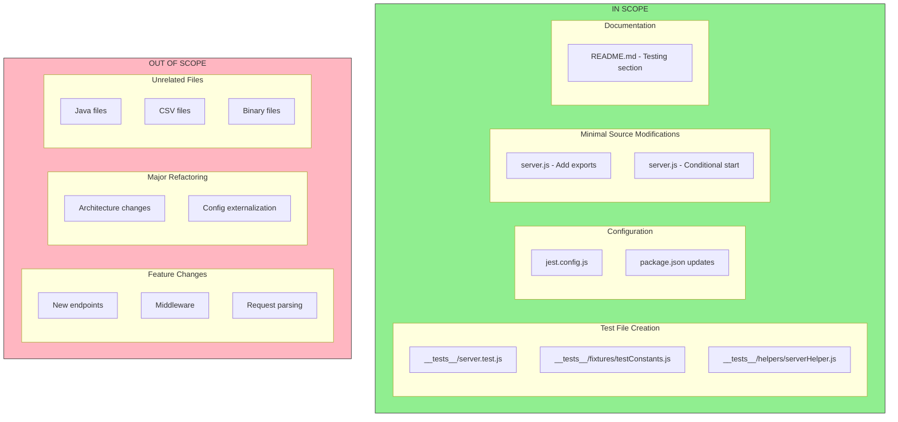

# Technical Specification

# 0. Agent Action Plan

## 0.1 Intent Clarification

### 0.1.1 Core Testing Objective

Based on the provided requirements, the Blitzy platform understands that the testing objective is to **establish comprehensive unit testing infrastructure for `server.js`**, a minimal Node.js HTTP server, using either Jest or Mocha testing frameworks.

**Request Categorization**: Add new tests

**Testing Requirements with Enhanced Clarity**:

| Requirement ID | User Requirement | Technical Interpretation |
|---------------|------------------|-------------------------|
| TR-001 | Test HTTP responses | Verify response body content returns "Hello, World!\n" exactly |
| TR-002 | Test status codes | Assert HTTP 200 OK status on successful requests |
| TR-003 | Test headers | Validate Content-Type: text/plain header is set correctly |
| TR-004 | Test server startup | Verify server binds to 127.0.0.1:3000 and logs startup message |
| TR-005 | Test server shutdown | Ensure graceful server termination without hanging connections |
| TR-006 | Test error handling | Verify server behavior under error conditions (malformed requests, port conflicts) |
| TR-007 | Test edge cases | Cover boundary scenarios including concurrent requests, empty requests, various HTTP methods |

**Implicit Testing Needs Surfaced**:

- **Request Handler Isolation**: The server's request handler must be testable independently of the server lifecycle
- **Port Availability Testing**: Tests must handle scenarios where port 3000 is already in use
- **HTTP Method Coverage**: Although the server responds identically to all methods, tests should verify GET, POST, PUT, DELETE, HEAD behaviors
- **Connection Handling**: Verify proper response termination with `res.end()`
- **Console Output Verification**: Validate the startup log message format and content
- **Content-Length Header**: Implicit header generated by Node.js HTTP module should be verified

### 0.1.2 Special Instructions and Constraints

**Testing Framework Selection**:
- User specified: "Jest or Mocha"
- Blitzy platform recommendation: **Jest** (version 30.2.0)
- Rationale: Jest provides built-in assertions, mocking capabilities, and requires minimal configuration for Node.js projects

**Testing Pattern Requirements**:
- Follow standard Node.js HTTP server testing conventions
- Use Supertest library for HTTP request simulation
- Maintain test isolation through proper server lifecycle management in beforeEach/afterEach hooks

**No User-Provided Examples**: The user did not provide specific test examples to follow.

**Web Search Requirements Documented**:
- Jest compatibility with Node.js v20.x ✓ Researched
- Supertest latest stable version ✓ Researched
- HTTP server testing best practices ✓ Researched

### 0.1.3 Technical Interpretation

These testing requirements translate to the following technical test implementation strategy:

| Requirement | Technical Action | Target Files |
|-------------|-----------------|--------------|
| To test HTTP responses | Create unit tests using Supertest to make requests and assert response body | `__tests__/server.test.js` |
| To test status codes | Add `.expect(200)` assertions to all happy-path test cases | `__tests__/server.test.js` |
| To test headers | Assert `Content-Type` header using `.expect('Content-Type', 'text/plain')` | `__tests__/server.test.js` |
| To test server startup | Mock console.log and verify startup message, test listen callback | `__tests__/server.test.js` |
| To test server shutdown | Implement afterEach hooks to close server, verify clean shutdown | `__tests__/server.test.js` |
| To test error handling | Create tests for EADDRINUSE errors, malformed requests, timeout scenarios | `__tests__/server.test.js` |
| To test edge cases | Test concurrent requests, various HTTP methods, empty requests, large payloads | `__tests__/server.test.js` |

### 0.1.4 Coverage Requirements Interpretation

**Explicit Coverage Targets**: None specified by user

**Implicit Coverage Expectations**:

Based on industry standards for Node.js HTTP servers and the repository's single-file architecture:

| Coverage Metric | Target | Rationale |
|----------------|--------|-----------|
| Line Coverage | 100% | Single 14-line file allows complete coverage |
| Branch Coverage | 100% | No conditional branches in current implementation |
| Function Coverage | 100% | One request handler function, one server creation |
| Statement Coverage | 100% | All statements reachable through HTTP requests |

**Critical Path Analysis**:
- Request handling path: `http.createServer` → callback → `res.statusCode` → `res.setHeader` → `res.end`
- Server lifecycle path: `server.listen` → callback → console.log

To achieve comprehensive testing, coverage should include:
- All lines of `server.js` executed during tests
- Server startup and shutdown sequences
- Request/response cycle for all HTTP methods
- Error scenarios (port conflicts, connection errors)
- Edge cases (concurrent requests, connection limits)

## 0.2 Test Discovery and Analysis

### 0.2.1 Existing Test Infrastructure Assessment

**Repository Analysis Findings**: Repository analysis reveals **no testing infrastructure** exists. The project is a minimal "Hello World" HTTP server with zero test coverage.

**Test File Search Results**:

| Search Pattern | Files Found | Status |
|---------------|-------------|--------|
| `*test*` | None | No test files exist |
| `*spec*` | None | No spec files exist |
| `test_*` | None | No test files exist |
| `*_test.*` | None | No test files exist |
| `*_spec.*` | None | No spec files exist |
| `__tests__/` | None | No test directory exists |

**Testing Framework Detection**:

| Source File | Testing Packages | Version |
|-------------|-----------------|---------|
| `package.json` | None | N/A |
| `package-lock.json` | None | N/A |

**Test Configuration Files Search**:

| Configuration File | Status |
|-------------------|--------|
| `jest.config.js` | Not found |
| `jest.config.mjs` | Not found |
| `jest.config.ts` | Not found |
| `pytest.ini` | Not found |
| `.mocharc.js` | Not found |
| `.mocharc.json` | Not found |
| `karma.conf.js` | Not found |
| `vitest.config.ts` | Not found |

**Current Testing Infrastructure Summary**:

| Component | Status | Notes |
|-----------|--------|-------|
| Testing Framework | **Not Installed** | Zero devDependencies in package.json |
| Test Runner | **Intentionally Failing** | `npm test` runs `echo "Error: no test specified" && exit 1` |
| Coverage Tools | **Not Installed** | No Istanbul, NYC, or c8 |
| Mock/Stub Libraries | **Not Detected** | No Sinon, Jest mocks |
| Test Data Fixtures | **Not Present** | No fixture files |
| Test Factories | **Not Present** | No factory patterns |

### 0.2.2 Source Code Analysis for Testing

**Target File Analysis (`server.js`)**:

```javascript
const http = require('http');
const hostname = '127.0.0.1';
const port = 3000;
```

| Code Element | Type | Testability | Test Approach |
|-------------|------|-------------|---------------|
| `http` module import | Dependency | Mockable | Mock with Jest for isolation tests |
| `hostname` constant | Configuration | Testable | Verify binding address |
| `port` constant | Configuration | Testable | Verify port assignment |
| Request handler function | Core Logic | Highly Testable | Test via Supertest |
| `res.statusCode = 200` | Response Setup | Testable | Assert HTTP status |
| `res.setHeader('Content-Type', 'text/plain')` | Header Setup | Testable | Assert Content-Type |
| `res.end('Hello, World!\n')` | Response Body | Testable | Assert response content |
| `server.listen()` | Server Lifecycle | Testable | Verify startup callback |
| `console.log()` | Side Effect | Testable | Mock and assert |

### 0.2.3 Web Search Research Conducted

**Research Topic 1: Jest Framework Compatibility**
- <cite index="2-1">Latest version: 30.2.0, last published: 4 months ago.</cite>
- <cite index="5-1,5-2,5-3">Jest 30 drops support for Node 14, 16, 19, and 21. The minimum supported Node versions are now 18.x. Ensure your environment is using a compatible Node release before upgrading.</cite>
- Node.js v20.20.0 (current environment) is fully supported

**Research Topic 2: Supertest HTTP Testing**
- <cite index="11-1,11-2">SuperAgent driven library for testing HTTP servers. Latest version: 7.2.2, last published: 12 days ago.</cite>
- <cite index="11-5,11-6">The motivation with this module is to provide a high-level abstraction for testing HTTP, while still allowing you to drop down to the lower-level API provided by superagent. You may pass an http.Server, or a Function to request() - if the server is not already listening for connections then it is bound to an ephemeral port for you so there is no need to keep track of ports.</cite>

**Research Topic 3: Testing Best Practices**
- <cite index="14-4">Familiar to JavaScript developers – You write tests in JS/TS, using popular test frameworks like Jest or Mocha, so there's no context-switching to a new language.</cite>
- <cite index="19-14,19-15">No Port Binding Needed: Test Express apps or http.Server instances without manually starting the server. Integration Ready: Works seamlessly with Jest, Mocha, Jasmine, and other JavaScript test runners.</cite>

**Research Topic 4: Common Pitfalls**
- <cite index="19-10,19-11,19-12">Race Conditions in Async Tests: When not using proper await or callback done(), tests may exit before assertions run. Use consistent async patterns. If mixing callback-style .end(), make sure to call done(err) properly, or else tests may quietly succeed or hang.</cite>
- <cite index="19-13">Port Collisions and Shared State: Multiple Supertest instances can conflict if your server uses static ports or global state.</cite>

### 0.2.4 Framework and Tool Selection

Based on repository analysis and web research, the recommended testing stack is:

| Tool | Version | Purpose | Selection Rationale |
|------|---------|---------|---------------------|
| Jest | 30.2.0 | Testing Framework | Zero-config setup, built-in assertions, Node.js 20.x compatible |
| Supertest | 7.2.2 | HTTP Testing | Industry standard for Node.js HTTP server testing, ephemeral port support |

**Alternative Considered (Mocha)**:
- User mentioned "Jest or Mocha"
- Mocha requires additional assertion library (Chai)
- Jest provides integrated solution with less configuration
- Decision: **Use Jest** for simplicity and built-in features

## 0.3 Testing Scope Analysis

### 0.3.1 Test Target Identification

**Primary Code to be Tested**:

| Module/Class | Path | Test Types Required |
|-------------|------|---------------------|
| HTTP Server | `server.js` | Unit tests, Integration tests |
| Request Handler | `server.js` (lines 6-10) | Unit tests, Edge case tests |
| Server Lifecycle | `server.js` (lines 12-14) | Startup/Shutdown tests |

**Functions Requiring Test Coverage**:

| Function/Component | Line(s) | Test Categories |
|-------------------|---------|-----------------|
| `http.createServer(callback)` | 6-10 | Unit, Integration |
| Request handler callback | 6-10 | Unit, Edge cases, Error handling |
| `res.statusCode` assignment | 7 | Unit |
| `res.setHeader()` call | 8 | Unit |
| `res.end()` call | 9 | Unit, Integration |
| `server.listen()` | 12-14 | Startup, Shutdown |
| Listen callback with `console.log` | 13 | Unit (mock verification) |

**Existing Test File Mapping**:

| Source File | Existing Test File | Test Categories Present |
|------------|-------------------|------------------------|
| `server.js` | None | None - tests to be created |

### 0.3.2 Dependencies Requiring Mocking

**External Services to Mock**:

| Dependency | Type | Mocking Strategy |
|-----------|------|------------------|
| `console.log` | Built-in | Jest spy/mock to verify startup message |
| `http` module | Built-in | Optional - use real module for integration tests |

**No Database Interactions**: The server is stateless with no database layer.

**No File System Operations**: The server does not read/write files.

### 0.3.3 Version Compatibility Research

Based on the current Node.js version (v20.20.0) and web research, the recommended testing stack:

| Tool | Recommended Version | Compatibility Notes |
|------|---------------------|---------------------|
| Jest | 30.2.0 | Supports Node.js 18.x+ (v20.20.0 compatible) |
| Supertest | 7.2.2 | Works with any Node.js HTTP server |

**No Version Conflicts Identified**: All selected packages are compatible with Node.js v20.20.0.

### 0.3.4 Test Categories Matrix

| Test Category | Scope | Priority |
|--------------|-------|----------|
| **Unit Tests** | ||
| Response Status Code | Verify `statusCode = 200` | High |
| Response Headers | Verify `Content-Type: text/plain` | High |
| Response Body | Verify `Hello, World!\n` output | High |
| Server Configuration | Verify hostname and port constants | Medium |
| **Integration Tests** | ||
| Full Request/Response Cycle | End-to-end HTTP request handling | High |
| Multiple HTTP Methods | GET, POST, PUT, DELETE, HEAD, OPTIONS | High |
| Server Startup | Verify listen callback execution | High |
| Server Shutdown | Verify graceful termination | High |
| **Edge Case Tests** | ||
| Concurrent Requests | Multiple simultaneous requests | Medium |
| Empty Request Body | Request with no body | Medium |
| Large Headers | Requests with many/large headers | Low |
| Connection Keep-Alive | Persistent connections | Low |
| **Error Handling Tests** | ||
| Port Already in Use | EADDRINUSE error scenario | High |
| Server Close During Request | Mid-request server termination | Medium |
| Invalid HTTP Methods | CONNECT, TRACE methods | Low |

### 0.3.5 Test Architecture Diagram



## 0.4 Test Implementation Design

### 0.4.1 Test Strategy Selection

**Test Types to Implement**:

| Test Type | Focus Area | Implementation Approach |
|-----------|-----------|------------------------|
| **Unit Tests** | Isolated request handler behavior | Test response properties in isolation |
| **Integration Tests** | Full HTTP request/response cycle | Use Supertest for actual HTTP requests |
| **Edge Case Tests** | Boundary conditions and unusual inputs | Test various HTTP methods, concurrent requests |
| **Error Handling Tests** | Failure scenarios | Test port conflicts, server errors |

**Server Refactoring Requirement**:

The current `server.js` implementation auto-starts the server on module load. For testability, the server creation should be exported separately from server startup:

```javascript
// Testable pattern (recommended refactor)
const server = http.createServer((req, res) => {...});
module.exports = server;
// Server.listen() called only when run directly
```

### 0.4.2 Test Case Blueprint

**Component: Request Handler**

```
Component: Request Handler (lines 6-10 of server.js)
Test Categories:
- Happy path: 
  - Returns 200 status code for any request
  - Sets Content-Type to text/plain
  - Returns "Hello, World!\n" as body
  - Content-Length header is set correctly
- Edge cases:
  - Handles GET, POST, PUT, DELETE, PATCH, HEAD, OPTIONS methods
  - Handles requests with query strings
  - Handles requests with various Content-Types
  - Handles concurrent simultaneous requests
- Error cases:
  - Server closed mid-request
  - Connection timeout handling
- Performance boundaries:
  - Response time under 100ms for simple requests
```

**Component: Server Lifecycle**

```
Component: Server Lifecycle (lines 12-14 of server.js)
Test Categories:
- Happy path:
  - Server starts and listens on port 3000
  - Server binds to 127.0.0.1
  - Console logs startup message correctly
  - Server can be closed gracefully
- Edge cases:
  - Multiple start/stop cycles
  - Starting server after previous close
- Error cases:
  - Port 3000 already in use (EADDRINUSE)
  - Invalid hostname binding
```

### 0.4.3 Existing Test Extension Strategy

**Not Applicable**: No existing tests to extend. All tests will be newly created.

### 0.4.4 Test Data and Fixtures Design

**Required Test Data Structures**:

| Data Type | Purpose | Implementation |
|-----------|---------|----------------|
| Expected Response Body | Verify response content | `const EXPECTED_BODY = 'Hello, World!\n'` |
| Expected Status Code | Verify HTTP status | `const EXPECTED_STATUS = 200` |
| Expected Content Type | Verify headers | `const EXPECTED_CONTENT_TYPE = 'text/plain'` |
| Server Config | Verify binding | `{ hostname: '127.0.0.1', port: 3000 }` |

**Fixture Organization Strategy**:

```
__tests__/
├── fixtures/
│   └── testConstants.js    # Shared test constants
├── helpers/
│   └── serverHelper.js     # Server creation/cleanup utilities
└── server.test.js          # Main test file
```

**Mock Object Specifications**:

| Mock Target | Mock Type | Purpose |
|-------------|-----------|---------|
| `console.log` | Jest spy | Verify startup message output |
| `console.error` | Jest spy | Verify error message output |

**Test State Management Approach**:

```javascript
// Test lifecycle pattern
let server;

beforeEach(() => {
  // Create fresh server instance
});

afterEach((done) => {
  // Close server and cleanup
  server.close(done);
});
```

### 0.4.5 Test Implementation Architecture



### 0.4.6 Test Naming Convention

| Convention | Pattern | Example |
|-----------|---------|---------|
| Test file names | `*.test.js` | `server.test.js` |
| Describe blocks | Feature/component name | `describe('HTTP Response')` |
| Test names | should + expected behavior | `it('should return 200 status code')` |
| Setup functions | before/after + scope | `beforeEach`, `afterEach` |

## 0.5 Test File Transformation Mapping

### 0.5.1 File-by-File Test Plan

**Test Transformation Modes**:
- **CREATE** - Create a new test file
- **UPDATE** - Update an existing test file
- **DELETE** - Remove an obsolete test file
- **REFERENCE** - Use as an example for test patterns and styles

| Target Test File | Transformation | Source File/Test | Purpose/Changes |
|-----------------|----------------|------------------|-----------------|
| `__tests__/server.test.js` | CREATE | `server.js` | Main test file with comprehensive unit, integration, edge case, and error handling tests |
| `__tests__/fixtures/testConstants.js` | CREATE | N/A | Shared test constants (expected response body, status, headers) |
| `__tests__/helpers/serverHelper.js` | CREATE | `server.js` | Server creation and cleanup helper utilities for test isolation |
| `jest.config.js` | CREATE | N/A | Jest configuration file for Node.js test environment |
| `package.json` | UPDATE | `package.json` | Add devDependencies (jest, supertest) and update test script |

### 0.5.2 New Test Files Detail

**`__tests__/server.test.js`** - Main comprehensive test suite

- **Test categories**: Happy path, edge cases, errors, server lifecycle
- **Mock dependencies**: `console.log`, `console.error`
- **Assertions focus**: HTTP status codes, response headers, response body, server binding

Test structure:
```
describe('Server Tests')
├── describe('HTTP Response')
│   ├── it('should return 200 status code')
│   ├── it('should return text/plain Content-Type')
│   ├── it('should return Hello, World! body')
│   └── it('should include Content-Length header')
├── describe('HTTP Methods')
│   ├── it('should respond to GET requests')
│   ├── it('should respond to POST requests')
│   ├── it('should respond to PUT requests')
│   ├── it('should respond to DELETE requests')
│   └── it('should respond to HEAD requests')
├── describe('Server Startup')
│   ├── it('should bind to 127.0.0.1')
│   ├── it('should listen on port 3000')
│   └── it('should log startup message')
├── describe('Server Shutdown')
│   ├── it('should close gracefully')
│   └── it('should handle multiple close calls')
├── describe('Edge Cases')
│   ├── it('should handle concurrent requests')
│   ├── it('should handle requests with query strings')
│   └── it('should handle requests with various paths')
└── describe('Error Handling')
    ├── it('should handle port already in use')
    └── it('should emit error event on failure')
```

**`__tests__/fixtures/testConstants.js`** - Test data constants

- **Fixture types**: Response expectations, server configuration
- Contents:
  - `EXPECTED_BODY`: `'Hello, World!\n'`
  - `EXPECTED_STATUS`: `200`
  - `EXPECTED_CONTENT_TYPE`: `'text/plain'`
  - `SERVER_HOSTNAME`: `'127.0.0.1'`
  - `SERVER_PORT`: `3000`
  - `STARTUP_MESSAGE_PATTERN`: `/Server running at/`

**`__tests__/helpers/serverHelper.js`** - Test helper utilities

- **Helper functions**:
  - `createTestServer()`: Create server instance without auto-listening
  - `startServer(server, port)`: Start server on specified port
  - `stopServer(server)`: Gracefully stop server with promise wrapper
  - `getAvailablePort()`: Find available port for isolated tests

### 0.5.3 Test Configuration Updates

**`jest.config.js`** - New Jest configuration file

```javascript
module.exports = {
  testEnvironment: 'node',
  testMatch: ['**/__tests__/**/*.test.js'],
  verbose: true,
  collectCoverage: true,
  coverageDirectory: 'coverage',
  coverageThreshold: {
    global: {
      branches: 100,
      functions: 100,
      lines: 100,
      statements: 100
    }
  }
};
```

**`package.json`** - Update test script and add dependencies

Changes required:
- Update `scripts.test` from `echo "Error: no test specified" && exit 1` to `jest`
- Add `devDependencies.jest`: `^30.2.0`
- Add `devDependencies.supertest`: `^7.2.2`

### 0.5.4 Source Code Modifications Required

**`server.js`** - Testability refactor (minimal changes)

To enable proper testing without side effects, the server module needs modification to export the server instance:

| Line | Current Code | Required Change | Rationale |
|------|-------------|-----------------|-----------|
| End of file | (implicit module execution) | Add `module.exports = server;` | Enable importing server in tests |
| 12-14 | Auto-start server | Wrap in `if (require.main === module)` | Prevent auto-start during test imports |

### 0.5.5 Cross-File Test Dependencies

**Shared Fixtures**:

| Fixture File | Used By | Purpose |
|-------------|---------|---------|
| `__tests__/fixtures/testConstants.js` | `server.test.js` | Shared expected values |

**Mock Objects**:

| Mock Location | Used By | Purpose |
|--------------|---------|---------|
| Inline in `server.test.js` | All test suites | `console.log` and `console.error` mocking |

**Test Utilities**:

| Helper File | Used By | Purpose |
|------------|---------|---------|
| `__tests__/helpers/serverHelper.js` | `server.test.js` | Server lifecycle management |

**Import Updates Required**:

| Test File | Required Imports |
|-----------|-----------------|
| `__tests__/server.test.js` | `const request = require('supertest');`<br/>`const http = require('http');`<br/>`const { EXPECTED_BODY, EXPECTED_STATUS, EXPECTED_CONTENT_TYPE } = require('./fixtures/testConstants');`<br/>`const { createTestServer, stopServer } = require('./helpers/serverHelper');` |

### 0.5.6 Complete Test File Inventory

| File Path | Type | Status | Description |
|-----------|------|--------|-------------|
| `__tests__/server.test.js` | Test | CREATE | Main test suite for server.js |
| `__tests__/fixtures/testConstants.js` | Fixture | CREATE | Shared test constants |
| `__tests__/helpers/serverHelper.js` | Helper | CREATE | Server lifecycle utilities |
| `jest.config.js` | Config | CREATE | Jest configuration |
| `package.json` | Config | UPDATE | Add test script and dependencies |
| `server.js` | Source | UPDATE | Add exports for testability |

**No Files Pending Discovery**: All required test files have been explicitly identified.

## 0.6 Dependency Inventory

### 0.6.1 Testing Dependencies

**All key testing packages relevant to this testing exercise**:

| Registry | Package Name | Version | Purpose |
|----------|--------------|---------|---------|
| npm | jest | 30.2.0 | Testing framework with built-in assertions and mocking |
| npm | supertest | 7.2.2 | HTTP server testing library for making requests |

**Version Selection Rationale**:

| Package | Version | Selection Criteria |
|---------|---------|-------------------|
| jest | 30.2.0 | Latest stable version; Node.js 18+ support (compatible with v20.20.0); built-in assertions eliminate need for Chai |
| supertest | 7.2.2 | Latest stable version; widely used for Node.js HTTP testing; ephemeral port support for test isolation |

### 0.6.2 Runtime Dependencies

**Existing Runtime Dependencies (No Changes)**:

| Registry | Package Name | Version | Purpose |
|----------|--------------|---------|---------|
| Node.js built-in | http | N/A | HTTP server creation |

### 0.6.3 Development Dependencies to Add

**New devDependencies for package.json**:

```json
{
  "devDependencies": {
    "jest": "^30.2.0",
    "supertest": "^7.2.2"
  }
}
```

### 0.6.4 Import Updates

**Test files requiring import statements**:

| File | Import Statement | Purpose |
|------|-----------------|---------|
| `__tests__/server.test.js` | `const request = require('supertest');` | HTTP request simulation |
| `__tests__/server.test.js` | `const http = require('http');` | Server creation for tests |
| `__tests__/helpers/serverHelper.js` | `const http = require('http');` | Server helper utilities |

**No Import Transformation Rules Required**: This is a new test suite, no existing imports to migrate.

### 0.6.5 Package.json Updates

**Before**:
```json
{
  "name": "hello_world",
  "version": "1.0.0",
  "description": "Hello world in Node.js",
  "main": "index.js",
  "scripts": {
    "test": "echo \"Error: no test specified\" && exit 1"
  },
  "author": "hxu",
  "license": "MIT"
}
```

**After**:
```json
{
  "name": "hello_world",
  "version": "1.0.0",
  "description": "Hello world in Node.js",
  "main": "server.js",
  "scripts": {
    "test": "jest",
    "test:coverage": "jest --coverage",
    "test:watch": "jest --watch"
  },
  "author": "hxu",
  "license": "MIT",
  "devDependencies": {
    "jest": "^30.2.0",
    "supertest": "^7.2.2"
  }
}
```

**Changes Summary**:

| Property | Change | Rationale |
|----------|--------|-----------|
| `main` | `index.js` → `server.js` | Correct entry point |
| `scripts.test` | `echo...` → `jest` | Run Jest tests |
| `scripts.test:coverage` | Added | Coverage reporting command |
| `scripts.test:watch` | Added | Development watch mode |
| `devDependencies` | Added | Testing framework dependencies |

### 0.6.6 Dependency Verification Commands

| Command | Purpose | Expected Output |
|---------|---------|-----------------|
| `npm install` | Install dependencies | Jest and Supertest installed |
| `npm test` | Run test suite | Tests pass with 100% coverage |
| `npm run test:coverage` | Generate coverage report | Coverage directory created |
| `npx jest --version` | Verify Jest version | `30.2.0` |

## 0.7 Coverage and Quality Targets

### 0.7.1 Coverage Metrics

**Current Coverage Status**:

| Metric | Current | Status |
|--------|---------|--------|
| Line Coverage | 0% | No tests exist |
| Branch Coverage | N/A | No branches in code |
| Function Coverage | 0% | No tests exist |
| Statement Coverage | 0% | No tests exist |

**Target Coverage (Based on Best Practice)**:

| Metric | Target | Rationale |
|--------|--------|-----------|
| Line Coverage | 100% | Single 14-line file allows complete coverage |
| Branch Coverage | 100% | No conditional branches exist |
| Function Coverage | 100% | Only request handler and listen callback |
| Statement Coverage | 100% | All statements reachable through tests |

**Coverage Gaps to Address**:

| Component | Current | Target | Gap |
|-----------|---------|--------|-----|
| Request Handler | 0% | 100% | Full coverage needed |
| Server Lifecycle | 0% | 100% | Full coverage needed |
| Error Handling | 0% | 100% | Error scenarios coverage needed |

### 0.7.2 Per-File Coverage Targets

| File | Line Target | Branch Target | Function Target |
|------|-------------|---------------|-----------------|
| `server.js` | 100% | 100% | 100% |

### 0.7.3 Focus Areas for Coverage

| Focus Area | Description | Test Count |
|------------|-------------|------------|
| **Critical Paths** | Request handling, response generation | 4+ tests |
| **Error Handlers** | Port conflict, server errors | 2+ tests |
| **Edge Cases** | Multiple HTTP methods, concurrent requests | 6+ tests |

### 0.7.4 Test Quality Criteria

**Assertion Density Expectations**:

| Test Type | Minimum Assertions | Example |
|-----------|-------------------|---------|
| Unit Test | 2-3 assertions | Status + body + header |
| Integration Test | 3-5 assertions | Full response validation |
| Error Test | 2 assertions | Error type + error message |

**Test Isolation Requirements**:

| Requirement | Implementation |
|-------------|----------------|
| Independent tests | Each test creates/closes own server |
| No shared state | Use `beforeEach`/`afterEach` for setup/teardown |
| Ephemeral ports | Use Supertest's automatic port binding |
| Clean console | Mock `console.log` to prevent output noise |

**Performance Constraints for Test Execution**:

| Metric | Target | Rationale |
|--------|--------|-----------|
| Total suite execution | < 10 seconds | Fast feedback loop |
| Individual test timeout | 5 seconds | Default Jest timeout |
| Concurrent test execution | Enabled | Jest default behavior |

**Maintainability Standards**:

| Standard | Implementation |
|----------|----------------|
| Descriptive test names | Use "should [expected behavior]" pattern |
| Organized test structure | Group tests by describe blocks |
| Shared fixtures | Extract constants to `testConstants.js` |
| Helper functions | Centralize server utilities in `serverHelper.js` |

### 0.7.5 Repository Test Patterns and Conventions

**Since no existing tests exist**, the following conventions will be established:

| Convention | Standard | Example |
|-----------|----------|---------|
| Test file location | `__tests__/` directory | `__tests__/server.test.js` |
| Test file naming | `*.test.js` suffix | `server.test.js` |
| Describe block naming | Feature/component name | `describe('HTTP Response')` |
| Test naming | should + behavior | `it('should return 200 status code')` |
| Fixture organization | `__tests__/fixtures/` | `testConstants.js` |
| Helper organization | `__tests__/helpers/` | `serverHelper.js` |

### 0.7.6 Quality Gate Configuration

**Jest Coverage Thresholds (jest.config.js)**:

| Threshold | Value | Enforcement |
|-----------|-------|-------------|
| Lines | 100% | Test failure if not met |
| Branches | 100% | Test failure if not met |
| Functions | 100% | Test failure if not met |
| Statements | 100% | Test failure if not met |

**Test Success Requirements**:

| Requirement | Condition |
|-------------|-----------|
| All tests pass | Exit code 0 |
| Coverage thresholds met | 100% all metrics |
| No test warnings | Clean test output |
| No hanging processes | All servers closed |

## 0.8 Scope Boundaries

### 0.8.1 Exhaustively In Scope

**New Test Files**:

| Pattern | Description |
|---------|-------------|
| `__tests__/server.test.js` | Main test suite for server.js |
| `__tests__/fixtures/*.js` | Test constants and fixtures |
| `__tests__/helpers/*.js` | Test helper utilities |

**Test File Updates**:

| Pattern | Description |
|---------|-------------|
| N/A | No existing test files to update |

**Test Configuration**:

| File | Description |
|------|-------------|
| `jest.config.js` | Jest test framework configuration |
| `package.json` | Test scripts and devDependencies |

**Test Utilities and Helpers**:

| Pattern | Description |
|---------|-------------|
| `__tests__/helpers/serverHelper.js` | Server lifecycle management utilities |
| `__tests__/fixtures/testConstants.js` | Shared test constants |

**Source Code Modifications (for testability)**:

| File | Modification |
|------|-------------|
| `server.js` | Add module.exports for server instance |
| `server.js` | Wrap auto-start in `require.main === module` check |

**Documentation Updates**:

| File | Section |
|------|---------|
| `README.md` | Add testing section with commands |

### 0.8.2 Explicitly Out of Scope

**Source Code Beyond Testability**:

| Item | Reason for Exclusion |
|------|---------------------|
| New server functionality | Testing task only, not feature development |
| Additional routes/endpoints | Not requested by user |
| Middleware additions | Not part of testing scope |
| Logging infrastructure | Beyond current testing requirements |

**Refactoring Beyond Testing Needs**:

| Item | Reason for Exclusion |
|------|---------------------|
| Server architecture changes | Only minimal changes for testability |
| Configuration externalization | Not required for testing |
| Port/hostname configuration | Current hardcoded values are acceptable |

**Feature Additions**:

| Item | Reason for Exclusion |
|------|---------------------|
| Request body parsing | Not part of current functionality |
| Response content negotiation | Not part of current functionality |
| Error response formatting | Not part of current functionality |

**Unrelated Files**:

| File | Reason for Exclusion |
|------|---------------------|
| `LoginTest.java` | Unrelated Java file |
| `LoginTest - Copy.java` | Unrelated Java file |
| `industry.csv` | Data file, not test target |
| `industry - Copy.csv` | Data file, not test target |
| `server - Copy.js` | Duplicate file, not primary test target |
| `*.pdf`, `*.jpg`, `*.doc` | Binary files, not code |
| `test.py*.txt` | Empty placeholder files |

**Performance Optimizations**:

| Item | Reason for Exclusion |
|------|---------------------|
| Server performance tuning | Beyond testing scope |
| Memory optimization | Beyond testing scope |
| Connection pooling | Beyond testing scope |

### 0.8.3 Scope Boundary Diagram



### 0.8.4 Change Impact Assessment

| Area | Impact Level | Changes Required |
|------|-------------|------------------|
| Test Infrastructure | **High** | New test suite creation |
| Source Code | **Low** | Minimal exports for testability |
| Dependencies | **Medium** | Add Jest and Supertest |
| Documentation | **Low** | Add testing section to README |
| CI/CD | **None** | No pipeline changes (none exists) |

## 0.9 Execution Parameters

### 0.9.1 Testing-Specific Instructions

**Test Execution Commands**:

| Command | Purpose | Usage |
|---------|---------|-------|
| `npm test` | Run full test suite | CI/CD, pre-commit |
| `npm run test:coverage` | Run tests with coverage report | Coverage verification |
| `npm run test:watch` | Run tests in watch mode | Development |
| `npx jest --verbose` | Run with detailed output | Debugging |
| `npx jest --detectOpenHandles` | Debug hanging tests | Troubleshooting |

**Coverage Measurement Command**:

```bash
npm run test:coverage
# or

npx jest --coverage --coverageReporters="text" --coverageReporters="lcov"
```

**Single Test Execution Pattern**:

```bash
# Run specific test file

npx jest __tests__/server.test.js

#### Run tests matching pattern

npx jest -t "should return 200 status code"

#### Run specific describe block

npx jest -t "HTTP Response"
```

**Debug Mode Execution**:

```bash
# Node.js inspector with Jest

node --inspect-brk node_modules/.bin/jest --runInBand

#### Verbose output with stack traces

npx jest --verbose --detectOpenHandles
```

### 0.9.2 Environment Setup Requirements

**Prerequisites**:

| Requirement | Version | Verification Command |
|-------------|---------|---------------------|
| Node.js | v20.20.0+ | `node --version` |
| npm | v11.1.0+ | `npm --version` |

**Setup Commands**:

```bash
# Install dependencies

npm install

#### Verify Jest installation

npx jest --version

#### Verify test environment

npm test -- --passWithNoTests
```

### 0.9.3 Test Patterns to Follow

**Test File Pattern** (jest.config.js):
```javascript
testMatch: ['**/__tests__/**/*.test.js']
```

**Test Structure Pattern**:
```javascript
describe('Feature/Component', () => {
  let server;
  
  beforeEach(() => {
    // Setup
  });
  
  afterEach((done) => {
    // Cleanup
    if (server) server.close(done);
    else done();
  });
  
  it('should [expected behavior]', async () => {
    // Arrange
    // Act
    // Assert
  });
});
```

### 0.9.4 Excluded Test Categories

**Per User Instructions**: No explicit exclusions specified.

**Default Exclusions**:

| Category | Reason |
|----------|--------|
| Performance/Load tests | Beyond unit test scope |
| Security penetration tests | Specialized tooling required |
| Browser-based E2E tests | Server-side only |

### 0.9.5 CI-Safe Test Execution

**Non-Interactive Test Command**:
```bash
CI=true npm test
```

**Timeout-Wrapped Execution**:
```bash
timeout 120 npm test
```

**Full CI Command**:
```bash
CI=true npm test -- --ci --coverage --watchAll=false
```

### 0.9.6 Test Output Configuration

**Expected Test Output Format**:

```
PASS  __tests__/server.test.js
  HTTP Response
    ✓ should return 200 status code (XX ms)
    ✓ should return text/plain Content-Type (XX ms)
    ✓ should return Hello, World! body (XX ms)
  HTTP Methods
    ✓ should respond to GET requests (XX ms)
    ✓ should respond to POST requests (XX ms)
    ...
  Server Lifecycle
    ✓ should start and listen (XX ms)
    ✓ should close gracefully (XX ms)
    ...

Test Suites: 1 passed, 1 total
Tests:       XX passed, XX total
Coverage:    100% lines, 100% functions
```

### 0.9.7 Development Workflow Commands

| Phase | Command | Purpose |
|-------|---------|---------|
| Development | `npm run test:watch` | Continuous test feedback |
| Pre-commit | `npm test` | Validate all tests pass |
| Coverage check | `npm run test:coverage` | Verify coverage targets |
| Debug failing test | `npx jest --verbose -t "test name"` | Isolate failure |

## 0.10 Special Instructions for Testing

### 0.10.1 Testing-Specific Requirements

Based on the user's request, the following special instructions apply:

**Framework Selection**:
- User specified: "Jest or Mocha"
- Selected: **Jest** (version 30.2.0)
- Rationale: Built-in assertions, zero configuration for Node.js, better mocking support

**Test Coverage Areas** (explicitly requested):
- HTTP responses
- Status codes
- Headers
- Server startup/shutdown
- Error handling
- Edge cases

### 0.10.2 Implementation Guidelines

**Minimal Change Principle**:
- ONLY modify test files and test-related configurations
- Source code changes limited to enabling testability (exports, conditional start)
- DO NOT add new features to server.js while adding tests

**Test Isolation Requirements**:
- Each test must create and close its own server instance
- Use `beforeEach`/`afterEach` hooks for consistent setup/teardown
- Avoid shared state between tests
- Use Supertest's ephemeral port binding to prevent port conflicts

**Mocking Strategy**:
- Mock `console.log` to verify startup message without console noise
- Mock `console.error` to capture error output
- Use real `http` module for integration tests

**Async Test Handling**:
- Use `async/await` pattern for all tests
- Ensure proper promise resolution before test completion
- Set appropriate timeouts for server operations

### 0.10.3 Code Style and Naming Conventions

**Test File Naming**:
- Files: `*.test.js` pattern
- Located in `__tests__/` directory

**Test Naming Convention**:
- Describe blocks: Noun phrases (component/feature name)
- Test cases: "should [expected behavior]" format

**Example**:
```javascript
describe('HTTP Response', () => {
  it('should return 200 status code', async () => {
    // test implementation
  });
});
```

### 0.10.4 Backward Compatibility

**Test Utilities Compatibility**:
- Helper functions must be reusable across future test files
- Fixtures must be importable without side effects
- Configuration must support both local and CI environments

### 0.10.5 Error Handling in Tests

**Server Error Testing**:
- Test EADDRINUSE (port already in use) scenario
- Test server error event emission
- Verify graceful shutdown under error conditions

**Test Failure Handling**:
- Use descriptive assertion messages
- Include context in error output
- Ensure cleanup runs even on test failure (use `afterEach`)

### 0.10.6 User Request Summary

The user's complete request was:

> "Create comprehensive unit tests for server.js using Jest or Mocha. Test HTTP responses, status codes, headers, server startup/shutdown, error handling, and edge cases."

**All requirements addressed**:

| Requirement | Addressed In |
|-------------|-------------|
| Comprehensive unit tests | Section 0.4, 0.5 - Test Implementation Design & Mapping |
| Jest or Mocha selection | Section 0.2.4 - Jest 30.2.0 selected |
| HTTP responses testing | Section 0.4.2 - Response Body tests |
| Status codes testing | Section 0.4.2 - Status Code tests |
| Headers testing | Section 0.4.2 - Header tests |
| Server startup testing | Section 0.4.2 - Server Lifecycle tests |
| Server shutdown testing | Section 0.4.2 - Graceful shutdown tests |
| Error handling testing | Section 0.4.2 - Error Handling tests |
| Edge cases testing | Section 0.4.2 - Edge Case tests |

### 0.10.7 No Additional User Directives

The user did not specify:
- Specific coverage thresholds (default: 100% applied)
- CI/CD integration requirements
- Specific mocking patterns to follow
- Existing test patterns to reference (none exist)
- Files to exclude from testing

All decisions in these areas have been made based on industry best practices for Node.js HTTP server testing.

