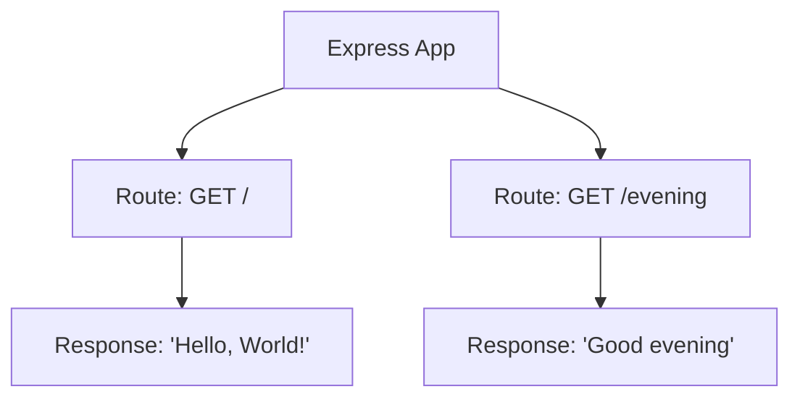
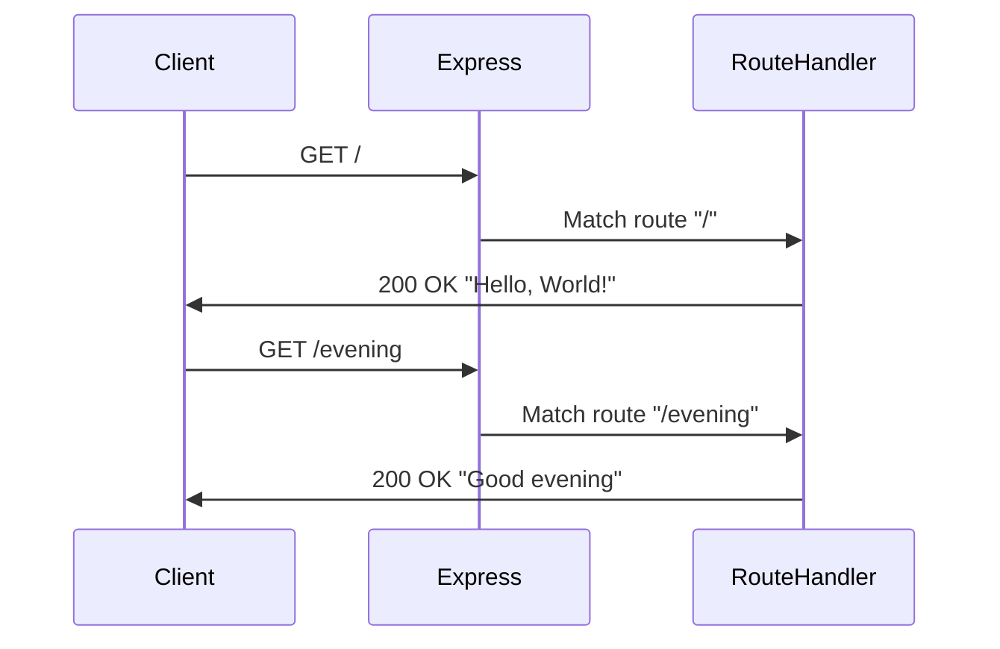
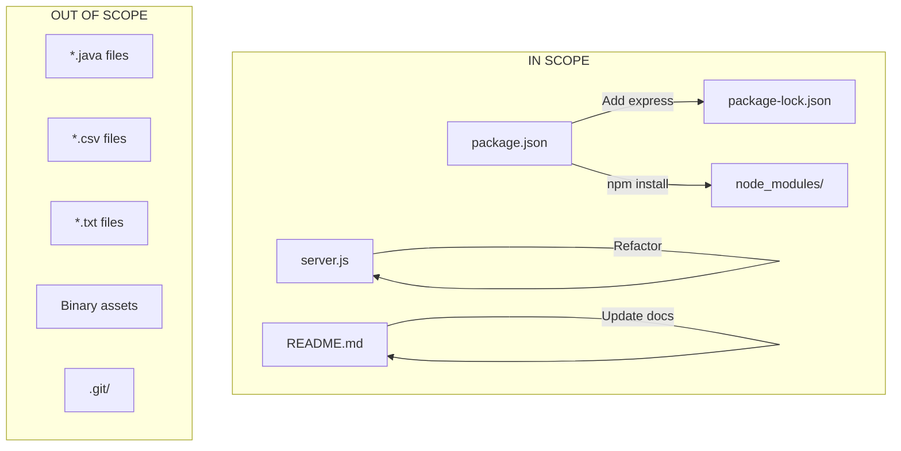

# Technical Specification

# 0. Agent Action Plan

## 0.1 Intent Clarification

### 0.1.1 Core Feature Objective

Based on the prompt, the Blitzy platform understands that the new feature requirement is to:

- **Integrate Express.js Framework**: Add the Express.js npm package to an existing Node.js HTTP server project that currently uses only the built-in `http` module
- **Add a New Endpoint**: Create an additional HTTP endpoint that returns the text "Good evening" as a response
- **Preserve Existing Functionality**: Maintain the current "Hello world" endpoint while adding the new endpoint capability
- **Modernize Server Architecture**: Transition from raw `http` module to Express.js routing pattern for better maintainability and scalability

**Implicit Requirements Detected:**
- The existing `server.js` file needs to be refactored to use Express.js instead of the native `http` module
- Both endpoints should coexist: one returning "Hello world" and another returning "Good evening"
- The server should continue running on the same port (3000) and host (127.0.0.1)
- Express.js must be added as a project dependency in `package.json`

**Feature Dependencies and Prerequisites:**
- Node.js runtime (v18+) - currently satisfied with v20.20.0
- npm package manager - currently satisfied with v11.1.0
- Express.js v5.x compatibility with Node.js 20.x

### 0.1.2 Special Instructions and Constraints

**Specific Directives:**
- Integrate Express.js into the existing server architecture
- Maintain backward compatibility with the existing "Hello world" response
- Follow conventional Express.js patterns for route handling

**Architectural Requirements:**
- Use Express.js application instance pattern
- Implement route handlers using `app.get()` method
- Maintain text/plain content type for responses

**User Example (preserved exactly as provided):**
> "this is a tutorial of node js server hosting one endpoint that returns the response 'Hello world'. Could you add expressjs into the project and add another endpoint that return the response of 'Good evening'?"

### 0.1.3 Technical Interpretation

These feature requirements translate to the following technical implementation strategy:

- **To integrate Express.js**, we will:
  - Install Express.js v5.2.1 as a project dependency
  - Update `package.json` to include the express dependency
  - Regenerate `package-lock.json` with the new dependency tree

- **To preserve the existing functionality**, we will:
  - Modify `server.js` to use Express.js instead of the native `http` module
  - Create a route handler for the root path (`/`) that returns "Hello, World!"

- **To add the new endpoint**, we will:
  - Create a new route handler that returns "Good evening"
  - Register this route at an appropriate path (e.g., `/evening` or `/greet/evening`)

- **To maintain server configuration**, we will:
  - Keep the server listening on port 3000
  - Preserve the localhost (127.0.0.1) binding
  - Maintain console logging for server startup confirmation

## 0.2 Repository Scope Discovery

### 0.2.1 Comprehensive File Analysis

**Repository Structure Overview:**
The repository is a minimal Node.js "Hello World" tutorial project with the following structure:

| File/Folder | Type | Purpose | Modification Required |
|-------------|------|---------|----------------------|
| `server.js` | Source | Main HTTP server entry point | MODIFY - Core refactoring |
| `server - Copy.js` | Source | Duplicate server file | OPTIONAL - Keep synchronized |
| `package.json` | Config | npm package manifest | MODIFY - Add Express dependency |
| `package-lock.json` | Config | npm dependency lock file | AUTO-GENERATED |
| `README.md` | Documentation | Project description | MODIFY - Update documentation |
| `LoginTest.java` | Source | Unrelated Java test stub | NO CHANGE |
| `LoginTest - Copy.java` | Source | Duplicate Java file | NO CHANGE |
| `industry.csv` | Data | Reference data file | NO CHANGE |
| `industry - Copy.csv` | Data | Duplicate CSV file | NO CHANGE |
| `*.txt` | Placeholder | Empty placeholder files | NO CHANGE |
| `*.pdf`, `*.doc`, `*.jpg` | Assets | Binary assets | NO CHANGE |

**Existing Modules to Modify:**
- `server.js` - Primary server implementation requiring Express.js integration

**Configuration Files Impacted:**
- `package.json` - Dependency manifest requiring express addition
- `package-lock.json` - Will be auto-regenerated by npm

**Documentation Updates:**
- `README.md` - Should be updated to reflect Express.js usage

### 0.2.2 Integration Point Discovery

**API Endpoints:**
| Current State | After Implementation |
|---------------|---------------------|
| Single handler for all requests returning "Hello, World!" | Route: `/` → "Hello, World!" |
| N/A | Route: `/evening` → "Good evening" |

**Server Configuration:**
- Host: `127.0.0.1`
- Port: `3000`
- Protocol: HTTP

**Current Implementation Analysis:**

```javascript
// Current: Uses native http module
const http = require('http');
```

**Target Implementation Pattern:**

```javascript
// Target: Uses Express.js
const express = require('express');
```

### 0.2.3 New File Requirements

**New Source Files to Create:**
- None required - all changes can be made within existing `server.js`

**New Test Files (Recommended):**
- `server.test.js` - Unit tests for endpoint responses (optional enhancement)

**New Configuration Files:**
- None required - Express.js requires no additional configuration files

### 0.2.4 Web Search Research Conducted

| Research Topic | Finding |
|---------------|---------|
| Express.js latest version | v5.2.1 (npm latest) |
| Node.js compatibility | Express v5 requires Node.js 18+ |
| Express.js installation | `npm install express` |
| Basic Express routing | Uses `app.get(path, handler)` pattern |
| Express.js response methods | `res.send()` for text responses |

## 0.3 Dependency Inventory

### 0.3.1 Private and Public Packages

**Current Dependencies:**
The project currently has no external dependencies. The `package.json` contains only metadata without a `dependencies` field.

**New Dependencies Required:**

| Registry | Package Name | Version | Purpose |
|----------|--------------|---------|---------|
| npm (public) | express | ^5.2.1 | Web application framework for routing and HTTP handling |

**Express.js Transitive Dependencies:**
Express.js v5.2.1 will bring the following notable sub-dependencies (auto-installed):
- `body-parser` - Request body parsing middleware
- `content-disposition` - Content-Disposition header handling
- `content-type` - Content-Type header parsing
- `cookie` - Cookie parsing
- `debug` - Debugging utility
- `encodeurl` - URL encoding
- `escape-html` - HTML escaping
- `etag` - ETag generation
- `fresh` - HTTP response freshness testing
- `merge-descriptors` - Descriptor merging
- `methods` - HTTP methods
- `mime-types` - MIME type handling
- `on-finished` - Request completion handling
- `parseurl` - URL parsing
- `path-to-regexp` - Route pattern matching (v8.x)
- `qs` - Query string parsing
- `range-parser` - Range header parsing
- `router` - Express router
- `safe-buffer` - Safe buffer handling
- `send` - Static file serving
- `serve-static` - Static file middleware
- `setprototypeof` - Prototype setting
- `statuses` - HTTP status codes
- `type-is` - Request type checking
- `utils-merge` - Object merging
- `vary` - Vary header handling

### 0.3.2 Dependency Updates

**Package.json Modifications:**

Current `package.json`:
```json
{
  "name": "hello_world",
  "version": "1.0.0",
  "description": "Hello world in Node.js",
  "main": "index.js"
}
```

Updated `package.json` (required changes):
```json
{
  "dependencies": {
    "express": "^5.2.1"
  }
}
```

**Import Updates:**

| File | Current Import | New Import |
|------|----------------|------------|
| `server.js` | `const http = require('http');` | `const express = require('express');` |

**External Reference Updates:**

| File Type | Files Affected | Update Description |
|-----------|----------------|-------------------|
| Configuration | `package.json` | Add express to dependencies |
| Lock File | `package-lock.json` | Auto-regenerated by npm |
| Documentation | `README.md` | Update to reference Express.js |

### 0.3.3 Version Compatibility Matrix

| Component | Current Version | Required Version | Compatible |
|-----------|-----------------|------------------|------------|
| Node.js | v20.20.0 | ≥ v18.0.0 | ✅ Yes |
| npm | v11.1.0 | ≥ v7.0.0 | ✅ Yes |
| Express.js | N/A (new) | ^5.2.1 | ✅ Yes |
| lockfileVersion | 3 | 3 | ✅ Yes |

## 0.4 Integration Analysis

### 0.4.1 Existing Code Touchpoints

**Direct Modifications Required:**

| File | Location | Modification Description |
|------|----------|-------------------------|
| `server.js` | Line 1 | Replace `http` import with `express` import |
| `server.js` | Lines 6-10 | Replace `http.createServer()` callback with Express app and route handlers |
| `server.js` | Lines 12-14 | Replace `server.listen()` with `app.listen()` |
| `package.json` | Root object | Add `dependencies` field with express package |

**Code Transformation Map:**

```
BEFORE (server.js):                    AFTER (server.js):
┌─────────────────────────────┐        ┌─────────────────────────────┐
│ const http = require('http')│   →    │ const express = require('.. │
│                             │        │ const app = express();      │
│ http.createServer((req,res) │   →    │ app.get('/', (req, res) =>  │
│   res.end('Hello, World!')  │        │   res.send('Hello, World!') │
│ });                         │        │ app.get('/evening', ...)    │
│                             │        │                             │
│ server.listen(port, host,   │   →    │ app.listen(port, host, () =>│
│   console.log(...)          │        │   console.log(...)          │
│ );                          │        │ );                          │
└─────────────────────────────┘        └─────────────────────────────┘
```

### 0.4.2 Dependency Injections

**Module Loading Changes:**
- **Remove**: `http` module import (built-in, no longer needed directly)
- **Add**: `express` module import (external, from npm)

**Express Application Setup:**
```javascript
const app = express();
```

### 0.4.3 Database/Schema Updates

**Not Applicable** - This project does not use a database.

### 0.4.4 Middleware Considerations

**Default Express Middleware:**
Express.js v5.x includes minimal built-in middleware. For this simple text response use case:
- No additional middleware required
- `res.send()` automatically handles Content-Type headers
- No body parsing needed (no incoming request bodies)

### 0.4.5 Routing Integration

**Route Registration Pattern:**



**Request Flow:**



### 0.4.6 Backward Compatibility Analysis

| Aspect | Current Behavior | After Change | Compatibility |
|--------|------------------|--------------|---------------|
| Root endpoint (/) | Returns "Hello, World!" | Returns "Hello, World!" | ✅ Preserved |
| Port binding | 3000 | 3000 | ✅ Preserved |
| Host binding | 127.0.0.1 | 127.0.0.1 | ✅ Preserved |
| Response format | text/plain | text/plain | ✅ Preserved |
| HTTP method | All methods | GET only | ⚠️ More specific |
| Unknown routes | 200 + "Hello, World!" | 404 | ⚠️ Different |

## 0.5 Technical Implementation

### 0.5.1 File-by-File Execution Plan

**CRITICAL: Every file listed here MUST be created or modified**

**Group 1 - Dependency Setup:**

| Action | File | Purpose |
|--------|------|---------|
| MODIFY | `package.json` | Add express dependency to enable npm installation |

**Group 2 - Core Feature Implementation:**

| Action | File | Purpose |
|--------|------|---------|
| MODIFY | `server.js` | Refactor to use Express.js with two route handlers |

**Group 3 - Documentation:**

| Action | File | Purpose |
|--------|------|---------|
| MODIFY | `README.md` | Update project description to reflect Express.js usage |

**Group 4 - Optional Synchronization:**

| Action | File | Purpose |
|--------|------|---------|
| MODIFY | `server - Copy.js` | Keep synchronized with main server.js (optional) |

### 0.5.2 Implementation Approach per File

**File: `package.json`**

| Aspect | Details |
|--------|---------|
| Current State | No dependencies field |
| Required Changes | Add `dependencies` object with express entry |
| Validation | Run `npm install` successfully |

**Implementation snippet:**
```json
"dependencies": { "express": "^5.2.1" }
```

---

**File: `server.js`**

| Aspect | Details |
|--------|---------|
| Current State | Uses native `http` module, single response for all requests |
| Required Changes | Replace with Express.js app, add two route handlers |
| Validation | Server starts and both endpoints respond correctly |

**Implementation approach:**
- Import express module instead of http
- Create Express application instance
- Register GET route for "/" returning "Hello, World!"
- Register GET route for "/evening" returning "Good evening"
- Call app.listen() with same port/host configuration

**Target structure:**
```javascript
const express = require('express');
const app = express();
// Route handlers...
app.listen(port, hostname, callback);
```

---

**File: `README.md`**

| Aspect | Details |
|--------|---------|
| Current State | Basic project warning text |
| Required Changes | Add Express.js usage documentation |
| Validation | Documentation reflects actual implementation |

### 0.5.3 Express.js Route Implementation Details

**Route 1: Root Endpoint**

| Property | Value |
|----------|-------|
| Method | GET |
| Path | `/` |
| Response Body | `Hello, World!` |
| Content-Type | text/plain (auto-set by res.send) |
| Status Code | 200 |

**Route 2: Evening Endpoint**

| Property | Value |
|----------|-------|
| Method | GET |
| Path | `/evening` |
| Response Body | `Good evening` |
| Content-Type | text/plain (auto-set by res.send) |
| Status Code | 200 |

### 0.5.4 Server Configuration Preservation

| Configuration | Current Value | After Implementation |
|---------------|---------------|---------------------|
| Hostname | `127.0.0.1` | `127.0.0.1` |
| Port | `3000` | `3000` |
| Startup Log | `Server running at http://127.0.0.1:3000/` | `Server running at http://127.0.0.1:3000/` |

### 0.5.5 Validation Criteria

**Installation Validation:**
- `npm install` completes without errors
- `node_modules/express` directory exists
- `package-lock.json` contains express dependency tree

**Runtime Validation:**
- Server starts without errors
- `curl http://127.0.0.1:3000/` returns "Hello, World!"
- `curl http://127.0.0.1:3000/evening` returns "Good evening"
- Console displays startup message

### 0.5.6 User Interface Design

**Not Applicable** - This feature does not include UI components. The implementation is purely API/backend focused with text responses.

No Figma URLs were provided for this feature request.

## 0.6 Scope Boundaries

### 0.6.1 Exhaustively In Scope

**Source Files:**

| File Pattern | Specific Files | Modification Type |
|--------------|----------------|-------------------|
| `server.js` | `server.js` | MODIFY - Core refactoring |
| `server*.js` | `server - Copy.js` | MODIFY - Optional sync |

**Configuration Files:**

| File Pattern | Specific Files | Modification Type |
|--------------|----------------|-------------------|
| `package.json` | `package.json` | MODIFY - Add dependency |
| `package-lock.json` | `package-lock.json` | AUTO-GENERATED |

**Documentation Files:**

| File Pattern | Specific Files | Modification Type |
|--------------|----------------|-------------------|
| `README.md` | `README.md` | MODIFY - Update description |

**Generated/Created Files:**

| File Pattern | Location | Generation Method |
|--------------|----------|-------------------|
| `node_modules/**` | `./node_modules/` | npm install |
| `node_modules/express/**` | `./node_modules/express/` | npm install |

### 0.6.2 Complete File Inventory

**Files Requiring Manual Modification:**

| Priority | File | Required Changes |
|----------|------|------------------|
| 1 | `package.json` | Add `dependencies.express` entry |
| 2 | `server.js` | Replace http module with Express.js implementation |
| 3 | `README.md` | Update project documentation |

**Files Auto-Generated:**

| File | Generated By | Trigger |
|------|--------------|---------|
| `package-lock.json` | npm | `npm install` command |
| `node_modules/*` | npm | `npm install` command |

### 0.6.3 Explicitly Out of Scope

**Unrelated Repository Files:**

| File | Reason for Exclusion |
|------|---------------------|
| `LoginTest.java` | Unrelated Java test file |
| `LoginTest - Copy.java` | Duplicate Java file |
| `industry.csv` | Reference data, unrelated to feature |
| `industry - Copy.csv` | Duplicate CSV file |
| `test.py.txt` | Empty placeholder file |
| `test.py - Copy.txt` | Empty placeholder file |
| `test.txt.txt` | Empty placeholder file |
| `100Pages.pdf` | Binary asset, unrelated |
| `100Pages - Copy.pdf` | Binary asset, unrelated |
| `demo.jpg` | Binary asset, unrelated |
| `demo - Copy.jpg` | Binary asset, unrelated |
| `sample.doc` | Binary asset, unrelated |
| `sample - Copy.doc` | Binary asset, unrelated |
| `.git/**` | Version control metadata |

**Functionality Out of Scope:**

| Item | Reason |
|------|--------|
| Database integration | Not requested |
| Authentication/Authorization | Not requested |
| HTTPS/TLS configuration | Not requested |
| Environment variable configuration | Not requested |
| Docker containerization | Not requested |
| CI/CD pipeline setup | Not requested |
| Unit test creation | Not requested (optional enhancement only) |
| Logging framework integration | Not requested |
| Error handling middleware | Not requested |
| Request validation | Not requested |
| CORS configuration | Not requested |
| Rate limiting | Not requested |

### 0.6.4 Scope Summary Diagram



## 0.7 Rules for Feature Addition

### 0.7.1 Express.js Integration Patterns

**Framework Conventions:**
- Use `const express = require('express')` for module import (CommonJS syntax matching existing codebase)
- Create application instance with `const app = express()`
- Define routes using `app.get(path, handler)` pattern
- Use `res.send()` for text responses (automatically sets Content-Type)
- Maintain Express.js v5.x API conventions

**Route Handler Standards:**
- Each route handler receives `(req, res)` parameters
- Handlers should call a response method (send, json, end, etc.)
- Keep handlers simple and focused on single responsibility

### 0.7.2 Code Style Requirements

**Existing Codebase Style (to be maintained):**
- CommonJS module syntax (`require()` instead of ES modules)
- `const` for variable declarations
- Template literals for string interpolation (`` `${variable}` ``)
- Semicolons at end of statements
- Single quotes for strings

**Example following existing style:**
```javascript
const express = require('express');
const hostname = '127.0.0.1';
```

### 0.7.3 Backward Compatibility Requirements

**Preserved Behaviors:**
- Root path (`/`) must continue to return "Hello, World!" response
- Server must listen on port 3000
- Server must bind to 127.0.0.1
- Console must log server startup message

**Acceptable Changes:**
- HTTP method restriction (GET only instead of all methods)
- 404 response for undefined routes (Express default behavior)

### 0.7.4 Performance Considerations

**Express.js Overhead:**
- Minimal performance impact for simple routing
- Express.js adds ~2-5ms latency compared to raw http module
- Acceptable trade-off for maintainability and feature extensibility

**No Performance Optimizations Required:**
- This is a tutorial/demonstration project
- No high-throughput requirements identified
- No caching layer needed

### 0.7.5 Security Requirements

**Express.js v5 Security Features:**
- Updated `path-to-regexp` for ReDoS mitigation
- Dropped support for legacy Node.js versions
- Removed deprecated APIs

**Minimum Security Practices:**
- Use latest stable Express.js version (5.2.1)
- No sensitive data exposure in responses
- No external input processing in current scope

### 0.7.6 User-Specified Rules

No additional rules or constraints were explicitly specified by the user beyond:
- Add Express.js to the project
- Add endpoint returning "Good evening"
- Maintain existing "Hello world" functionality

## 0.8 References

### 0.8.1 Repository Files Analyzed

**Source Files Examined:**

| File Path | Analysis Purpose | Key Findings |
|-----------|------------------|--------------|
| `server.js` | Current implementation review | Uses native http module, returns "Hello, World!" on all requests |
| `server - Copy.js` | Duplicate verification | Identical to server.js |
| `package.json` | Dependency analysis | No external dependencies, npm package metadata only |
| `package-lock.json` | Dependency lock verification | lockfileVersion 3, empty dependencies |
| `README.md` | Documentation review | Minimal warning text, no usage instructions |

**Configuration Files Examined:**

| File Path | Analysis Purpose | Key Findings |
|-----------|------------------|--------------|
| `package.json` | npm configuration | Main entry incorrectly set to "index.js", no dependencies |
| `package-lock.json` | Dependency tree | Empty dependency tree, lockfileVersion 3 compatible |

**Other Files Examined (Out of Scope Verification):**

| File Path | Result |
|-----------|--------|
| `LoginTest.java` | Java stub file, not related to Node.js feature |
| `LoginTest - Copy.java` | Duplicate Java file |
| `industry.csv` | Reference data CSV, not related to feature |
| `industry - Copy.csv` | Duplicate CSV file |
| `test.py.txt`, `test.py - Copy.txt`, `test.txt.txt` | Empty placeholder files |
| `*.pdf`, `*.doc`, `*.jpg` | Binary assets, not related to feature |

### 0.8.2 External References

**Web Search Research Conducted:**

| Query | Source | Key Information |
|-------|--------|-----------------|
| Express.js npm latest version 2025 | npmjs.com/package/express | Express.js v5.2.1 is the latest version |
| Express.js npm latest version 2025 | expressjs.com | Express 5.1.0 became the default on npm, v5 requires Node.js 18+ |
| Express.js npm latest version 2025 | github.com/expressjs/express | Express v5 dropped support for Node.js versions before v18 |

**Official Documentation:**
- Express.js official website: https://expressjs.com/
- Express.js npm package: https://www.npmjs.com/package/express
- Express.js GitHub repository: https://github.com/expressjs/express

### 0.8.3 User-Provided Attachments

**No attachments were provided for this feature request.**

### 0.8.4 Figma Screens

**No Figma URLs were provided for this feature request.**

### 0.8.5 Environment Details

| Component | Version | Source |
|-----------|---------|--------|
| Node.js | v20.20.0 | Runtime environment verification |
| npm | v11.1.0 | Runtime environment verification |
| Express.js (target) | v5.2.1 | npm registry search |

### 0.8.6 Search History Summary

| Search # | Tool Used | Target | Purpose |
|----------|-----------|--------|---------|
| 1 | bash (find) | `.blitzyignore` | Check for ignore patterns |
| 2 | get_source_folder_contents | Repository root | Repository structure analysis |
| 3 | read_file | `server.js` | Current implementation review |
| 4 | read_file | `package.json` | Dependency configuration review |
| 5 | read_file | `package-lock.json` | Lock file verification |
| 6 | read_file | `README.md` | Documentation review |
| 7 | bash (node --version) | Node.js runtime | Version verification |
| 8 | web_search | Express.js version | Latest version research |
| 9 | bash (npm install) | Project setup | Environment validation |

